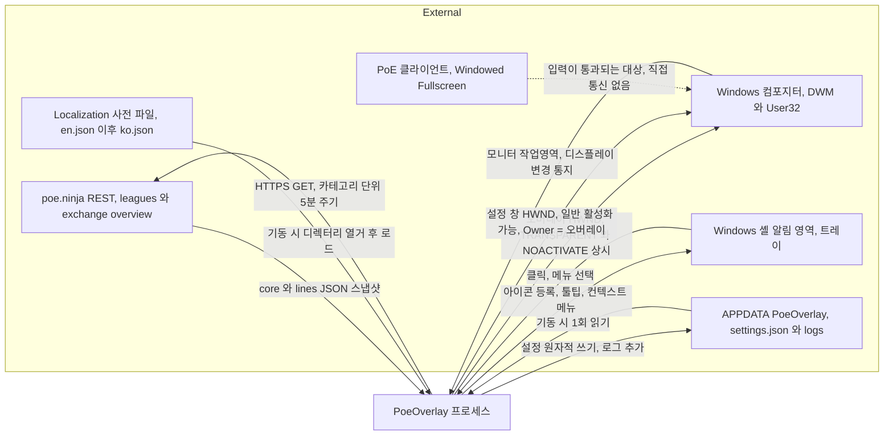
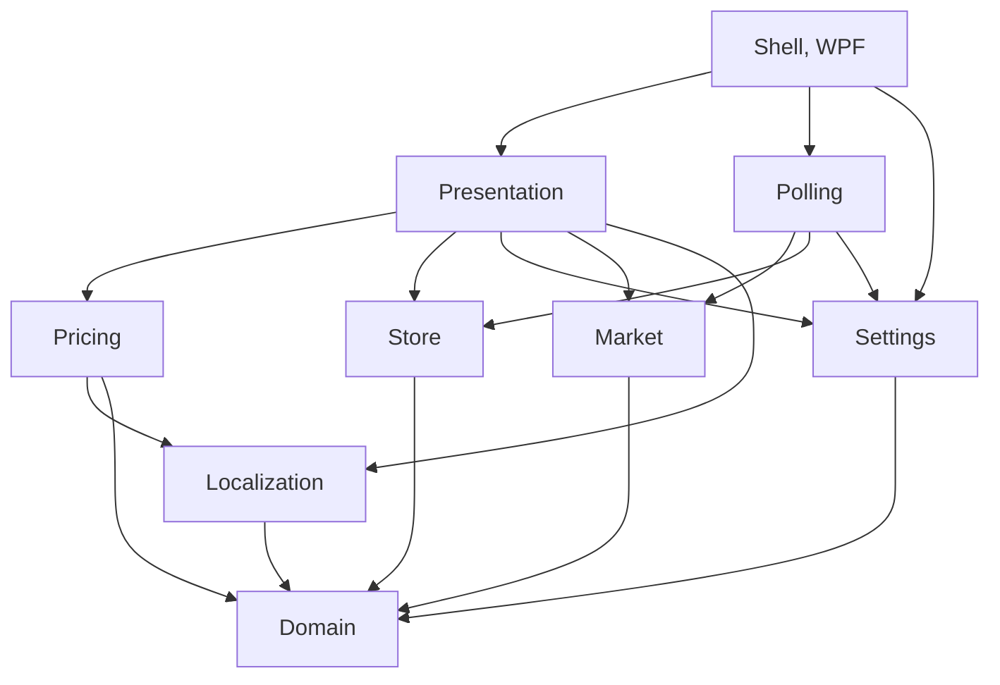
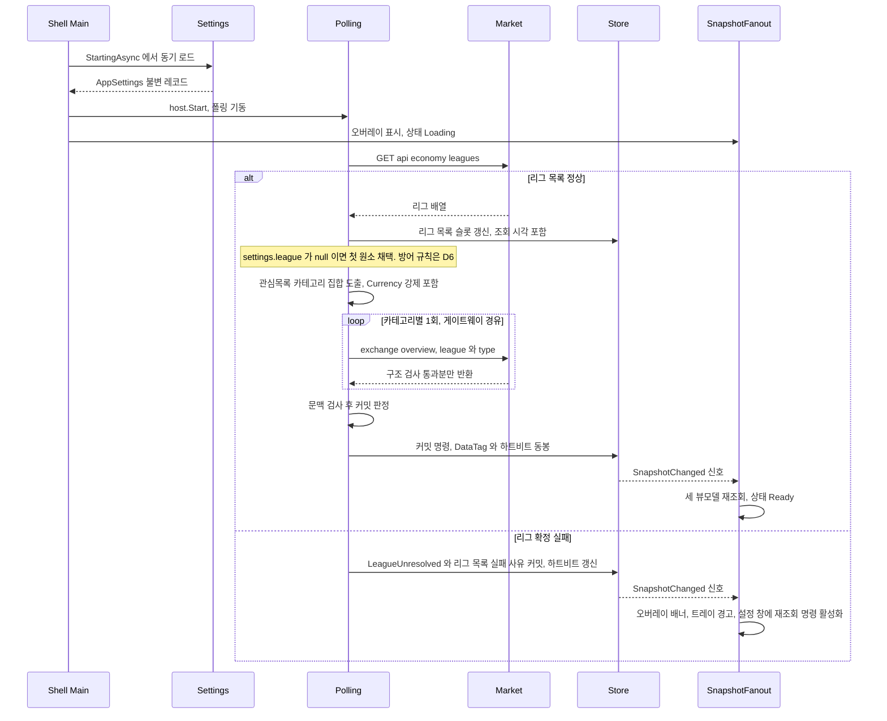
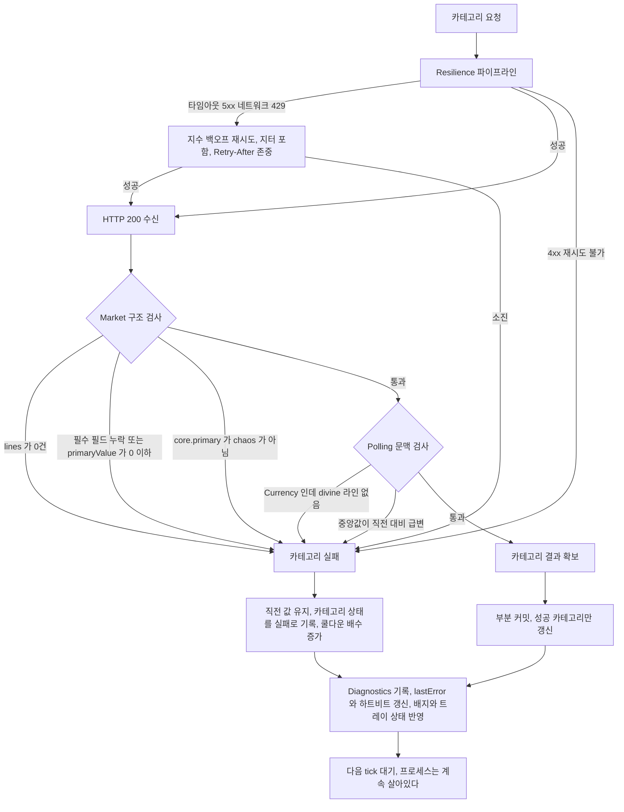
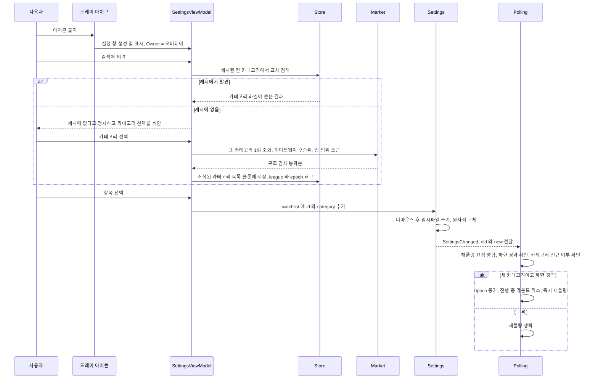

# PoE 시세 오버레이 — 상위 설계 (HLD)

| | |
|---|---|
| 문서 상태 | **개정 7판 — S1 동결** |
| 작성일 | 2026-08-15 |
| 상위 문서 | `docs/REQUIREMENTS.md` **개정 2판**, `docs/design/00-api-contract.md` (**데이터 계약 — 구속력 있음**), `docs/design/00-shell-measurements.md` (**Win32·렌더링 실측 — 구속력 있음**) |
| 범위 | 컴포넌트·경계·흐름·수명 모델. **메서드 시그니처·클래스 멤버·JSON 필드 매핑은 다루지 않는다** (S2~S4 소관) |
| 표기 규약 | **【측정】** 표시가 붙은 진술은 프로브 프로젝트를 빌드·실행해 확인한 사실이다. 추론보다 우선하며, 이와 어긋나는 설계는 무효다 |
| 데이터 계약 | 필드 수준의 정본은 `00-api-contract.md`. REQUIREMENTS §6은 개정 2판에서 대응표로 정정, §7은 `Microsoft.Extensions.Http.Resilience`·서킷브레이커 미사용을 명시 |
| 선결 과제 | REQUIREMENTS §10 **완료** — SDK 8.0.424, PR #2 머지(`a274711`), 구 스캐폴딩 제거(`a2b7241`) |
| 후속 단계 | **S2** LLD Core 절반 / **S3** LLD 셸 절반 / **S4** DLD |

---

## 0. 개정 이력

### 0.0 개정 7판 — 최종 정합성 마감 지시서 반영. 구현 가능한 상태로 닫는다

검증 3종(개정 정확성 감사 · 교차 일관성 검토 · 요구사항 재감사)을 통합한 마감 지시서(`docs/design/_wip/final-consistency-punchlist.md`)의 지적을 반영했다. **기각된 지적은 없다.** 개정 요구 태그가 붙은 행은 27개(1·3·4·7·11·15·16·17·18·24·25·26·27·28·29·30·32·33·34·35·36·37·38·39·40·41·42, S3 §13 기준)이며, 이번 패스에서 27개 전부의 처리 여부를 다시 세었다 — 직전 패스가 산수 실수(`42 − 25 = 17`)로 놓친 **행 11**(FR-08-6 필드 부재)을 이번에 닫았다.

- **FR-08-6 영속 필드 신설(B1, 행 11)** — §7 스키마 표에 최상위 `bool`(기본 `false`) 행을 추가하고, §8 FR-08-6 행의 소유 모듈에 `Settings`를 더했다. S2 §8.1 `AppSettings`·§8.2 검증표·§8.4 읽기 경로도 같은 패스로 동기화했다(세부는 S2 §0).
- **기동 순서와 초기 언어 적용(B5)** — §3.5 5단계의 `Settings`/`Localization` 순서를 뒤집었다(`Localization` → `Settings`) — S2 §8.2가 `language`를 "발견된 사전 중 하나"로 검증하므로 그 반대 순서는 성립할 수 없었다(S3 §3.1이 이미 옳은 순서로 등록하고 있었다). `settings.language`를 부팅 시 적용하는 주체와 시점도 명시했다(§3.5 5.5번, 신규).
- **인스턴스 신호 절차를 D18-d/D-SH18과 측정 §10.1에 맞춤(B6)** — §3.5 2단계의 응답 판정을 "타임아웃 시"에서 센티널 불일치=무응답으로 정정했고, 8단계의 "오버레이 HWND 훅" 선택지와 "펌프 시작 전 신호도 큐에 남는다"는 전제를 삭제했다(S3 D-SH4/D-SH18이 채택한 메시지 전용 창 + 재시도 방식으로 교체).
- **§2.2 의존 표를 §2.3 그래프와 맞춤** — `Localization → Domain`(D-C1), `Polling → Pricing.StalenessPolicy`(D-C2) 행을 추가했다.
- **§3.4/§4.1의 커밋 페이로드 정정** — "`RoundContext` 동봉"을 S2 D-ST1이 실제로 채택한 `DataTag`(league, dataEpoch)로 고쳤다.
- **§3.5에 `Store`의 `IHostedService` 등록과 그 순서를 명문화** — `Polling`보다 먼저 등록해야 정지 순서(역순)가 D20의 마지막 하트비트 기록을 보존한다(S3 §3.1과 일치).
- **§3.4의 최근 오류 링 소유자 정정** — `Store`가 아니라 `Diagnostics`(§9.3, S2와 일치).
- **D17의 `settings.bak.json` 정의 정정** — "마지막으로 성공 로드한 설정"을 "마지막으로 성공 **쓴** 설정"으로 고쳐 S2 §8.5(`File.Replace`의 실제 동작)와 맞췄다.
- **§6.1 다섯 표시 형태에 `ui.price.*` 키 열 추가**(S2 §3.6과 일치).
- **§6.4 배너 표 보강** — `CommitRejected`를 S3 §5.5의 오버레이 배너 우선순위표 4위(신설)로 편입했고, 파생 상태 `ItemDropped`·`RateInherited` 행을 추가했다(S2 §2.11/§10.5).
- **인용·문언 정정** — §3.5 11단계의 "함정" 프레이밍을 제거하고 의도된 z-순서로 재서술(D18-b와 정합), §10 Q5의 측정 문서 인용을 `00-shell-measurements.md §8`/`§8.2`로 확장, §0.2(구 개정 4판 이력) 5번 행 각주의 판 번호를 "개정 5판"에서 "개정 6판"으로 정정, §7 `window.x`/`.y` 검증의 근거 인용을 정정(D19 푸터 불변식, S3 §4.5).
- **상위 문서에 `00-shell-measurements.md`를 추가**했다(개정 6판 전체를 유발한 구속력 있는 문서인데 헤더가 인용하지 않고 있었다).
- **D4-d의 자기모순을 바로잡았다(§E 정정).** 지난 지시서는 "통과 메커니즘이 컬러키로 바뀌었다"고 적었으나 두 기제(창 전체 단위 `WS_EX_TRANSPARENT`, 상시 존재하는 `LWA_COLORKEY`)는 실제로 공존한다 — 적용된 문장이 "메커니즘은 하나"로 시작한 뒤 그 직후 문장에서 사실상 둘을 서술해 자기모순이었다. 공존과 각각의 적용 국면이 드러나도록 다시 썼다.

FR-08-6을 제외한 42/42 요구사항 충족은 유지된다. B1이 닫히므로 다시 42/42다.

세부 근거와 원문 대조는 `docs/design/_wip/final-consistency-punchlist.md`와 `03-lld-shell.md` §13을 참조.

### 0.1 개정 6판 — S3(`03-lld-shell.md` 제4판) §13의 검증된 42행 개정 목록을 반영

S3 제4판 §13이 원문 대조로 재검증한 42개 항목 가운데 이 문서(HLD)를 대상으로 하는 개정 요구를 반영했다. 실패로 확인된 행은 없었다. 원인별로 묶으면:

- **`00-shell-measurements.md` §8/§9의 측정** — 오버레이가 `AllowsTransparency=true`에서 `AllowsTransparency=false` + `WS_EX_LAYERED`(컬러키+알파)로 전환됨에 따라 D4-a(`AllowsTransparency`/`WindowStyle` 행), D4-c(그립의 클릭 통과 근거), D4-d(통과 메커니즘 서술), D18-a(오버레이 표면 표), §3.5 9단계 기동 의사코드, §10 Q5의 권고를 정정했다(S3 §13 행 18/24/25/26/27/37).
- **`00-shell-measurements.md` §2의 측정** — §1 mermaid, §3.5 11단계 주석, §4.4 시퀀스 다이어그램, D18-a·D18-b, §8 FR-08-2 행, §0.1(구 개정 4판 이력) 5번 행에 남아 있던 "Owner 미지정/금지"를 "`Owner = 오버레이`"로 정정했다(다섯 자리 전부, S3 §13 행 3/32).
- **`00-shell-measurements.md` §1의 측정** — §10 Q17의 "임시 Topmost" 폴백 문구를 삭제했다. 활성화는 우회 없이 성공한다(S3 §13 행 4).
- **S3의 설계 결정** — §6.4에 `PollingStopped`(진입 열도 함께 정정), `LoggingUnavailable`, `ViewModelRefreshFailing`, `SettingsReadOnly`, `SettingsUnreadable`, `CommitRejected` 행을 추가·정정했다(S3 §13 행 1/16/29/38). D18-d 채널 행(`SendMessageTimeout` 채택으로 큐잉 전제 무효화), D4-b 잔여조건①, §7 `window.x`/`.y` 검증 열(최소 가시 면적), §3.3 타이머 예산 표(이동 모드 워치독 행)와 마무리 문장, §8 FR-07-1 행(단계 표기)·NFR-01 행·마무리 문장(ID 개수), §3.5 마무리 불릿(트레이 폐기 순서 정합)도 함께 정정했다(S3 §13 행 15/30/33/35/36/40/42).

세부 근거와 원문 대조는 `03-lld-shell.md` §13을 참조.

### 0.2 개정 5판 — 동결 전 내부 모순 3건 해소

4판을 최종 추적 감사에 넘긴 결과 **41개 ID 전부 SATISFIED (NOMINAL·PARTIAL·VIOLATED 0건)** 이 확인됐다. 3판이 남긴 PARTIAL 4건(FR-01-1·FR-05-3·FR-05-6·FR-08-2)은 모두 실질 해소됐다. 다만 **4판이 새로 추가한 것들 사이의 규범 문장 충돌 3건**이 남아 있었고, 5판은 그것만 고친다. 설계 변경이 아니라 모순 제거다.

| # | 모순 | 해소 |
|---|---|---|
| 1 | **`Store` 단일 기록자 규약이 신규 슬롯과 충돌.** §3.4는 "모든 변경은 `Polling`의 소비 루프에서만"이라 했으나, §4.4는 `SettingsViewModel`이 조회 목록 슬롯에 직접 쓰고, D6은 사용자 개시 리그 재조회를 허용하며, `lastError`는 설정 저장 경로에서도 발생한다. **더 심각하게는, 소비 루프를 `Polling`이 소유하면 폴링이 죽는 순간 `Store`가 쓰기 불능이 된다** — D20이 존재하는 전제와 정면 충돌한다 | **"소비자는 하나, 생산자는 여럿"** 으로 재서술하고 소비 루프 소유를 `Store` 자신으로 옮겼다. 여섯 슬롯의 생산자를 표로 명시하고, `PollingStopped`가 저장 상태가 아니라 파생 계산임을 못박았다 (§3.4) |
| 2 | **`epoch`가 두 의미를 겸함.** D9 각주는 "데이터 유효 범위라는 하나의 의미로 유지"한다며 `interval`을 배제해 놓고, 같은 표의 `watchlist` 행이 그 논리를 어긴다. 그 겸직이 4판의 검색 캐시 태그에 상속되어 **항목을 하나 추가할 때마다 캐시가 무효화되고, 진행 중이던 사용자 조회의 커밋이 무관한 편집 때문에 거부**된다 | **`dataEpoch`(데이터 유효 범위, `league`에서만 증가)와 `roundGeneration`(라운드 취소 토큰)으로 분리.** 데이터에 붙는 태그는 `dataEpoch` 뿐이다 (D9). Q4를 "리그 축 종결 + 과잉 무효화 축 해소"로 정정 |
| 3 | **뮤텍스 해제 시점이 D18-d와 §3.5에서 정반대.** D18-d는 "트레이 폐기 직후, `StopAsync` 이전"인데 §3.5의 실제 순서는 `StopAsync`가 먼저였고, 그 순서에서는 12-e의 주석이 약속한 효과("느린 종료 중 재실행이 삼켜지지 않게")가 나오지 않는다 | §3.5 teardown을 `구독 해제 → flush → 트레이 폐기 → 뮤텍스 해제 → StopAsync → 로그 flush`로 확정. 12-a에서 이미 구독을 끊으므로 트레이 폐기를 앞당겨도 C11의 문제가 재발하지 않는다 |

비차단 잔여 항목(오류 링 소유 표기, `DispatcherTimer`의 TFM 문제, 엄격 역직렬화와 비율 검사의 순서, `volume` 보존 여부, 신호 큐잉 주장 범위, 기하 검증을 최소 가시 면적으로, §8의 `TrayViewModel`·`opacity` 기록자 표기, 워치독 타이머의 §3.3 등재, §6.1 다섯 서식의 `ui.*` 키 부여, 설정 창 레이아웃 절 신설)은 **S2/S3에서 처리한다.**

### 0.3 개정 4판 — 측정으로 확정하고, 표시 전용화가 남긴 구멍을 메웠다

개정 3판을 네 갈래로 검토했고(요구사항 추적 · 아키텍처 · 조용한 실패 사냥 · 실제 프로브 빌드 기반 .NET/WPF 타당성), 추적 결과는 **41개 ID 중 37 SATISFIED / 4 PARTIAL / 0 NOMINAL / 0 VIOLATED** 였다. 방향에는 차단 사유가 없다. 4판이 고치는 것은 아래다.

**측정으로 종결된 것**

| # | 【측정】 사실 | 설계 반영 |
|---|---|---|
| 1 | ex-style `0x08080008`, 포그라운드는 타 프로세스가 보유한 상태에서 `CaptureMouse()` 성공, `GetCapture()` 일치, 클라이언트 영역 **밖** 좌표의 `WM_MOUSEMOVE` 수신, 커서가 밖에 있는 채로 `WM_LBUTTONUP` 수신 후 `LostMouseCapture`. **드래그 끼임 없음. 포그라운드 불변** | **Q13 종결.** D4-b의 "실패 시 `NOACTIVATE` 해제" 폴백 조항 **삭제** — 개정 절차 없이 요구사항 위반을 미리 승인한 문장이었다 |
| 2 | `NotifyIcon`이 `RegisterWindowMessage("TaskbarCreated")`(49340)를 내부 필드로 보유. `NIM_DELETE`로 몰래 지운 뒤 `PostMessage`로 `TaskbarCreated`를 보내자 `NIM_MODIFY`가 false→true로 회복 | `TaskbarCreated` 수동 훅을 **요구에서 금지로 전환**(D18-c). WPF 펌프만으로 충분함도 동시에 증명됨 |
| 3 | `SizeToContent="Height"` 활성 중 `Height` DP가 레이아웃마다 덮어써짐 (`500 → 136 → 680 → 300 → 102 → 68`). 대입은 조용히 무시됨 | **flush 시점에 `Window.Height`/`ActualHeight`를 읽지 않는다.** 사용자 조작 시점에 스칼라로 포착해 **값으로** 큐잉 (D19) |
| 4 | `SizeToContent="Manual"`에서도 `MaxHeight`가 강제됨. `MaxHeight=300`이면 그립을 400까지 끌어도 300에서 잘림 | 3판의 "조절한 값을 새 상한으로 저장"은 **줄어들기만 하는 래칫**이었다. D19 전면 재작성 |
| 5 | `settingsWindow.Owner = MainWindow` 시 exstyle `0x00040108` — `WS_EX_TOPMOST` 켜짐. 그런데 `Topmost` 속성은 false로 읽힘 | **설정 창에 `Owner`를 지정하지 않는다**를 불변식화(D18-b). 소스 어디에도 `Topmost=true`가 없는데 설정 창이 게임 위로 뜨는 사고 방지 (이 결정은 개정 6판/S3 4판에서 뒤집혔다 — D18-b·§5.1 참조, `00-shell-measurements.md` §2) |
| 6 | `SourceInitialized` 시점에 이미 `WS_EX_LAYERED`(`0x00080008`) 설정됨 | D4-d의 읽고-고쳐-쓰기는 **주의가 아니라 필수**. 통째 대입은 투명도를 즉시 파괴 |
| 7 | Win32가 마우스 이동 메시지를 병합 (주입 5회 → 전달 2회) | 드래그·리사이즈는 **절대 커서 좌표 − 드래그 원점**으로 계산. 누적 델타 금지 (D4-c) |
| 8 | `Run(window)` + `OnExplicitShutdown`에서 `Closing` 핸들러의 `e.Cancel=true`가 `Shutdown()`을 막지 못함. `Run` 복귀 후 `SynchronizationContext.Current`는 평범한 컨텍스트로 되돌아옴 | §3.6의 진단과 처방 모두 유효. 이동 모드 종료 핸들러에 유리 |
| 9 | `UseWPF` + `UseWindowsForms` 동시 사용 시 출력 어셈블리 **증가 0**. `EnableVisualStyles()` 충돌 없음. `NotifyIcon`은 `Application.Run` 불필요 | D18-c 채택안 유지 |
| 10 | WinForms `IMessageFilter.PreFilterMessage` 호출 횟수 **0**. 그럼에도 트레이 `ContextMenuStrip`은 바깥 클릭으로 닫히고 화살표 키에 반응(드롭다운이 자체 HWND를 가짐) | 제약으로 기록 — 메시지 필터에 의존하는 WinForms 기능을 나중에 끌어오지 말 것 (§9) |
| 11 | `Shutdown()`이 창을 강제 종료한 뒤 `RestoreBounds`는 `Empty`. `Left/Top/Width/Height`는 생존, HWND는 0 | `RestoreBounds` 사용 금지 (D19) |
| 12 | `IHostedLifecycleService`는 `StartingAsync`(전체) → `StartAsync`(전체) → `StartedAsync`(전체) 순 | D12 유지. 단 전제 두 개를 명문화 |
| 13 | `UseWindowsForms` + DPI 선언 매니페스트 조합에서 빌드 경고 `WFAC010` | **그 권고는 이 프로젝트에서 틀렸다.** WPF PerMonitorV2는 매니페스트 외 경로가 없고 `ApplicationConfiguration.Initialize()`는 커스텀 `Main`이 부르지 않는다. `NoWarn`에 **이유와 함께** 등록 (§9) |

**차단 결함 수정**

| # | 문제 | 조치 |
|---|---|---|
| 14 | **`PollingStopped`에 생산자가 없다.** `ApplicationStopped`는 `Shutdown()`으로 발화하지 않고 `StopAsync`는 트레이 폐기 뒤에 온다. 라운드 루프가 조용히 빠져나가면 배너도 트레이 경고도 없이 몇 시간 묵은 가격이 정상 서식으로 계속 렌더된다 | **하트비트로 도출**(D20). 루프는 `lastRoundAttemptAt`을 기록하고, UI의 30초 타이머가 정체를 감지한다. **폴링 루프에게 폴링 루프가 살아 있는지 묻지 않는다** |
| 15 | **D19의 높이 상한이 창의 `y`를 무시**했고, 잘리는 순서가 출처 → 갱신 시각·실패 배지 → `외 n개 더` → 시세 행이었다. **클리핑을 알리는 줄이 가장 먼저 잘린다** | 상한에 `workArea.Bottom - window.Top` 항 추가, **푸터를 클리핑 제외 고정 영역으로 선언**, §7 기하 검증을 "교차"에서 "완전 포함"으로 강화 (D19) |
| 16 | **트레이 등록 실패가 관측되지 않고, 재실행 폴백은 조용한 무동작**이다. 명명 뮤텍스는 탐지만 할 뿐 신호를 나르지 못하는데 수신자도 채널도 §3.5에 없다. 사용자가 exe를 다시 눌러도 **아무 일도 일어나지 않는다** | 등록을 **검사·재시도되는 연산**으로 만들고 최종 실패 시 설정 창을 즉시 띄운다. 신호 채널을 `RegisterWindowMessage` 기반으로 명시. 무응답 시 네이티브 `MessageBox`로 로그 경로 안내 (D18-c/d) |

**설계 오류 수정**

| # | 문제 | 조치 |
|---|---|---|
| 17 | 유효성 게이트가 `Market` 소유인데 검사 (c)(e)는 라운드·스토어 문맥을 요구 — 설정 창의 사용자 개시 조회가 게이트를 통과하는지 미정의 | **구조 검사(a,b,d)는 `Market`·전 호출 적용 / 문맥 검사(c,e)는 `Polling` 커밋 판정·라운드 한정**으로 분리 (D8) |
| 18 | 설정 창에 데이터 경로가 없고 §3.4와 §4.4가 모순 | **"구독은 하나, 읽기는 자유"** 로 재작성. `SnapshotFanout` 도입, 뷰모델 간 참조 금지 (§3.4) |
| 19 | 리그 드롭다운에 공급자가 없다 — `LeagueUnresolved` 안내가 **빈 드롭다운**으로 끝난다 | `Store`에 **리그 목록 슬롯** 신설, 재조회 명령·자유 입력·재시도 어피던스 추가 (D6/§6.4) |
| 20 | 리사이즈 그립이 **클릭이 닿지 않는 투명 픽셀** 위에 있었다 | **이동 모드 어피던스는 전부 불투명 픽셀 위에**. 테두리도 안쪽 테두리로 (D4-c) |
| 21 | 이동 모드 토글 소유가 모순(설정 창 전용이라며 트레이 토글을 추가). 강제 OFF가 실제 작업 흐름을 막는다 | **켜기는 설정 창만, 끄기는 설정 창·트레이 양쪽.** 창 닫힘 강제 OFF 삭제, **비활동 워치독**으로 대체 (D4-b) |
| 22 | `IOverlayModeService`가 이름만 서비스인 전역 변수 — 기록자 3인, 통지 규약 없음. 트레이로 켜고 설정 창을 열면 토글이 어긋나 **아무 일도 일어나지 않는다** | 서비스를 **단일 진실원**으로, 토글은 통과 속성, UI 스레드 친화 선언, 순서 규약을 서비스 내부에 가둠 (D4-b) |
| 23 | 캡처-스타일 토글 불변식을 3판이 삭제했으나 **위험은 캡처에서 왔고 이동 모드는 여전히 캡처한다** | 이동 모드로 재범위화. `LostMouseCapture`는 **드래그 취소**로 처리하고 기하는 드래그 종료마다 커밋 (D4-c) |
| 24 | 트레이 폐기가 그것을 만지는 콜백보다 먼저 | 해제 → 폐기 순서 확정, `AppDomain.UnhandledException`·치명 경로에도 폐기 추가 (§3.5/§3.6) |
| 25 | `DispatcherUnhandledException`의 무조건 `Handled=true`가 **유일한 진입점을 죽은 버튼으로** 만든다 | 허용 목록 방식으로 교체, 트레이→창 표시 경로는 자체 try/catch + 반복 실패 시 네이티브 `MessageBox` (D12) |
| 26 | 오버레이 기하 검증이 기동 시 1회뿐 — 도킹 해제·해상도 변경 후 보이지 않는 창을 회수할 방법이 없다 | `DisplaySettingsChanged` 구독 + **"오버레이 위치·크기 초기화"** 명령 (D22) |
| 27 | 트레이 상태의 소유자 부재, 5개 상태가 아이콘 1개로 뭉개짐, 해제 조건 미정의, 벌룬은 게임 중 포커스 지원에 막힘 | **`TrayViewModel`** 신설, 아이콘 3변형, 툴팁 조립 규칙, §6.4에 **해제 조건 열** 추가, 저장 실패·파손을 **오버레이에도 표시** (D21/§6.4) |
| 28 | 설정 창 닫기의 의미가 키마다 다름 — 디바운스된 30분 주기 변경이 그대로 커밋된다 | 닫기 시 **대기 중 쓰기 즉시 flush**, 창 범위 취소 토큰, 살아남는 상태와 초기화되는 상태를 분류 (D18-b) |
| 29 | 싱글턴 `SettingsViewModel`의 근거가 자기모순이고 세션 캐시에 `(league, dataEpoch)` 태그가 없다 | 캐시를 **`Store`의 태그된 슬롯**으로 이관, 뷰모델은 **transient**로. Q4는 이로써 계속 종결 상태 (D18-b/D7) |
| 30 | `SettingsCorrupt`에서 편집이 성공한 것처럼 보이나 아무것도 저장되지 않음 | **확인 = 쓰기 재개**로 정의. 그전까지 편집 UI 비활성 또는 "이 세션에서는 저장되지 않습니다" 표시 (D17) |
| 31 | FR-01-1 절반 충족 — 카테고리 우선은 **아이템→카테고리 매핑을 이미 알아야** 한다. REQUIREMENTS §3이 ⚠로 경고하는 바로 그 함정(생기는 `Currency` 안) | 카테고리 브라우징은 유지하되 **캐시 전역 교차 검색**을 추가. 캐시에 없으면 그 사실을 말하고 카테고리 선택을 제안 (D7) |

**표시 전용화(3판)로 사라진 복잡도는 그대로 유지된다** — 3상태 기계, 64ms 히트테스트와 입력 지연, `SetForegroundWindow` 위험, `WindowFromPoint` 검사가 모두 없다. 4판은 그 자리에 생긴 **관측 공백**(폴링 사망, 트레이 실패, 창 실종)을 메운다.

### 0.4 개정 3판 — 오버레이가 표시 전용이 되었다 (유지)

REQUIREMENTS 개정 2판(E2/E4/E6)이 부분 클릭 통과를 폐기했다. 오버레이는 입력을 일절 받지 않고, 모든 조작은 트레이에서 여는 일반 설정 창으로 옮겼다.

| 삭제된 것 | 함께 사라진 위험 |
|---|---|
| 3상태 기계 `PassThrough`/`Interactive`/`Focused` | 상태 전이 누락, 잘못된 상태로의 고착 |
| 64ms 커서 히트테스트 타이머·히스테리시스 | **입력 지연 버그** — 영역 진입 후 최대 64ms 클릭이 게임으로 새어 원치 않는 이동·스킬 |
| `WindowFromPoint` 최상위 확인 | 덮인 창이 보이지 않으면서 클릭을 삼킴 |
| `SetForegroundWindow` + `NOACTIVATE` 일시 해제 | 포그라운드 잠금 규칙 하 성공률 미검증 |
| 목록 본문을 상호작용 영역으로 승격한 FR-05-2 문언 축소 | 게임 조작 면적 잠식 |

유휴 타이머는 3개 → **2개**(§3.3).

### 0.5 개정 2판 — 초판에서 바뀐 것 (유지)

| # | 내용 | 사유 |
|---|---|---|
| 1 | 데이터 계약을 `00-api-contract.md`로 이관. `lines[]` ↔ `core.items[]` **조인 필수** | 초판 §6 필드명이 실재하지 않음 |
| 2 | 리그 엔드포인트 확정. **현재 챌린지 리그 플래그 없음** → 방어 규칙 | 실측 |
| 3 | 컴포지션 루트를 **명시적 `[STAThread] Main`** 으로 | `OnStartup`은 디스패처 컨텍스트 — 폴링이 UI 스레드로 올라옴 |
| 4 | NFR-03 수단 교체 — `BackgroundServiceExceptionBehavior.Ignore` + 루프 내 최종 방어선 | 기본값 `StopHost`에서 전역 훅 3종 모두 미발화 |
| 5 | **데이터 유효성 게이트 신설** | 알 수 없는 카테고리가 **200 + 정상 형식 빈 본문** 반환 |
| 6 | divine rate를 **선택적 값**으로 강등 | 초판 D1과 실패 흐름의 상호 모순 |
| 7 | rate·카테고리·스냅샷에 **(league, epoch) 태그** | 리그 전환 오염 |
| 8 | 모듈 13 → 8 + 셸 + Diagnostics. `Presentation`을 Core로 | 강제되는 경계는 어셈블리 하나뿐 |
| 9 | 18개 선수집 → **카테고리 우선 지연 로딩** | FR-01-1은 전역 인덱스를 요구하지 않음 |
| 10 | `Diagnostics` 신설, "결과 없는 catch 금지" | WinExe에 콘솔이 없음 |
| 11 | 서킷 브레이커 삭제, **429/`Retry-After`** 추가 | 5분에 카테고리당 1회는 표본창을 못 채움 |

---

## 1. 시스템 컨텍스트



| 경계 | 넘나드는 것 | 방향 | 비고 |
|---|---|---|---|
| poe.ninja HTTP | 리그 목록, 카테고리별 시세 스냅샷 | 아웃바운드 요청 / 인바운드 데이터 | **HTTP 200이 데이터 성공을 의미하지 않는다**(D8) |
| PoE 게임 창 | **없음** | — | 프로세스 감지·DirectX 훅 금지(NFR-04) |
| Windows 컴포지터 | 오버레이 확장 스타일, 모니터 배치·**디스플레이 변경 통지**, 설정 창 통상 입력 | 양방향 | 오버레이로 들어오는 입력은 이동 모드 중에만 존재 |
| Windows 셸 알림 영역 | 아이콘·툴팁·메뉴 등록, 클릭 통지 | 양방향 | 오버레이는 작업 표시줄에 없으므로 **유일한 진입점**(FR-08-1). 등록 실패를 반드시 관측한다 |
| `%APPDATA%\PoeOverlay` | `settings.json`, `settings.bak.json`, `settings.corrupt-*.json`, `logs\` | 양방향 | 기동 시 동기 읽기 1회, 변경 시 디바운스 쓰기, 종료·창 닫힘 시 flush |
| 사전 파일 | ID → 문자열 표 | 인바운드 | **파일 추가만으로 언어가 늘어난다**(FR-07-3). 내장 `en.json`이 최종 바닥(D3) |

---

## 2. 모듈 분해

### 2.1 물리 구성

| 프로젝트 | TFM | 담는 것 |
|---|---|---|
| `src/PoeOverlay.Core` | `net8.0` | Domain, Localization, Pricing, Market, Store, Polling, Settings, **Presentation**, Diagnostics |
| `src/PoeOverlay` | `net8.0-windows` (`UseWPF` + `UseWindowsForms`) | `Shell` — 오버레이·설정 창 Views, 트레이 아이콘, Win32 interop, 높이·클리핑 레이아웃, 컴포지션 루트(`Main`) |
| `tests/PoeOverlay.Core.Tests` | `net8.0` | `PoeOverlay.Core`만 참조. UI 스레드·HWND 없이 실행 |

**컴파일러가 강제하는 경계는 이 어셈블리 분리 하나뿐이다.** 나머지 모듈 경계는 폴더 규약이며 도구가 검사하지 않는다. **폴더 = 모듈**로 두어 눈으로 검증 가능하게 한다.

【측정】 `UseWPF`와 `UseWindowsForms`를 함께 켜도 출력 어셈블리는 늘지 않는다.

### 2.2 논리 모듈

| 모듈 | 단일 책임 | 허용 의존 |
|---|---|---|
| `Domain` | 불변 도메인 타입·열거값(카테고리 18종, 표시통화, 관심목록 항목, 아이템 시세, 카테고리 스냅샷, `DivineRate?`, `RoundContext`, `LeagueList`). 로직 없음 | 없음 |
| `Localization` | 문자열 ID → 표시 문자열. 사전 디렉터리 열거, 내장 바닥 사전, 폴백 체인, 미해결 키 기록 | `Domain`, `Diagnostics` |
| `Pricing` | **순수 계산 전부** — 표시통화 결정, 디바인 환산, 역수 판정, FR-04-4 5행 서식, 변동 방향·문자열, 상대 시각, vintage 산출 | `Domain`, `Localization` |
| `Market` | poe.ninja 접근 창구. 리그 목록, 카테고리 overview, `core.items` 조인 매핑, **구조 유효성 검사**(D8-a/b/d), `NinjaGateway` | `Domain`, `Diagnostics`, `IHttpClientFactory` + Resilience |
| `Store` | 최신 스냅샷 1개 + **divine rate 슬롯 + 리그 목록 슬롯 + 조회된 카테고리 목록 슬롯 + 하트비트 + lastError** 보관, 변경 신호 발신. **단일 기록자**(명령 채널 경유), 다수 독자 | `Domain`, `Diagnostics` |
| `Polling` | 라운드 실행. 주기 관리, 배치 구성, **문맥 유효성 검사**(D8-c/e)와 커밋 판정, epoch 관리, 하트비트 기록, 최종 방어선 | `Domain`, `Market`, `Store`, `Settings`, `Diagnostics`, `Pricing`(`StalenessPolicy` 한 타입 한정) |
| `Settings` | 불변 `AppSettings` 보관, 로드·검증·격리·원자적 저장·변경 통지 | `Domain`, `Diagnostics` |
| `Presentation` | `SnapshotFanout` + 뷰모델 **셋** — `OverlayViewModel`(표시), `SettingsViewModel`(조작), `TrayViewModel`(상태 신호). 그리고 `IOverlayModeService` 인터페이스 | `Domain`, `Pricing`, `Localization`, `Store`, `Settings`, `Market`(사용자 개시 조회 한정), `Diagnostics` |
| `Shell` *(WPF)* | 오버레이 창, 설정 창, 트레이 아이콘, Win32 interop, **창 기하·높이·클리핑**, `IOverlayModeService` 구현, 컴포지션 루트 | `Presentation`, `Localization`, `Domain`, 전 모듈(루트로서) |
| `Diagnostics` | 횡단 관심사. 롤링 파일 로깅, 최근 오류 링 버퍼, 세션 1회 경고 억제 | 없음 |

**`Localization`의 `Domain`(D-C1, S2 §1.2)과 `Polling`의 `Pricing.StalenessPolicy`(D-C2, S2 §1.2) 허용 의존은 이 표를 아래 §2.3 그래프와 일치시키기 위해 추가됐다 — 두 간선은 원래부터 그래프에 있었으나(다음 절) 표에 반영되지 않았다.**

### 2.3 의존 방향



`Diagnostics`는 모든 모듈이 참조하고 아무것도 참조하지 않으므로 생략한다.

규칙:

1. **화살표는 위에서 아래로만.** 순환 없음. `Shell`만 전부를 안다.
2. `Shell`의 interop는 `Presentation`을 모른다. **역방향도 없다** — 뷰모델에 HWND·확장 스타일·픽셀·모니터가 없다. 이동 모드조차 뷰모델에서는 **불리언 하나**다.
3. `Polling`은 `Presentation`을 모른다. 결과는 `Store`를 통해서만 전달된다.
4. `Pricing`은 부작용이 없다. 시각은 `DateTimeOffset` 입력, 타이머는 `TimeProvider` 주입.
5. **네트워크 호출 주체는 둘** — `Polling`(주기)과 `SettingsViewModel`(**사용자 개시 조회: 카테고리 및 리그 목록**). 둘 다 `NinjaGateway`를 통과한다(D13).
6. **뷰모델은 다른 뷰모델을 참조하지 않는다.** 공유 상태는 `Store`·`Settings`·`IOverlayModeService`를 통해서만 흐른다.
7. `Core` 내부의 `await`는 **`ConfigureAwait(false)`가 기본**이다. 예외는 `Presentation`으로, async 명령은 UI 동기화 컨텍스트 복귀를 전제한다.

---

## 3. 프로세스·스레드·수명 모델

### 3.1 스레드

| 스레드 | 소유 작업 | 비고 |
|---|---|---|
| UI 스레드 (STA, `Dispatcher`) | 두 창의 Views, 세 뷰모델, `Pricing` 계산, 트레이 콜백, `IOverlayModeService` 상태 변경 | 계산 대상이 수십 행이라 바인딩 시점 수행으로 충분(D5) |
| 스레드풀 | `Polling` 라운드, HTTP, 파일 I/O, `Store` 명령 처리 | 전용 스레드 0개 |
| `SystemEvents` 콜백 스레드 | 전원 복귀, **디스플레이 설정 변경**(D22) | 전용 스레드로 도착하므로 반드시 마샬링 |

트레이 콜백은 UI 스레드에서 처리한다. 【측정】 `NotifyIcon`은 자체 `Application.Run`을 요구하지 않으며 WPF `Dispatcher` 펌프로 충분하다.

### 3.2 폴링을 UI 스레드에서 끌어내리는 방법 (유지)

`App.OnStartup`은 이미 디스패처 루프 안이며 `SynchronizationContext.Current`가 `DispatcherSynchronizationContext`다. 거기서 `host.StartAsync()`를 부르면 `BackgroundService.ExecuteAsync`가 **첫 await까지 동기 실행**되고 이후 모든 await가 디스패처 컨텍스트를 캡처한다. HTTP 재개와 JSON 파싱이 UI 스레드에 착지한다.

- `.csproj`: `<EnableDefaultApplicationDefinition>false</EnableDefaultApplicationDefinition>` + `<StartupObject>`
- `App.xaml`은 `ApplicationDefinition`에서 내리고 리소스 딕셔너리는 코드로 병합 (형태는 S3)
- `host.Start()`는 **`Application` 생성 이전**에 호출한다. 그 시점 스레드에는 동기화 컨텍스트가 없다

### 3.3 타이머 예산 (NFR-01)

| 타이머 | 주기 | 소유 | 유휴 비용 |
|---|---|---|---|
| 폴링 `PeriodicTimer` | 5분 이상 (`TimeProvider` 주입) | `Polling` | 실질 0. 대기 중 스레드 점유 없음 |
| 상대 시각 + **하트비트 감시** `DispatcherTimer` | 30초 | `SnapshotFanout` 계열 | 문자열 몇 개 갱신 + 타임스탬프 비교 1회 (D20) |
| 이동 모드 워치독 | 비활동 임계(→ S4) | `TimeProvider.CreateTimer`, `IOverlayModeService` 구현(`Shell`) | 이동 모드 `Active` 중에만 존재, 무시할 수 있는 수준 |

유휴 상태에서 상시 도는 타이머는 둘이다(폴링 `PeriodicTimer`, 상대 시각+하트비트 감시 `DispatcherTimer`). 이동 모드 `Active` 중에만 워치독 타이머가 추가로 존재한다(무시할 수 있는 수준, S3 §13-30). 애니메이션·주기 리페인트 금지, 브러시·지오메트리는 `Freeze()`. **UI 가상화는 도입하지 않는다** — 오버레이는 스크롤 자체가 없고 설정 창 목록은 열려 있는 동안만 존재한다.

### 3.4 백그라운드 결과가 UI로 넘어오는 경로

```
[ThreadPool] Polling 라운드 완료 또는 실패
      │  불변 카테고리 결과 + DataTag(league, dataEpoch)
      ▼
[Store] 명령 채널에 커밋 명령 투입 → 단일 소비자가 처리
      │  epoch 불일치면 거부 + Warning 기록, 조용히 버리지 않는다
      │  새 불변 스냅샷 생성 → Volatile.Write 로 참조 교체
      ▼
[Store] SnapshotChanged 발신 — 신호만, 데이터는 싣지 않는다
      ▼
[SnapshotFanout] Store 의 유일한 네이티브 구독자
      │  IUiDispatcher 로 UI 스레드에 post, 대기 중 post 가 있으면 병합
      │  Dispatcher.HasShutdownStarted 이면 no-op
      ▼
[OverlayViewModel] [SettingsViewModel] [TrayViewModel]
      각자 store.Current 를 Volatile.Read 로 재조회
```

경합 규약:

- **구독은 하나, 읽기는 자유.** `Store.Current`는 불변이므로 `Volatile.Read`로 누가 읽어도 안전하다. 반면 `SnapshotChanged`의 **네이티브 구독자는 `SnapshotFanout` 하나**이며, 세 뷰모델은 팬아웃에 붙는다. 팬아웃은 UI 스레드에서만 재발행하므로 구독자들은 스레드 문제를 신경 쓰지 않는다.
- 스냅샷은 **불변 객체 통째 교체**다. 기록 측 `Volatile.Write`와 **독자 측 `Volatile.Read`가 모두 있어야** 락 없는 일관성이 성립한다. `readonly`는 ECMA-335에서 Java `final` 같은 게시 보장을 주지 않는다.
- **소비자는 하나, 생산자는 여럿이다.** `Store`의 모든 변경은 명령 채널을 거치고, 그 채널의 **소비 루프는 `Store` 자신이 소유한다** — `Polling`이 아니다. `Store`의 허용 의존이 `Domain`·`Diagnostics`뿐이므로 의존 방향에 무리가 없다.
  - **소비 루프를 `Polling`에 두면 안 되는 이유**: 그러면 폴링 루프가 죽는 순간 `Store`가 쓰기 불능이 된다. 그런데 D20이 존재하는 전제가 바로 "폴링이 죽어도 앱은 산다"이고, §3.4 자신이 루프 이탈 원인으로 "완료된 `Store` 채널"을 열거한다. 그 상태에서 사용자가 설정 창에서 카테고리를 조회하면 커밋이 영원히 소비되지 않고 **조용히 사라진다** — 4판이 잡겠다고 선언한 바로 그 부류의 실패다.
  - 소비는 여전히 **단일 스레드 직렬**이므로 read-modify-write 경합이 없다는 성질은 그대로다. 바뀐 것은 소유자뿐이다.

| 슬롯 | 생산자 | 비고 |
|---|---|---|
| 카테고리 스냅샷 | `Polling` | 라운드 커밋. epoch 검증 대상 |
| divine rate | `Polling` | 라운드 커밋. 승계 판정 포함 |
| 리그 목록 | `Polling`(라운드 시작) · `SettingsViewModel`(사용자 개시 재조회, D6) | **생산자 둘** |
| 조회된 카테고리 목록 | `SettingsViewModel`(사용자 개시 조회, §4.4) | 라운드가 아니라 UI 스레드가 생산한다 |
| 하트비트 | `Polling` | 매 회차 시작 + 최외곽 `finally`(D20) |
| `lastError` | `Polling`(라운드 실패) · `Settings`(쓰기 실패·파손, D17) | **생산자 둘.** 셸·설정 창·트레이 셋이 모두 읽는다 |

- **`PollingStopped`는 저장 상태가 아니라 파생 계산이다.** 하트비트와 현재 시각으로 표시 시점에 판정한다(D20). UI 스레드가 `Store`에 그 상태를 써 넣지 않는다 — 그러면 생산자가 하나 더 늘고, 판정 임계가 바뀔 때 저장된 값이 낡는다.
- 팬아웃과 구독자의 예외는 `Polling` 루프로 새어나갈 수 없다(post된 델리게이트가 자체 catch + 기록).
- **핸들러 안에서 `Store`를 변경하지 않는다.** 테스트용 동기 `IUiDispatcher`가 발신→핸들러→커밋을 재귀로 만들기 때문이며 Debug 빌드에 재진입 가드를 둔다.
- **뷰모델끼리 참조하지 않는다.** 설정 창이 필요로 하는 것 중 카테고리 목록·카테고리별 실패 상태·미해결 슬러그는 표시용 행과 다른 데이터이므로 `Store`에서 직접 읽는다. **최근 오류 링은 `Store`가 아니라 `Diagnostics`가 소유**하며 그쪽에서 직접 읽는다(§9.3) — `Store.LastError`(`ErrorRecord` 하나)와는 별개 개념이다.

### 3.5 기동 순서 (`Main`)

```
[STAThread] static void Main
 1. Diagnostics 부트스트랩 — 로그 파일 오픈. 이후 모든 실패가 기록 가능해진다
 2. 단일 인스턴스 가드(명명 뮤텍스)
      획득 실패 시: AllowSetForegroundWindow(firstPid) → 메시지 전용 창을 SendMessageTimeout 으로
                    탐색해 신호 전송, 짧고 유한한 횟수만 재시도(D-SH4/D-SH18)
                    ack 판정은 반환값이 아니라 lpdwResult 의 센티널 일치로만 한다.
                    센티널 불일치는 무응답과 동일 처리 — 무응답 시 네이티브 MessageBox 로
                    로그 경로 안내 후 종료  (D18-d, 측정 §10.1)
 3. System.Windows.Forms.Application.EnableVisualStyles()
 4. HostBuilder 구성
      - IHostLifetime = NoopLifetime            (ConsoleLifetime 제거)
      - HostOptions.BackgroundServiceExceptionBehavior = Ignore
      - HostOptions.ServicesStartConcurrently = false
      - Localization 과 Settings 를 IHostedLifecycleService 로 등록
      - **Store 를 IHostedService 로, Polling 보다 먼저 등록한다** — 정지는 등록 역순이므로 이 순서라야
        Polling.StopAsync 의 최외곽 finally(D20의 마지막 하트비트 기록)가 Store 의 명령 채널이
        아직 열려 있는 동안 실행된다(세부 근거·등록 표는 S3 §3.1)
      - HttpClient + Resilience 파이프라인, DI 등록
 5. host.Start()      ← 동기화 컨텍스트 없는 스레드
      StartingAsync : Localization 카탈로그 로드 → Settings 로드(동기 파일 API)
      StartAsync    : Polling 기동
      (순서 근거: Settings 의 language 검증은 "발견된 사전 중 하나"를 요구하므로(REQUIREMENTS §8,
       S2 §8.2) Localization 이 먼저 사전 목록을 확정해야 한다)
 5.5. host.Start() 반환 직후, Main 스레드가 DI 컨테이너에서 해석한 ILocalizer.SetLanguage(settings.Language)
      를 직접 호출해 초기 언어를 적용한다. 이 구간은 아직 Dispatcher 펌프가 시작되지 않은 단일 스레드
      구간이므로 SetLanguage 의 "쓰기는 UI 스레드 전용" 제약(S2 §3.5)이 자명하게 성립한다 — 이 Main
      스레드가 그대로 이후 WPF UI 스레드가 된다
 6. 전역 훅 등록
      AppDomain.UnhandledException          (트레이 폐기 → 기록 → 종료)
      TaskScheduler.UnobservedTaskException (기록 전용 — 안전망이 아니다)
      IHostApplicationLifetime.ApplicationStopped (종료 로깅 전용. 폴링 생존 판정에 쓰지 않는다 — D20)
 7. var app = new Application { ShutdownMode = OnExplicitShutdown };
      app.DispatcherUnhandledException += 허용 목록 기반 처리   (D12)
      app.SessionEnding             += 설정 flush
 8. 인스턴스 신호 수신기 생성 — **메시지 전용 창**(`HWND_MESSAGE` 부모, D-SH4) 하나뿐이다.
      오버레이 HWND 는 9번에서야 생기므로 신호 수신을 얹을 수 없다.
      SendMessageTimeout 은 PostMessage 와 달리 큐에 남지 않는다 — 펌프 시작 전(8~11번 구간)
      도착한 신호는 큐잉이 아니라 **발신측의 짧고 유한한 재시도**로 커버한다(D-SH18, 측정 §10.1)
 9. 오버레이 창 생성
      WindowStyle=None, AllowsTransparency=False, ShowActivated=False, ShowInTaskbar=False,
      Topmost=True, ResizeMode=NoResize
      SourceInitialized 에서 §4.0/§4.1의 읽고-고쳐-쓰기로 WS_EX_LAYERED 등 적용  (D-SH17, S3)
      저장된 기하 검증 후 적용 — 최소 가시 면적 미달이면 기본 위치  (D-SH8, §7)
      높이 정책 적용 (D19)
10. 트레이 아이콘 생성 및 등록 — 결과를 검사한다
      실패 시 백오프 재시도. 최종 실패면 Error 기록 + TrayUnavailable 상태 +
      설정 창 즉시 표시 (그때는 그것이 유일한 가시 표면)          (D18-c)
11. app.Run(overlayWindow)
      ※ MainWindow 지정은 편의다. 【측정】 설정 창의 Owner 로 쓰면 WS_EX_TOPMOST 가 전파된다 —
        오버레이가 상시 Topmost=true 인 이 앱에서는 그 전파가 설정 창을 오버레이 위에 띄우는
        데 필요조건이다(§6.0). 위험이 아니라 의도된 z-순서다. Owner = 오버레이 (D18-b)
12. Run 복귀 후 teardown — 전체를 하드 타임아웃으로 감싼다
      a. 종료 플래그 설정 → ApplicationStopped 등 트레이를 만지는 구독 해제
      b. 설정 전량 flush (자체 타임아웃)
      c. 트레이 아이콘 확정적 폐기   ← a 에서 구독을 끊었으므로 StopAsync 앞에 두어도 안전하다
      d. 단일 인스턴스 뮤텍스 해제   ← StopAsync 지연(최대 5초) 중 재실행이 삼켜지지 않도록 그 앞에 둔다
      e. host.StopAsync(5s).GetAwaiter().GetResult()
      f. 로그 flush
```

- 5번이 9번보다 앞이므로 폴링은 설정·사전이 확정된 뒤 시작한다.
- 오버레이가 첫 라운드보다 먼저 뜨는 것은 경합이며 무방하다. 첫 라운드 이전 상태를 `OverlayViewModel`이 `Loading`으로 **표현한다**.
- 설정 로드는 **진짜 동기 파일 API**를 쓴다. `...Async().Result`는 금지 — 컨텍스트가 있는 스레드에서 교착한다.
- 【측정】 `Run` 복귀 후 `SynchronizationContext.Current`는 평범한 컨텍스트로 되돌아오므로 12번의 블로킹 대기는 안전하다.
- 유령 아이콘은 프로세스 급사에서 생기지, 수백 밀리초의 순서 차이에서 생기지 않는다. 다만 §0.1 #3이 확정했듯 트레이 폐기(c)는 `StopAsync`(e) **앞**에 둔다 — d(뮤텍스 해제)가 e보다 앞서야 하고 d는 c 다음이므로, 순서상 c도 자연히 e보다 앞에 온다.

### 3.6 종료 순서

`ShutdownMode = OnExplicitShutdown`이므로 **어떤 창을 닫아도 앱은 종료되지 않는다**(FR-08-4). `Application.Shutdown()` 호출자는 **트레이 메뉴의 종료 명령 하나**다.

| 경로 | 처리 |
|---|---|
| 트레이 → 종료 | `Shutdown()` → `Run` 복귀 → §3.5의 12번. 【측정】 `Closing`에서 `e.Cancel=true`를 해도 `Shutdown()`은 막히지 않는다 |
| **설정 창 닫기** | ① 대기 중 설정 쓰기를 **즉시 flush**한다(디바운스 무시). ② 창 범위 `CancellationTokenSource`를 취소해 진행 중 사용자 개시 조회를 끊는다. ③ 진행·오류·선택 상태를 초기화한다. ④ **이동 모드는 그대로 둔다**(D4-b). ⑤ 뷰모델을 폐기하고 팬아웃 구독을 해제한다 |
| 오버레이 창 닫기 | 발생하지 않는다. 닫기 UI가 없고 입력도 받지 않는다 |
| 로그오프·재시작 (`SessionEnding`) | flush 즉시 수행. 이 경로는 어떤 창 닫힘도 타지 않아 그냥 두면 창 기하가 유실된다 |
| **치명적 예외** | **트레이 아이콘 폐기** → 기록 → 종료. 폐기하지 않으면 유령 아이콘이 남고, D18-d로 재실행하면 그 옆에 두 번째 아이콘이 생겨 어느 쪽이 살아 있는지 알 수 없다 |

- 설정 flush는 **멱등이며 모든 경로에서 호출 가능**해야 한다. 창 기하·투명도만이 아니라 **대기 중인 모든 변경**을 쓴다.
- 【측정】 `Application.Shutdown()`은 `ApplicationStopping`/`ApplicationStopped`를 발화시키지 않는다. `StopAsync`는 명시 호출해야 돌고, UI 스레드에서 `.Wait()`하면 교착한다.
- 【측정】 `Shutdown()`이 창을 강제 종료한 뒤 `RestoreBounds`는 `Empty`다. **기하 저장에 `RestoreBounds`를 쓰지 않는다.**

---

## 4. 주요 데이터 흐름

### 4.1 기동 → 리그 확정 → 첫 라운드 → 렌더



**`Loading`은 자동자 이론에서 말하는 흡수 상태가 아니다.** 첫 라운드는 성공·실패와 무관하게 반드시 `Ready` 또는 `Failed`로 전이시킨다.

### 4.2 주기 라운드 (정상 경로)

```
PeriodicTimer tick  또는 재폴링 요청
   │
   ├─ 하트비트 기록: lastRoundAttemptAt = UtcNow          ── D20
   ├─ RoundContext 생성 (league, epoch, startedAt)
   ├─ 관심목록 → 카테고리 집합 (중복 제거)                ── FR-03-2
   ├─ Currency 무조건 추가                                ── FR-02-5
   ├─ 쿨다운 중인 카테고리 제외 (연속 실패 백오프)
   │
   ├─ 카테고리별 조회, NinjaGateway 가 동시성 2 · 최소 간격 250ms 강제
   │     Market: core.items 사전 구축 → lines 조인 → 구조 검사(a,b,d)
   │
   ├─ Polling: 문맥 검사(c,e) → 커밋 판정
   ├─ Currency 결과에서 id=divine 의 primaryValue 추출 → DivineRate(값, 획득시각, league)
   │     실패 시 직전 rate 승계 — league 일치 + 만료 이내일 때만 (D1/D9)
   │
   └─ 카테고리별 커밋 명령 투입 → 스토어 교체 → 하트비트 결과 기록 → UI 신호
```

관심목록 항목 수와 무관하게 요청 수는 **서로 다른 카테고리 수 (+ Currency 미포함 시 1)** 이다.

### 4.3 실패 경로 — 유효성 게이트 · 재시도 · 마지막 성공값 유지



원칙:

- **예외는 라운드 루프 밖으로 새어나가지 않는다.** 최종 방어선의 catch는 **예외 종류·카테고리·리그·라운드 번호를 Error 수준으로 기록하고 `lastError`를 갱신해야 한다. 관측 가능한 결과가 없는 catch는 금지한다.**
- **그리고 `catch`만으로는 부족하다.** `ExecuteAsync` 최외곽을 **`finally`** 로 감싸 "어떤 이유로든 루프를 떠났다"를 상태로 만든다(D20).
- 실패가 값을 지우지 않는다(FR-03-3).
- **HTTP 200은 성공이 아니다.** 알 수 없는 카테고리는 404가 아니라 정상 형식의 빈 본문을 200으로 반환한다(REQUIREMENTS §6 주의 2).
- **역직렬화는 엄격 모드**다. 필수 필드 누락은 매핑 오류이며 카테고리 실패로 분류한다.
- **서킷 브레이커는 두지 않는다.** 대신 카테고리별 쿨다운 배수(상한 있음)를 쓰며 **영구 제외는 하지 않는다.**

### 4.4 관심목록 추가/삭제 → 설정 저장 → 조건부 재폴링



- 삭제는 재폴링을 유발하지 않는다.
- **추가된 항목의 카테고리가 이미 스냅샷에 있으면 재폴링도 생략한다.** D2의 카테고리 캐시가 값을 지불받는 지점이다.
- 조회 결과 캐시는 **`Store`의 `(league, dataEpoch)` 태그된 슬롯**에 있다. 뷰모델이 아니라 스토어가 갖기 때문에 리그가 바뀌면 자동으로 무효화된다.

### 4.5 위치 이동 모드 토글

```
[설정 창] 이동 모드 ON  (켜기는 설정 창에서만)
   │  SettingsViewModel 토글 → IOverlayModeService.EnterMoveMode
   ▼
[Shell 구현] 순서를 서비스 내부에 가둔다
   │   1. 기하 재검증 (사용자가 켰다는 것 자체가 위치 문제의 신호다 — D22)
   │   2. MaxHeight 해제  (래칫 제거)
   │   3. SizeToContent 를 Manual 로
   │   4. WS_EX_TRANSPARENT 비트만 해제. NOACTIVATE 는 유지
   │   5. 안쪽 테두리와 그립 표시 — 둘 다 불투명 픽셀 위
   ▼
[오버레이] 드래그·크기 조절 가능. 절대 커서 좌표 기준 계산
   │   각 드래그·리사이즈가 끝날 때마다 기하를 스칼라로 포착해 Settings 에 커밋
   │   LostMouseCapture 는 드래그 취소로 처리하고 시작 시점 기하로 복원
   ▼
[OFF] 설정 창 토글 또는 트레이 메뉴 끄기 또는 비활동 워치독
   │   역순: 스타일 복원 → 어피던스 숨김 → 높이 정책 복귀 → MaxHeight 재적용
   ▼
[오버레이] 즉시 전체 클릭 통과 복귀 (FR-05-6)
```

---

## 5. 주요 설계 결정

### D1. Divine Orb 시세 — 선택적 값, 커밋 게이트가 아니다

| | |
|---|---|
| 결정 | rate는 스냅샷의 **선택적 1급 필드**다. `DivineRate?` = (값, 획득 시각, 리그). 폴링은 관심목록과 무관하게 `Currency`를 항상 요청 집합에 넣고 `id="divine"` 라인의 `primaryValue`를 취한다 |
| 커밋과의 관계 | **rate 유무는 커밋 판정에 관여하지 않는다.** 이미 받은 Scarab·Essence 데이터를 rate 때문에 버리지 않는다 |
| 부재 표현 | 부재는 타입 부재가 아니라 **`PriceDisplay`의 명시적 케이스**(`RatePending`)다 |
| 취소된 주장 | "생성자 필수 인자라 컴파일 시점에 잡힌다"는 **삭제**. 필수 인자는 null을 막을 뿐 **낡음도 0도 막지 못한다.** 실제 방어는 D8과 D9다 |
| 출처 선택 | `core.rates.divine`(=1/194.6)이 아니라 `lines[]`의 `primaryValue`(=194.6). `core.rates`는 역수이고 반올림 폭이 문서화돼 있지 않다 |
| 기각 | ① `valueAlt` — raw API에 **존재하지 않는다.** 위반 경로가 구조적으로 부재하므로 FR-04-5는 자동 충족. ② `core.rates` 역수 — 같은 성격의 위험이라 함께 금지. ③ 설정 파일 캐시 — 리그 교체 시 틀린 값 생존. ④ 관심목록에 divine이 있을 때만 조회 — FR-02-5 위반 |

### D2. 스냅샷 캐시 단위 = 카테고리

| | |
|---|---|
| 결정 | 스토어는 `카테고리 → (항목 맵, 조회 시각, 상태, 리그, epoch)` 구조를 갖는다. 아이템 단위 캐시가 아니다 |
| 근거 | 조회 단위가 카테고리이므로 캐시 단위도 카테고리여야 커밋이 원자적이다. 아이템 단위면 갱신 시각이 갈리고 어느 rate로 환산됐는지 추적 불가 |
| 부수 이득 | 항목을 빼도 카테고리 데이터가 남아 재추가가 즉시 표시된다. **설정 창의 교차 검색도 여기서 먼저 조회**해 네트워크 0회로 끝나는 경우가 많다(D7) |
| 부분 실패 | 카테고리별 독립 커밋. 3개 중 1개 실패 시 나머지 2개는 갱신 |
| 메모리 | 최대 18 카테고리 × 수백 항목. 걸러 저장하는 최적화는 하지 않는다 |

### D3. i18n — 파일 열거 + 어셈블리 내장 바닥 사전

| | |
|---|---|
| 결정 | 사전은 출력 디렉터리의 데이터 파일(`Localization/*.json`)이다. 기동 시 디렉터리를 열거해 언어 목록을 만든다. `ko.json`을 넣으면 **코드·빌드 변경 없이** 설정 창 드롭다운에 나타난다 |
| 부트스트랩 방어 | 디스크 `en.json`이 없거나 깨지면 UI 전체가 원시 키로 렌더되고 **그 사실을 알리는 오류 문구조차 키로 표시된다.** 따라서 `en.json`을 **어셈블리에 내장해 최종 바닥**으로 삼는다. 디스크 열거는 그대로이므로 FR-07-3과 `.resx` 기각 근거는 유지된다 — **바닥이지 언어 메커니즘이 아니다** |
| 키 공간 | `ui.*`(UI 문구·상태 문구·**트레이 메뉴와 툴팁**·출처 표기)와 아이템 이름(키 = poe.ninja `id` 슬러그) |
| 폴백 체인 | ① 현재 언어 → ② 영문(디스크) → ③ 영문(내장) → ④ **아이템 키에 한해** `core.items[].name` → ⑤ 키 문자열 |
| 관측 | 최종 폴백까지 내려간 키는 **세션당 1회 기록**. 그렇지 않으면 한글 사전에 무엇이 빠졌는지 알 수 없다 |
| 숫자 서식 | 사전 조회 성공에 의존하지 않는다 |
| 기각 | ① `.resx` + 위성 어셈블리 — 재빌드 필요, FR-07-3 위반. ② poe.ninja 한글 라벨 — 게임 용어와 불일치. ③ 코드에 영문 리터럴 — FR-07-1 위반 |

### D4. 오버레이 입력 모델 — 표시 전용

**D4-a. 상시 스타일 (FR-05-1/2/3)**

| 스타일 | 값 | 근거 |
|---|---|---|
| `Topmost` | 상시 | FR-05-1 |
| `WindowStyle` | **`None`** | `WindowStyle=None`은 레이어드 창 구성(`WS_EX_LAYERED`, D-SH17)의 전제 조건이다. 런타임 변경 금지(D4-d) |
| `AllowsTransparency` | `False` + `WS_EX_LAYERED` | 배경 투명(컬러키, 이진 경계) — 둥근 모서리 불가(`00-shell-measurements.md` §8) |
| `WS_EX_TRANSPARENT` | **상시 on** (이동 모드 제외) | FR-05-2. 클릭·휠 전부 게임으로 통과 |
| `WS_EX_NOACTIVATE` | **상시 on, 예외 없음** | FR-05-3. 이동 모드에서도 해제하지 않는다 |
| `ShowInTaskbar` | `False` | `NOACTIVATE`의 귀결이며 명시적으로도 선언 |
| `ShowActivated` | `False` | 기동 시 게임에서 포커스를 뺏지 않는다 |
| `ResizeMode` | `NoResize` **고정** | 런타임 변경 금지. 크기 조절은 D4-c의 커스텀 그립. 【측정】 `NoResize`에서도 `Width`/`Height` 대입은 정확히 동작한다 |

**커서 감지·히트테스트 타이머·상태기계가 없다.**

**D4-b. 위치 이동 모드 (FR-05-6)**

| | |
|---|---|
| 상태 소유 | **`IOverlayModeService`가 단일 진실원**이다. 인터페이스는 `Presentation`, 구현은 `Shell`(유일한 의미론적 소비자). `AppSettings`에 넣지 않는다(FR-06) |
| 노출 API | `EnterMoveMode()` / `ExitMoveMode(reason)` / 상태 변경 이벤트. **순서 규약(캡처 해제 → 기하 확정 → 스타일 비트 복원)은 서비스 내부에 가둔다.** 호출자가 순서를 알 필요가 없어야 한다 |
| 스레드 | **UI 스레드 친화**로 선언한다. §3.1이 기록자를 전부 UI 스레드에 두므로 `volatile`이 필요 없고, `volatile`을 붙이면 다른 스레드에서 써도 된다는 오해를 부른다. Debug 빌드에서 스레드를 단언한다 |
| 토글 바인딩 | `SettingsViewModel`의 토글은 **통과 속성**이다 — getter는 서비스를 읽고 setter는 서비스에 쓰며, 서비스의 변경 이벤트를 받아 `PropertyChanged`를 다시 발생시킨다. 트레이 메뉴 체크 표시도 같은 이벤트를 구독한다. 뷰모델이 값을 캐시하면 트레이로 켠 뒤 설정 창을 열었을 때 **토글이 어긋난 채 눌러도 아무 일도 일어나지 않는다** |
| **켜기** | **설정 창에서만.** FR-05-6의 "설정 창에서 켜는 동안만"과 FR-08-3의 열거를 그대로 지킨다 |
| **끄기** | **설정 창 또는 트레이 메뉴.** 트레이 항목은 **끄기 전용**이다 — 요구사항에 없는 상태를 늘리지 않으면서 안전 스위치 역할만 한다 |
| 창 닫힘 | **강제 OFF 하지 않는다.** 3판의 강제 OFF는 실제 작업 흐름을 막는다 — 위치를 잡는 동안 설정 창을 계속 띄워 두어야 하고, 그 창이 바로 위치를 잡으려는 화면 영역을 가린다 |
| **비활동 워치독** | 대신 이것을 둔다. N분간 드래그가 없거나 트레이 아이콘이 등록 해제된 것이 확인되면 **자동 OFF**, Info 기록, 오버레이에 한 줄 통지. 게임 클릭을 삼키는 상태가 무한정 지속되어서는 안 된다 |
| 스타일 조작 | `WS_EX_TRANSPARENT` 비트**만** 해제. `WS_EX_NOACTIVATE`는 유지 |
| 【측정】 근거 | ex-style `0x08080008`, 타 프로세스가 포그라운드를 쥔 상태에서 `CaptureMouse()` 성공, `GetCapture()` 일치, 클라이언트 밖 좌표의 `WM_MOUSEMOVE` 전달, 커서가 밖인 채로 `WM_LBUTTONUP` 수신 후 `LostMouseCapture`. **드래그 끼임 없음, 포그라운드 불변.** MSDN이 말하는 "배경 창은 커서가 위에 있을 때만 메시지를 받는다"는 서술은 측정된 Windows 11 동작과 일치하지 않았다 |
| 잔여 조건 | ① **컬러키(클릭 통과) 영역은 `WM_LBUTTONDOWN`을 아예 전달하지 않는다** → 드래그는 불투명 본문에서 시작해야 한다(D4-c, S3 §4.0.1). ② 게임이 `ClipCursor`를 걸면 드래그 범위가 제한된다 |
| 어피던스 | 이동 모드 중 **안쪽 테두리**를 표시한다. 바깥 테두리는 투명 영역에 그려져 클릭이 닿지 않는다 |

**D4-c. 드래그와 크기 조절**

- **드래그**: 이동 모드 중 **불투명 본문** 어디서나 수동 캡처 → `MouseMove` → 해제. `DragMove()`는 `DefWindowProc`의 중첩 모달 이동 루프에 들어가 메시지를 자체 펌프하므로 쓰지 않는다.
- **좌표 계산**: 【측정】 Win32는 마우스 이동 메시지를 병합한다(주입 5회 → 전달 2회). 따라서 **절대 커서 좌표에서 드래그 원점을 뺀 값**으로 계산한다. 누적 델타 방식은 창이 커서를 따라가지 못한다.
- **크기 조절**: 이동 모드 중에만 보이는 커스텀 그립. **그립은 도색된 본문 안쪽으로 들여 배치한다** — 컬러키(클릭 통과) 영역은 어떤 모양이든 클릭이 닿지 않는다. 규칙으로 승격: **이동 모드의 모든 어피던스는 불투명 픽셀 위에 있어야 한다.**
- **캡처 불변식(재도입)**: 3판이 이 불변식을 지웠으나 위험은 상태기계가 아니라 **캡처**에서 왔고 이동 모드는 여전히 캡처한다. **마우스 버튼이 눌려 있거나 캡처 중일 때 확장 스타일을 토글하지 않는다.** 이동 모드를 끄는 경로가 셋(설정 창·트레이·워치독)이므로 실제로 발생 가능하다.
- **`LostMouseCapture`는 드래그 취소로 처리한다.** UAC 보안 데스크톱, Ctrl+Alt+Del, 해상도 변경으로 캡처를 잃으면 드래그 시작 시점 기하로 되돌리고 Info로 기록한다. 오버레이는 키보드 포커스가 없으므로 Esc로 취소할 수 없다.
- **기하는 드래그·리사이즈가 끝날 때마다 커밋한다.** 모드 종료 시점에 몰아서 저장하면 이동 모드 중 크래시나 작업 관리자 강제 종료로 조정 내용이 흔적 없이 사라진다. 이동 모드 자체는 저장되지 않으므로 복구 단서도 없다.
- 【측정】 `SizeToContent` × `MaxHeight` × 런타임 토글 조합은 레이어드 창에서 안정적이다.

**D4-d. Win32 취급 규칙**

- 확장 스타일은 항상 `GetWindowLong` → 비트 조작 → `SetWindowLong`으로 **읽고-고쳐-쓴다.** 【측정】 `SourceInitialized` 시점에 `WS_EX_LAYERED`가 이미 설정되어 있으므로(`0x00080008`) **통째 대입은 투명도를 즉시 파괴한다.** 이것은 주의가 아니라 필수다.
- `WS_EX_TRANSPARENT` 변경에 **`SWP_FRAMECHANGED`는 필요 없다.** 그 주의사항은 `WS_EX_CLIENTEDGE` 같은 프레임 스타일용이며, 붙이면 불필요한 `WM_NCCALCSIZE`와 레이어드 창 재합성을 유발한다. "안전하게 하려고" 다시 추가되는 것을 막기 위해 근거를 남긴다.
- WPF는 `Topmost`·`WindowStyle`·`ResizeMode`를 런타임에 바꾸면 스타일을 다시 쓴다. **셋 다 런타임 변경을 금지**한다.
- **통과 메커니즘은 둘이 공존한다(§E 정정).** ① `WS_EX_TRANSPARENT` 비트 — **창 전체 단위**로 켜고 끈다. 평시에는 켜져 있어 창 전체가 클릭을 통과시키고(FR-05-2), 이동 모드에서는 이 비트만 끈다(D4-b). ② `LWA_COLORKEY`(D-SH17) — `AllowsTransparency=false` 전환 이후 창의 배경은 컬러키로 칠해진 영역과 불투명 콘텐츠 영역으로 나뉘며, **컬러키 영역은 ①의 상태와 무관하게 클릭이 닿지 않는다**(`WM_LBUTTONDOWN` 자체가 전달되지 않는다, 측정 §8.6). 평시에는 ①이 창 전체를 통과시키므로 ②는 관측되지 않지만, 이동 모드에서 ①을 끄면 ②만 남아 **컬러키 영역은 여전히 클릭 통과, 불투명 영역만 클릭을 받는다** — 이동 모드의 모든 어피던스(그립·테두리)를 불투명 픽셀 위에 두어야 하는 이유(D4-c)가 바로 ②다.

**D4-e. DPI**

`app.manifest`에 **PerMonitorV2**를 선언한다(WPF 기본이 아니다). 기하 검증과 작업영역 계산은 DIP 기준으로 하고 필요 시 `HwndSource.CompositionTarget`으로 변환한다. **DPI 경계를 가로지르는 수동 드래그**는 `Left`/`Top` 직접 갱신이 WPF의 `WM_DPICHANGED` 권장 사각형 처리와 같은 프레임에서 경합할 수 있어 S3 확인 항목(Q21)이다.

### D5. 환산·서식은 커밋이 아니라 바인딩 시점에

스토어는 **원자료**(`primaryValue`, `maxVolumeCurrency`, `maxVolumeRate`, `sparkline.totalChange`, 이름, 조회 시각)만 보관한다. 표시통화 결정·환산·역수·문자열화는 뷰모델이 `Pricing`을 호출해 표시 시점에 수행한다. 표시통화·언어는 설정 창에서 수시로 바뀌는 표시 관심사이므로 커밋 시점에 굳히면 설정 변경마다 재조회가 필요해져 NFR-02와 충돌한다.

### D6. 리그 확정과 리그 목록 공급

| | |
|---|---|
| 엔드포인트 | `GET https://poe.ninja/poe1/api/economy/leagues` → `[{id,name}, ...]`. 구 `api/data/getindexstate`는 404이며 대안이 없다 |
| 판별 | **현재 챌린지 리그 플래그가 없다.** 배열 첫 원소가 유일한 신호다 |
| 방어 | ① 배열이 비었거나 ② 첫 원소가 `Standard`/`Hardcore`이면 **이상으로 간주**하고 자동 선택을 포기, `LeagueUnresolved`를 커밋한다. 세션당 1회 Warning |
| **리그 목록 슬롯** | 폴링은 매 라운드 시작에 리그 목록을 조회하므로, 그 결과를 `Store`의 슬롯(목록, 조회 시각, 상태)에 넣는다. **설정 창은 이 슬롯을 읽는다.** 이것이 없으면 `LeagueUnresolved`가 안내하는 수동 선택 드롭다운이 **비어 있게** 된다 — 하필 그 상태가 "목록을 못 받았거나 믿을 수 없다"는 뜻이므로 반드시 빈다 |
| 슬롯이 빌 때 | 설정 창은 원인과 마지막 시도 시각을 표시하고(`ui.state.leagueListEmpty`) **"리그 목록 다시 불러오기"** 명령을 제공하며, 최후 수단으로 **리그명 자유 입력**을 허용한다. Q10에서 변형 필터링을 하지 않기로 했고, 오타는 D8-a(0건 응답)가 잡는다 |
| 되쓰기 금지 | `league: null`은 "자동"이라는 **의도**다. 런타임 확정값을 설정에 쓰면 리그 교체 후 옛 리그에 고정된다. 설정 창에서 명시 선택한 경우에만 기록한다 |

### D7. 항목 검색 — 캐시 교차 검색 + 카테고리 지연 로딩

| | |
|---|---|
| 문제 | 카테고리 우선 방식만 두면 사용자가 **아이템→카테고리 매핑을 이미 알아야** 한다. 그런데 REQUIREMENTS §3은 그 매핑이 반직관적이기 때문에 존재하며, **생기가 `Currency` 안에 있다**고 ⚠로 경고한다. `Currency`를 열어볼 생각을 못한 사용자는 "vivid"를 어느 화면에서도 매칭시키지 못한다 |
| 기본 경로 | **캐시 교차 검색.** `Store`가 들고 있는 모든 카테고리를 한 번에 검색하고 결과에 **카테고리 라벨**을 붙인다. D2 덕분에 **네트워크 비용 0** |
| 보조 경로 | 카테고리 드롭다운 브라우징은 유지한다. 아직 받지 않은 카테고리를 고르면 **그 하나만** 조회한다 |
| 빈 결과 | "캐시에 없음"과 "존재하지 않음"을 **구별해 말한다.** 캐시에 없으면 그 사실을 명시하고 카테고리를 골라 받아오도록 제안한다. 평범한 빈 목록으로 렌더하지 않는다 |
| 캐시 소재 | 조회 결과는 뷰모델이 아니라 **`Store`의 `(league, dataEpoch)` 태그된 슬롯**에 넣는다. D2가 이미 같은 모양이라 새 개념이 아니며, 태그·수명·창 닫힘 처리를 한 번에 해결한다 |
| 기각 | 18개 카테고리 선수집 — 폴링과 충돌하고 진행 UI·무효화 정책을 부른다 |

### D8. 데이터 유효성 게이트 — HTTP 성공 ≠ 데이터 성공, 두 층으로 나눈다

3판은 게이트 전체를 `Market`에 두었으나 검사 (c)(e)는 라운드·스토어 문맥을 요구한다. 그 결과 **두 번째 네트워크 호출자(설정 창의 사용자 개시 조회)가 게이트를 통과하는지 자체가 미정의**였다.

| 층 | 검사 | 적용 범위 | 근거 |
|---|---|---|---|
| **구조 — `Market`** | a. `lines`가 0건 | **모든 호출** | 알 수 없는 카테고리가 **200 + 정상 형식 빈 본문** 반환. 404가 오지 않으므로 상태 코드로는 못 잡는다 |
| | b. 필수 필드(`id`, `primaryValue`) 누락 또는 `primaryValue <= 0` 비율이 임계 초과 | 모든 호출 | 필드명이 개편되면 `System.Text.Json`이 조용히 `0`을 채우고, 그 `0`이 "방금 갱신됨" 보증을 달고 나온다. **설정 창의 추가 목록에 0원짜리 항목이 뜨는 경로도 이것으로 막는다** |
| | d. `core.primary != "chaos"` | 모든 호출 | 기준 통화 전제의 붕괴 감지 |
| **문맥 — `Polling`** | c. `Currency`인데 `id="divine"` 라인 없음 | **라운드 한정** | rate 확보 실패를 성공으로 오인하지 않기 위해 |
| | e. 카테고리 중앙값이 직전 스냅샷 대비 급변 | 라운드 한정 | 비교 대상이 스토어의 직전 스냅샷이므로 라운드 밖에서는 정의되지 않는다. 임계·적용 여부는 S2 |

역직렬화는 엄격 모드다. **매핑 오류는 절대 삼키지 않는다** — 카테고리 실패로 분류하고 기록한다.

### D9. (league, epoch) 태그 — 리그 전환 오염 차단

- **A.** 리그 전환 → 즉시 재폴링 → 새 리그의 `Currency` 실패 → **이전 리그 rate가 승계**되어 모든 디바인 수치가 조용히 틀린다.
- **B.** 리그 전환 **전에** 시작된 라운드가 전환 **후에** 도착해 비워진 스토어에 구 리그 데이터를 커밋한다.

| | |
|---|---|
| 결정 | **세대 식별자를 둘로 분리한다.** `RoundContext = (league, dataEpoch, roundGeneration, startedAt)` |
| **`dataEpoch`** | **데이터 유효 범위 식별자.** "이 데이터가 어느 세계의 것인가"만 뜻한다. **`league` 변경에서만 증가**한다. rate·카테고리 스냅샷·**조회된 카테고리 목록 슬롯**이 이 태그를 지닌다 |
| **`roundGeneration`** | **진행 라운드 취소 토큰.** "지금 도는 라운드가 아직 유효한가"만 뜻한다. `league`·`watchlist` 변경에서 증가한다. **어떤 데이터에도 태그로 붙지 않는다** |
| 커밋 검사 | 스토어는 **`dataEpoch` 불일치** 커밋을 거부하고 Warning으로 기록한다. 조용히 버리지 않는다. `roundGeneration` 불일치는 취소이지 오염이 아니므로 Debug 기록으로 충분하다 |
| rate 승계 | **리그가 같고 만료 이내일 때만.** `RateMaxAge = max(30분, 3 × 갱신주기)`. 초과 시 rate 없음으로 취급 |
| 라운드 중첩 | 라운드 루프는 하나이며 **중첩을 금지**한다. 진행 중 재폴링 요청은 pending 플래그로 병합 |

| 변경 키 | `dataEpoch` | `roundGeneration` | 진행 라운드 취소 | 스토어 무효화 | 즉시 재폴링 |
|---|---|---|---|---|---|
| `league` | **증가** | 증가 | 예 | 전체 + rate + **조회 목록 슬롯** | 예 |
| `watchlist` | **불변** | 증가 | 예 | 아니오 | 조건부 (§4.4) |
| `refreshIntervalMinutes` | 불변 | 불변 | 아니오 | 아니오 | 아니오 (`Period` 재설정만) |

> **왜 나누는가.** 3판·4판은 하나의 `epoch`가 두 역할을 겸했고, D9 각주가 "하나의 의미로 유지한다"고 선언하면서도 같은 표의 `watchlist` 행이 그것을 깼다 — 관심목록 편집은 `interval` 변경과 마찬가지로 **이미 받은 데이터의 유효성에 영향이 없는데도** epoch를 올렸다.
>
> 그 겸직이 4판의 신규 슬롯에 그대로 상속되어 실제 결함을 만들었다. 검색 캐시가 `epoch` 태그를 달았으므로 **사용자가 항목을 하나 추가할 때마다 캐시가 무효화**되어 D7의 "네트워크 비용 0"과 D18-b의 "창을 닫았다 열어도 유지"가 무너진다. 더 나쁜 경우, 설정 창의 사용자 개시 조회가 진행 중일 때 다른 항목을 추가하면 그 조회의 커밋이 "epoch 불일치"로 **거부되고 경고로 남는다** — 무관한 편집 때문에 사용자가 요청한 작업이 버려진다.
>
> 분리하면 둘 다 사라진다. 검색 캐시는 `league`가 바뀔 때만 무효화되고, 라운드 취소는 데이터를 오염으로 분류하지 않는다.

> **`interval` 변경에 대한 조정 의견과의 이견(유지):** 주기 변경은 두 세대 식별자 중 어느 것도 올리지 않는다. 데이터 유효성에도, 진행 라운드의 유효성에도 영향이 없기 때문이다. `PeriodicTimer.Period` 재설정만 수행한다.

### D10. `Settings`도 `Store`와 같은 형태를 갖는다

설정은 **UI 스레드가 쓰고 폴링 루프가 읽는다.**

| | |
|---|---|
| 결정 | 불변 `AppSettings` 레코드 하나. 변경은 `with` 식으로 **통째 교체**, 게시는 `Volatile.Write`, 조회는 `Volatile.Read`. 라운드는 시작 시점에 스냅샷을 한 번 읽고 그 값으로 끝까지 진행한다 |
| 통지 | `SettingsChanged(old, new)`를 발신해 소비자가 **자기가 관심 있는 키만 diff**한다 |
| **`window.*` 단일 기록자** | **`Shell`만 쓴다.** `SettingsViewModel`은 위치·크기 키를 절대 건드리지 않는다(투명도는 예외적으로 설정 창 소유). 이 문서에서 단일 기록자 규약을 명문화한 두 곳 중 하나이므로 구멍을 남기지 않는다 |

| 키 | 효과 | 필요한 동작 | 소유 |
|---|---|---|---|
| `league` | 데이터 전체 무효 | epoch↑, 라운드 취소, 스토어·rate·조회 목록 비우기, 즉시 재폴링 | `Polling` |
| `refreshIntervalMinutes` | 주기 + 하트비트 임계 | `Period` 재설정, `PollingStopped` 임계 재계산 | `Polling` |
| `watchlist` | 요청 집합·행 구성 | 행 재조정, 조건부 재폴링, **높이 재계산** | `Polling` + `Shell` 뷰 계층 |
| `defaultDisplayCurrency` | 표시 폭 | 표시 문자열 재계산, **높이 재계산** — §6.1의 다섯 형태는 길이가 크게 다르다(`1.85d` vs `1d당 3,040개`) | `Presentation` + `Shell` |
| `watchlist[].displayCurrency` | 표시 폭 | 해당 행 재계산, **높이 재계산** | `Presentation` + `Shell` |
| `language` | 표시 폭 | 전 문자열 재계산, **높이 재계산**(줄바꿈이 달라진다), 트레이 툴팁·메뉴 갱신 | `Presentation` + `Shell` |
| `window.x/y` | 셸만 | 오버레이에 적용, 재검증 | `Shell` |
| `window.width` | 셸만 | 적용 + **높이 재계산**(좁아지면 줄바꿈이 늘어난다) | `Shell` |
| `window.height` / `window.heightMode` | 셸만 | 높이 정책 적용 (D19) | `Shell` |
| `opacity` | 셸만 | 오버레이에 적용 | `Shell` (값 변경은 설정 창) |

**위치 이동 모드는 이 표에 없다.** `AppSettings`의 키가 아니며 `IOverlayModeService`가 갖는다(FR-06, D4-b). `AppSettings`로 우회 배선하지 않는다 — "불변 레코드는 이번 라운드의 세계"라는 계약이 흐려진다.

### D11. 재폴링 디바운스와 주기 하한 (NFR-02)

- 설정 **쓰기**는 디바운스되지만 **재폴링**도 따로 디바운스해야 한다. 항목 5개를 연달아 추가하면 즉시 재폴링이 5회, 매번 카테고리 팬아웃이 발생한다.
- 재폴링 트리거는 **병합**하고, **직전 라운드 완료 이후 최소 경과 시간**을 강제하며, **추가된 카테고리가 이미 스냅샷에 있으면 재폴링 자체를 생략**한다.
- `refreshIntervalMinutes`의 **하한은 5분**이다. NFR-02가 "카테고리 단위 호출 + 최소 5분 주기"를 무조건으로 규정하므로 FR-03-1의 "변경 가능"과 양립하는 유일한 해석은 **늘리는 방향만 허용**이다. 상한 60분.

### D12. 호스팅 구성 — GUI 프로세스에 맞춘 수명

| 항목 | 결정 | 이유 |
|---|---|---|
| 컴포지션 루트 | 명시적 `[STAThread] Main` | `OnStartup`은 디스패처 컨텍스트 — §3.2 |
| `IHostLifetime` | **`ConsoleLifetime` 제거**, no-op | WinExe에 콘솔이 없다. `Console.CancelKeyPress`·POSIX 시그널·`AppDomain.ProcessExit`를 훅해 순수 부채가 된다 |
| `BackgroundServiceExceptionBehavior` | **`Ignore`** | 기본값 `StopHost`는 `StartAsync` 경로에서 아무도 `StopAsync`를 부르지 않아 앱만 살고 폴링이 죽으며 전역 훅이 발화하지 않는다 |
| **`ServicesStartConcurrently`** | **`false` 유지** | `StartingAsync` → `StartAsync` 순서 보장이 이 값에 의존한다 |
| 등록 형태 | `Settings`·`Localization`을 **`IHostedLifecycleService`로 등록** | `IHostedService`만 구현하면 `StartingAsync`가 아예 호출되지 않아 §3.5의 순서 보장이 무성립 |
| 실제 방어선 | **라운드 루프 내부의 최종 `catch` + 최외곽 `finally`** | `Ignore`는 그물일 뿐 메커니즘이 아니다 |
| 폴링 생존 판정 | **하트비트**(D20) | `ApplicationStopped`는 `Shutdown()`으로 발화하지 않으므로 생존 판정에 쓸 수 없다. 그 구독은 **종료 로깅 전용**으로 강등 |
| `TaskScheduler.UnobservedTaskException` | **기록 전용** | 파이널라이저 시점에 비결정적으로 발화 |
| **`DispatcherUnhandledException`** | **허용 목록 방식.** 알려진 무해 예외만 `Handled=true`, 나머지는 기록 후 전파 | 무조건 처리하면 설정 창 생성 경로의 예외(사전 키 누락으로 인한 바인딩 변환 실패, 트레이 콜백의 NRE)가 삼켜지고 **유일한 진입점이 죽은 버튼**이 된다. 게다가 "로그 폴더 열기"는 열리지 않는 그 창 안에 있다 |
| 트레이→창 표시 경로 | **자체 try/catch로 감싸고 실패를 상태로 기록.** 반복 실패 시 네이티브 `MessageBox`로 로그 경로 안내 | WPF도 트레이도 죽었을 때 남는 유일한 채널 |
| `ShutdownMode` | **`OnExplicitShutdown`** | FR-08-4. `Shutdown()` 호출자는 트레이 종료 명령 하나 |

### D13. HTTP 복원력과 전역 요청 예산

| 항목 | 결정 |
|---|---|
| 패키지 | **`Microsoft.Extensions.Http.Resilience`** (Polly v8). 구 `Microsoft.Extensions.Http.Polly`(v7)가 아니다. .NET 8 대상 8.x/9.x 고정 |
| 표준 핸들러 | `AddStandardResilienceHandler`를 **그대로 쓰지 않는다.** 기본값에 브레이커와 30초 총 타임아웃이 있다 |
| 파이프라인 | 시도별 타임아웃 + 지수 백오프 재시도(지터, 유한 횟수). **브레이커 없음** |
| 재시도 조건 | 타임아웃, 네트워크 오류, 5xx, **429**, 503 |
| `Retry-After` | **존중한다.** delta-seconds와 HTTP-date 모두 처리, 상한 클램프, 라운드 예산 초과 시 그 회차는 카테고리 실패 |
| 취소 | `CancellationToken`이 폴링 루프에서 `HttpClient.SendAsync`까지 **무손실 전파**. 사용자 개시 조회는 **설정 창 범위 토큰**에 묶인다 |
| `NinjaGateway` | NFR-02는 **총 트래픽** 제약이므로 호출자별로 세면 안 된다. 프로세스 전역 게이트웨이가 **동시성 상한 2**와 **최소 요청 간격 250ms**를 강제하고 **폴링이 우선**이다 |
| 카테고리 쿨다운 | 연속 실패 카테고리는 조회 간격에 배수 적용(상한 있음). **영구 제외하지 않는다** |

### D14. `IConfiguration`/`IOptions<T>`를 쓰지 않는다 — 의도된 선택

`settings.json`은 앱이 **쓰고 원자적으로 교체하는** 파일이다. 구성 공급자는 읽기 전용 계층 병합과 리로드 토큰을 위한 물건이며, 쓰기·격리·검증 실패 복구·부분 무효 항목 보존을 지원하지 않는다. **근거를 남기지 않으면 이 질문이 매 리뷰마다 되돌아온다.**

### D15. Diagnostics — 결과 없는 catch 금지

오버레이가 표시 전용이 되면서 사용자가 앱을 만질 일이 줄었으므로 로그의 가치는 오히려 올라갔다.

| | |
|---|---|
| 저장소 | `%APPDATA%\PoeOverlay\logs\` 롤링 파일(일자·크기 상한). 구현체는 S2 확정 |
| 형태 | 구조화 항목: 시각(UTC), 수준, 모듈, 리그, epoch, 카테고리, 라운드 번호, 예외 타입 |
| 메모리 | 최근 오류 링 버퍼 → **설정 창에서 열람**, 로그 폴더 열기 버튼 |
| 억제 | "세션당 1회" 채널(미해결 i18n 키, 미지 `maxVolumeCurrency` 값, 리그 순서 이상) |
| 최후 채널 | WPF도 트레이도 실패했을 때는 **네이티브 `MessageBox`로 로그 경로**를 알린다 |
| 원칙 | **최종 방어선의 catch는 반드시 기록하고 상태를 갱신한다. 관측 가능한 결과가 없는 catch는 금지한다.** |

### D16. Vintage — 환산 결과의 나이는 입력 중 가장 오래된 것이다

- `Pricing`은 결과와 함께 `effectiveAsOf = min(카테고리 조회 시각, rate 획득 시각)`를 반환한다.
- 승계된 rate로 계산된 값은 **시각적으로 표시**한다.
- rate가 `RateMaxAge`(D9)를 넘으면 **디바인 병기를 아예 억제**한다 — 틀린 값을 보여주는 것보다 낫다.

### D17. 설정 파손·저장 실패는 사용자에게 도달해야 하고, 편집을 막아야 한다

| 상황 | 처리 |
|---|---|
| **파일 없음** (최초 실행) | 기본값 생성. 정상 경로 |
| **파일 파손** | "없음"과 **다른 사건**이다. 덮어쓰면 복구 가능한 증거가 사라진다. → `settings.corrupt-{utc}.json`으로 **격리**, 기본값으로 시작, **그 세션의 쓰기를 차단** |
| **확인(acknowledge)의 정의** | **확인 = 쓰기 재개.** 격리 파일이 이미 증거를 보존하므로 안전하며, 사용자에게 쓸모 있는 유일한 해석이다 |
| **확인 전 편집** | **UI 수준에서 편집을 비활성화**하거나, 최소한 영향 받는 모든 컨트롤에 "이 세션에서는 저장되지 않습니다"를 표시한다. 그러지 않으면 사용자가 15분 걸려 관심목록을 재구성하고 전부 적용·재폴링되는 것을 본 뒤 **재시작에서 전부 잃는다** |
| 개별 항목 무효 | **조용히 버리지 않는다.** "미해결" 행으로 보존 |
| 백업 | 마지막으로 성공 **쓴** 설정을 `settings.bak.json` 1개 유지 — `File.Replace`의 백업 인자가 만드는 파일은 직전에 성공적으로 쓴 파일이다 |
| **쓰기 실패** | 트레이가 **오류 변형**으로 바뀌고, **오버레이에도 표시하며**(§6.4), 설정 창에 지속 경고 + 위 편집 차단 규칙을 동일 적용. **성공적 쓰기에서만 해제** |
| 종료 시 flush | 대기 중 **전체** 변경을 쓰고 자체 짧은 타임아웃으로 대기. 실패는 로그 디렉터리에 흔적을 남겨 **다음 기동 시 1회 보고**하고 흔적을 지운다 |

### D18. 창 토폴로지 · 트레이 아이콘 · 인스턴스 신호

**D18-a. 세 표면**

| 표면 | 스타일 | 입력 | 수명 |
|---|---|---|---|
| 오버레이 | `Topmost` + `WS_EX_LAYERED`(컬러키+알파) + `TRANSPARENT` + `NOACTIVATE`, 작업 표시줄 없음 | **없음** (이동 모드 제외) | 앱 수명 전체 |
| 설정 창 | 일반 창, 활성화 가능, 작업 표시줄 표시, **`Owner` = 오버레이** | 전체 | 열고 닫힘 반복 |
| 트레이 아이콘 | — | 클릭·컨텍스트 메뉴 | 앱 수명 전체 |

**D18-b. 설정 창의 생성 정책과 상태 분류**

| | |
|---|---|
| 결정 | **Window와 ViewModel 모두 요청 시 생성(transient).** 닫으면 폐기하고 팬아웃 구독 해제, 창 범위 토큰 취소가 한 줄로 정렬된다 |
| 3판 근거의 폐기 | "창을 살려두면 보이지 않는 UI를 매 스냅샷마다 갱신한다"가 transient Window의 근거였는데, **그 갱신을 하는 주체가 바로 뷰모델**이다. 뷰모델을 싱글턴으로 두면 지적한 비용이 그대로 남는다 |
| 데이터 캐시 | **`Store`의 `(league, dataEpoch)` 태그 슬롯**으로 이관(D7). 창을 닫았다 열어도 유지되며, 리그가 바뀌면 자동 무효화된다. 3판의 싱글턴 캐시는 태그가 없어 **리그를 바꾼 뒤 같은 창에서 검색하면 이전 리그 항목이 나왔다** |
| 살아남는 것 | 데이터 캐시(스토어 소유), 검색어 문자열(설정에 준하는 사소한 값으로 별도 보관 가능) |
| **초기화되는 것** | 진행 표시, 오류 메시지, 스피너, 선택 상태. 그러지 않으면 30분 전 실패 메시지를 방금 일어난 일처럼 보여준다 |
| 삭제된 주장 | "스크롤 상태가 보존된다" — 스크롤 오프셋은 `ScrollViewer`, 즉 Window와 함께 버려지는 비주얼 트리에 있다. 사실이 아니었다 |
| **`Owner = 오버레이`** — exstyle `WS_EX_TOPMOST` 전파를 설정 창이 오버레이 위에 뜨는 데 이용한다 | 【측정】 `Owner`를 오버레이로 지정하면 exstyle `0x00040108` — `WS_EX_TOPMOST`가 전파되는데 `Topmost` 속성은 false로 읽힌다. 오버레이가 상시 `Topmost=true`인 이 앱에서는 그 전파가 설정 창을 **오버레이 위에** 띄우는 데 필요조건이다(§6.0, `00-shell-measurements.md` §2) — 4판의 "게임 위에 뜬다"는 서술과 지금의 "오버레이 위에 뜬다"는 같은 관측을 가리키며, 오버레이가 항상 게임 위에 있으므로 결과적으로 같다. 위험이 아니라 의도된 z-순서다 |
| 이미 열려 있을 때 | 새로 만들지 않고 기존 창을 `Activate()`. 게임이 포그라운드를 쥔 상태의 활성화 성공률은 S3 측정 항목(Q17) |
| 즉시 적용 모델 | **설정 창의 변경은 즉시 적용된다. 유일한 예외는 이동 모드이며 그 예외는 UI에 라벨로 명시한다.** 닫기는 취소가 아니다 — §3.6의 닫기 처리가 대기 중 쓰기를 flush하는 이유다 |

**D18-c. 트레이 아이콘**

| | |
|---|---|
| 채택 | **`System.Windows.Forms.NotifyIcon`** (`UseWindowsForms=true` + `UseWPF=true`) |
| 근거 | WPF에 트레이 기본 제공이 없다. WinForms는 Windows Desktop 공유 프레임워크에 이미 포함되어 있고 【측정】 **출력 어셈블리 증가가 0**이다. 【측정】 자체 메시지 루프도 불필요하다 |
| 기각 | 전용 패키지 — WPF `ContextMenu` 바인딩이 매끄럽지만 본인 전용 로컬 빌드(G1)에 서드파티를 하나 더 얹을 이득이 아니다. 메뉴 항목은 3~4개다 |
| **`TaskbarCreated`** | 【측정】 `NotifyIcon`이 `RegisterWindowMessage("TaskbarCreated")`(49340)를 내부 보유하며, `NIM_DELETE`로 지운 뒤 `PostMessage`로 그 메시지를 보내자 스스로 재등록했다(`NIM_MODIFY` false→true). **따라서 수동 훅을 구현하지 않는다 — 금지 항목이다.** 중복 `NIM_ADD` 경로를 만들 뿐 얻는 것이 없다 |
| **등록 실패 처리** | `Shell_NotifyIcon(NIM_ADD)`는 로그온 직후 셸 준비 전에 실패할 수 있고 Microsoft도 재시도를 권한다. **반환값을 검사하고 백오프 재시도**한다. 최종 실패 시 Error 기록, `TrayUnavailable` 상태 진입, **설정 창을 즉시 표시**한다 — 그때는 그것이 유일한 가시 표면이다 |
| 아이콘 | `.ico` 임베디드. **세 변형** — 정상 / 주의 / 오류 (D21) |
| 툴팁 | i18n 대상(FR-07-1). 조립 규칙은 D21. `NotifyIcon.Text`의 길이 한계는 S3 확인 항목(Q20) — 과거 WinForms 한계는 63자였고 **자르지 않고 던진다** |
| 메뉴 | `ui.tray.openSettings` / `ui.tray.movePositionOff`(끄기 전용) / `ui.tray.exit` |
| 클릭 | 좌클릭 1회 = 설정 창 열기(주 동작이 하나뿐). 더블클릭도 같은 동작. 우클릭 = 메뉴 |
| 폐기 | §3.5의 12-a→12-d 순서. **먼저 트레이를 만지는 구독을 해제한 뒤 폐기**한다. 3판은 폐기 후에 `ApplicationStopped` 구독자가 트레이를 만지는 순서였다 |

**D18-d. 단일 인스턴스 가드와 신호 채널**

**정합성 때문에 유지하며, 트레이가 도달 불가능해진 경우의 유일한 회수 경로이기도 하다.**

- **설정 파일 교차 프로세스 경합** — 두 인스턴스가 각자 원자적으로 교체하면 나중 쓰기가 앞 쓰기를 통째로 지운다. D17의 원자적 교체는 프로세스 간 경합을 막지 못한다.
- **NFR-02 트래픽 2배** — `NinjaGateway`는 프로세스 내부 예산이라 막지 못한다.
- 트레이 아이콘이 둘 생겨 어느 쪽이 살아 있는지 알 수 없다.

**신호 채널을 명시한다.** 명명 뮤텍스는 탐지만 할 뿐 신호를 나르지 못한다. 3판은 "신호를 보내고 종료한다"고만 적어 **수신자도 채널도 없었고, 사용자가 exe를 다시 눌러도 아무 일도 일어나지 않았다.**

| 요소 | 결정 |
|---|---|
| 채널 | `RegisterWindowMessage`로 앱 고유 메시지를 등록하고, 메시지 전용 창(D-SH4)에서 `SendMessageTimeout` 기반 동기 확인으로 처리한다(D-SH18). `SendMessageTimeout`은 `PostMessage`와 달리 큐에 남지 않으므로, 펌프 시작 전(수신 창 생성~`app.Run()`) 구간은 발신측의 짧은 유한 재시도로 커버한다 — **순서 문제는 큐잉이 아니라 재시도로 해소한다.** 응답(ack)은 반환값이 아니라 핸들러가 설정한 센티널과 `lpdwResult`의 일치로 판정한다 — 【측정】 `DestroyWindow`가 대기 중인 `SendMessageTimeout`을 **핸들러 미실행 상태로 성공 반환시킨다**(`00-shell-measurements.md` §10.1, S3 §3.2) |
| 발신 측 | `AllowSetForegroundWindow(firstPid)`를 먼저 호출한 뒤 신호를 보낸다 |
| 무응답 | 타임아웃 내 확인이 없으면 **조용히 죽지 않는다.** 네이티브 `MessageBox`로 로그 경로를 안내한다 — WPF에도 트레이에도 의존하지 않는 유일한 채널이다 |
| 뮤텍스 해제 | **트레이 폐기 직후, `StopAsync` 이전**(§3.5 12-d). 느린 종료 중의 재실행이 삼켜지지 않게 한다. teardown 전체를 하드 타임아웃으로 감싼다 |

### D19. 오버레이 높이 — 기본은 자동, 사용자가 정하면 그 값이 높이다

3판은 저장된 `window.height`를 **상한**으로 재해석했다. 세 검토자가 독립적으로 이를 공격했고 측정이 결정타를 놓았다.

| 【측정】 | 함의 |
|---|---|
| `SizeToContent="Height"` 활성 중 `Height` DP가 레이아웃마다 덮어써진다 (`500 → 136 → 680 → 300 → 102 → 68`). 대입은 조용히 무시된다 | **flush 시점에 `Window.Height`/`ActualHeight`를 읽으면 사용자가 정한 크기가 아니라 순간 콘텐츠 높이가 저장된다.** 디바운스 쓰기와 종료 flush가 그대로 이 함정에 빠진다 |
| `SizeToContent="Manual"`에서도 `MaxHeight`가 강제된다 (`MaxHeight=300`이면 400까지 끌어도 300) | "조절값을 새 상한으로 저장"은 **줄어들기만 하는 래칫**이며 UI에 되돌릴 수단이 없다 |
| `SizeToContent` × `MaxHeight` × 런타임 토글은 레이어드 창에서 안정적이다 | 메커니즘 자체는 살린다. 잘못된 것은 정책이었다 |
| `Shutdown()` 후 `RestoreBounds`는 `Empty` | **`RestoreBounds` 사용 금지** |

**정책**

| | |
|---|---|
| 기본 | `heightMode = auto`. `SizeToContent="Height"`로 내용에 맞춘다 |
| 명시 전환 | **사용자가 이동 모드에서 높이를 직접 조절하는 순간** `heightMode = explicit`이 되고 `window.height`는 **상한이 아니라 높이 그 자체**로 저장된다 |
| 되돌리기 | 설정 창에 **"높이 자동으로 되돌리기"** 명령을 둔다 |
| 래칫 제거 | 이동 모드 진입 시 `MaxHeight`를 해제하고, 나갈 때 **auto 모드에서만** 재적용한다 |
| 값 포착 | 【측정】 사항에 따라 **사용자 조작 시점에 스칼라로 포착해 값으로 큐잉**한다. 창 참조를 넘겨 나중에 읽지 않는다 |

이 한 수로 네 가지가 동시에 정리된다 — 상한 재해석(높이는 다시 높이다), 래칫, "의도가 즉시 취소되는" 문제(크게 끌어 놓고 모드를 끄면 도로 줄어들던 것), 진동(고정 높이는 진동하지 않고, 자동 높이는 사용자가 아직 정하지 않은 동안에만 변한다).

**화면 여유와 클리핑**

| 규칙 | 내용 |
|---|---|
| 상한 계산 | `min(내용 높이, 명시 높이, workArea.Bottom - window.Top - margin)`. 3판은 작업영역의 **높이**를 썼는데, §7이 "어느 작업영역과 교차만 하면 통과"였으므로 아래쪽에 놓인 창은 화면 밖으로 한참 넘어갈 수 있었다 |
| 창 이동 | 남은 공간이 **한 행 + 푸터**도 못 담으면 **창을 위로 옮긴다** |
| **푸터는 클리핑 제외 고정 영역** | 갱신 시각·실패 배지·출처는 절대 잘리지 않는다. 잘리는 것은 **시세 행뿐**이다. 3판의 잘림 순서는 출처 → 시각·배지 → `외 n개 더` → 시세 행이어서, **클리핑을 알리는 줄이 가장 먼저 잘리고** D19 자신의 "조용한 클리핑 금지"를 D19의 공식이 위반했다. 이것은 지침이 아니라 **불변식**이다 |
| `외 n개 더` 높이 예약 | 넘침을 감지하면 **먼저 마커 높이를 확보한 뒤** 남은 공간으로 N을 계산한다. 반대로 하면 마커를 붙이는 순간 다시 넘쳐 WPF가 재클리핑하고 **마커가 하나 적게 센다** — 4개가 숨겨졌는데 "3개 더"라고 읽힌다. 믿을 수 없는 개수는 없는 것만 못하다 |
| 개수 산출 | **실제 레이아웃 결과**(패널이 배치하지 못한 행)에서 도출한다. "행 수 × 추정 행 높이"로 계산하지 않는다 |
| 재계산 트리거 | `watchlist`, `language`, `window.width`, `defaultDisplayCurrency`, 항목별 `displayCurrency`, 스냅샷 갱신. **표시 문자열이나 폭에 영향을 주는 모든 변경**이 트리거다 |
| 레이아웃 제약 | `SizeToContent="Height"`는 무한 높이 기준으로 콘텐츠를 측정한다. **루트 트리에 `ScrollViewer`나 `Height="*"` 행이 하나라도 있으면 자동 높이가 최소값으로 붕괴한다.** §6.3의 레이아웃은 전 구간 `Auto` 행을 쓴다 |
| **소유** | 계산이 픽셀·모니터를 다루므로 §2.3 규칙 2에 따라 **`Shell`의 뷰 계층(첨부 동작)**이 소유한다. 뷰모델은 **행이 몇 개인지만** 안다 |

### D20. 폴링 생존 신호 — 하트비트 (신설)

3판은 `ApplicationStopped`를 폴링 중단 신호로 지정했으나 **생산자가 존재하지 않았다.** `Application.Shutdown()`은 그 이벤트를 발화시키지 않고, `StopAsync`는 트레이가 폐기된 뒤에야 호출되며, `BackgroundServiceExceptionBehavior.Ignore`는 의도적으로 호스트를 살려둔다. 라운드 루프가 조용히 반환하면(`IUiDispatcher` post 경로의 예외, 완료된 `Store` 채널, 폐기된 `PeriodicTimer`의 `ObjectDisposedException`) **배너도 트레이 경고도 없이 몇 시간 묵은 가격이 정상 서식으로 계속 렌더된다.** 유일한 신호는 §6.3 스스로 "사용자가 무시하는 법을 배운다"고 인정한 푸터 시계뿐이다.

| | |
|---|---|
| 원칙 | **폴링 루프에게 폴링 루프가 살아 있는지 묻지 않는다** |
| 기록 | 루프는 매 회차 시작에 `lastRoundAttemptAt`(성공·실패 무관)을 `Store`에 기록한다 |
| 감시 | §3.3의 **기존 30초 `DispatcherTimer`** 가 `now - lastRoundAttemptAt > interval × 2 + grace`이면 `PollingStopped`로 전이시킨다. 새 타이머를 추가하지 않으므로 NFR-01 비용이 늘지 않는다 |
| 이탈 포착 | `ExecuteAsync` 최외곽을 **`catch`가 아니라 `finally`** 로 감싸 "어떤 이유로든 루프를 떠났다"를 상태로 만든다. 정상 취소와 비정상 이탈은 토큰 상태로 구별한다. `finally`도 루프 스레드에서 실행되므로 §3.4의 단일 기록자 규약이 유지된다 |
| 강등 | `ApplicationStopped` 구독은 **종료 로깅 전용**이다 |
| 임계 재계산 | `refreshIntervalMinutes` 변경 시 임계를 다시 계산한다(D10) |

### D21. 트레이 상태 표면 — `TrayViewModel` (신설)

§6.4는 트레이에 실질적인 상태 기계를 요구한다. 그런데 3판의 `Presentation`은 뷰모델을 둘로 고정했고, 임계 판정 로직이 갈 곳이 없었다.

| | |
|---|---|
| 결정 | **`TrayViewModel`을 세 번째 뷰모델**로 추가하고 `SnapshotFanout`에 붙인다. 아이콘 변형·툴팁 문자열·벌룬 여부를 계산하며, `Shell`은 `Icon`/`Text`/`ShowBalloonTip`을 바인딩만 한다. 임계 로직이 셸 코드에 묻히지 않고 테스트 가능해진다 |
| **아이콘 3변형** | 정상 / **주의**(데이터 실패, 자가 회복 가능) / **오류**(사용자 조치 필요). 2변형으로는 "잠시 후 낫는다"와 "당신이 손대야 한다"가 구별되지 않는다 |
| 툴팁 조립 | **가장 심각한 상태 요약을 앞에**, 앱 이름은 남는 공간이 있을 때만, 동시 상태는 `(외 2건)`으로. 길이 제한은 **조립기가 강제**한다. 3판의 "앱 이름 + 상태 요약"은 **잘리는 쪽이 항상 요약**이었다 |
| 벌룬 | 남발하지 않는다. 네트워크 일시 실패에는 쓰지 않고, **사용자 개입 없이는 풀리지 않는 사건**에만 1회. 다만 NFR-04가 전제하는 테두리 없는 전체화면 게임 중에는 Windows의 집중 지원이 벌룬을 숨기므로 **벌룬을 유일한 통지 수단으로 삼지 않는다** — 아이콘 변형과 오버레이 표시가 본선이다 |
| 길이 한계 | `NotifyIcon.Text`가 한계를 넘기면 자르지 않고 던진다. 던져진 예외는 UI 스레드 미처리 예외가 되고 D12의 허용 목록이 아니면 앱을 흔든다. **조립기가 사전에 자른다.** 정확한 한계값은 S3 확인(Q20) |

### D22. 디스플레이 변경 대응과 위치 초기화 (신설)

3판은 오버레이 기하를 **기동 시 1회만** 검증했다. 노트북 도킹을 해제하거나 게임이 해상도를 바꾸면 좌표가 어떤 작업영역과도 교차하지 않게 되는데, 재검증 트리거가 없어 창은 그냥 보이지 않는 곳에 남는다. 트레이 아이콘은 멀쩡해 보이므로 앱은 건강하다고 주장한다. **이동 모드는 보이지 않는 창을 끌 수 없다.** 실질적 복구 수단은 `settings.json` 직접 편집뿐이었다.

| | |
|---|---|
| 구독 | `SystemEvents.DisplaySettingsChanged` 또는 `WM_DISPLAYCHANGE`. §3.1의 마샬링 규칙 적용 |
| 동작 | 재검증 후 필요 시 기본 위치로 복귀시키고 **그 사실을 오버레이에 알린다.** 조용히 옮기면 사용자는 자기가 옮긴 줄 안다 |
| 이동 모드 진입 시 | **재검증한다.** 사용자가 이동 모드를 켰다는 것 자체가 위치 문제를 겪고 있다는 신호다 |
| 명령 | 설정 창에 **"오버레이 위치·크기 초기화"** 를 둔다 (FR-08-3 목록, §6.0 내용) |

---

## 6. 화면 구성과 표시 규칙

### 6.0 세 표면의 역할 분담

| | 오버레이 | 설정 창 | 트레이 |
|---|---|---|---|
| 성격 | 수동적 표시 전용 | 능동적 조작 전용 | 진입점 + 상태 신호 |
| 내용 | 배너, 관심목록 시세, 갱신 시각, 실패 배지, 출처 | 관심목록 검색·편집, 리그(목록 재조회·자유 입력 포함), 주기, 언어, 표시통화, 투명도, 이동 모드 토글, **높이 자동 되돌리기**, **오버레이 위치·크기 초기화**, 오류 상세·로그 열기, 파손 격리 확인 | 아이콘 3변형, 상태 툴팁, 메뉴(설정 열기 / 이동 모드 끄기 / 종료) |
| 클릭 가능한 것 | **없음** | 전부 | 아이콘·메뉴 |

### 6.1 FR-04-4 — 다섯 행 전부

`v` = `lines[].primaryValue` (카오스), `r` = divine rate (카오스/디바인), `d = v ÷ r`.

| # | 표시통화 | 조건 | 출력 | 예 | rate 필요 | 키(S2 §3.6) |
|---|---|---|---|---|---|---|
| 1 | chaos | `v ≥ 1` **그리고** `d ≥ 1` | `359.7c (1.85d)` | 뿔 갑충석 | 예 | `ui.price.chaosWithDivine` |
| 2 | chaos | `v ≥ 1` **그리고** `d < 1` | `43.5c` | Sacred 생기 | 예 | `ui.price.chaos` |
| 3 | chaos | `v < 1` | `1c당 15.5개` (`1 ÷ v`) | 혈기생기 | **아니오** | `ui.price.perChaos` |
| 4 | divine | `d ≥ 1` | `1.85d` | 뿔 갑충석 | 예 | `ui.price.divine` |
| 5 | divine | `d < 1` | `1d당 3,040개` (`r ÷ v`) | 혈기생기 | 예 | `ui.price.perDivine` |

**비대칭**: 카오스 표시는 임계를 **둘**(1c와 1d), 디바인 표시는 **하나**만 검사한다. "카오스 항목은 rate 없이도 동작한다"는 **행 3에만 참**이다.

**rate 부재 시**: 행 1/2는 구분이 불가능하다. 병기만 떼어 `359.7c`로 출력하면 **행 2와 문자 단위로 동일**해져 괄호의 부재가 "1디바인 미만"이라는 **거짓 정보를 적극적으로 전달**한다.

| 표시통화 | rate 부재 시 | 키 |
|---|---|---|
| chaos, `v ≥ 1` | `359.7c (환율 대기)` — 슬롯 유지 | `ui.price.chaosRatePending` |
| chaos, `v < 1` | 행 3 그대로 정상 출력 | `ui.price.perChaos` |
| divine | `환율 대기` (값 없음) | `ui.price.ratePending` |

환산은 `primaryValue ÷ divine.primaryValue`. `core.rates.divine` 역수도 금지(D1). 실측 검산: `0.06401 ÷ 194.6 → 역수 3040.0` = API의 `maxVolumeRate` 3040.

**이 다섯 형태는 길이 차이가 크다**(`1.85d` vs `1d당 3,040개`). 표시통화 변경이 D19의 높이 재계산 트리거인 이유다.

### 6.2 FR-04-3 — `auto` 해석과 폴백

- `auto`는 **`lines[].maxVolumeCurrency`를 따른다.**
- 관측값은 `chaos`(96) / `divine`(8) 둘뿐, 결측 없음(Essence 104행 전수). **값 공간이 닫혔다는 증거는 아니다.**
- **폴백**: 값이 없거나 그 둘이 아니면 **`chaos`로 해석**한다(`core.primary`가 보증된 단위). 관측값을 세션당 1회 Info로 기록한다.
- 우선순위: 항목별 `displayCurrency` → 전역 `defaultDisplayCurrency` → `auto` 해석.

### 6.3 오버레이 레이아웃

```
┌───────────────────────────────────────────────┐
│ ⚠ 리그를 확인할 수 없습니다.                   │ ← 배너: LeagueUnresolved,
│   트레이에서 설정을 여세요                     │    PollingStopped, SettingsCorrupt 등
├───────────────────────────────────────────────┤    상태가 있을 때만 나타난다
│ Vivid Crystallised Lifeforce                  │
│                     1d당 3,040개      ▲30.5%  │ ← 시세 행 영역
│ Essence of Horror          43.5c       ▼6.2%  │    유일하게 잘릴 수 있는 구간
│ Horned Scarab of Pandemonium                  │    스크롤 없음, 클릭 없음
│                     359.7c (1.85d)     ▲2.9%  │
│ Sacred Crystallised Lifeforce   갱신 실패 12분 │
│ 외 3개 더                                      │ ← 넘칠 때만. 높이를 먼저 예약한다
├───────────────────────────────────────────────┤
│ 최근 갱신 2분 전      ⚠ 1개 카테고리 갱신 실패 │ ┐
│ 자료 poe.ninja · GGG 무관                      │ ┘ 푸터: 클리핑 제외 고정 영역
└───────────────────────────────────────────────┘
   전 영역 클릭 통과. 이동 모드에서만 안쪽 테두리와 그립 표시
   루트 트리는 전 구간 Auto 행 — ScrollViewer 나 Height 별표 행 금지 (D19)
```

**변동률** (`lines[].sparkline.totalChange`)

| 조건 | 글리프 | 방향 | 색 |
|---|---|---|---|
| `x > +0.05` | `▲` | `Up` | 상승색 |
| `x < -0.05` | `▼` | `Down` | 하락색 |
| 그 외 (0.0%로 반올림) | 없음 | `Flat` | 중립색 |
| 값 없음 | 없음 | `Unknown` | 중립색 |

**글리프와 숫자 문자열은 `Pricing`이, 색은 View가 소유한다.** `Pricing`이 `ChangeDirection`을 함께 반환하고 View가 `DataTrigger`로 브러시를 고른다.

**하단 시각**

| 요소 | 규칙 |
|---|---|
| `최근 갱신 N분 전` | 성공한 카테고리 중 **가장 최근** 조회 시각 기준 |
| 실패 배지 | **실패가 있을 때만** — `⚠ 2개 카테고리 갱신 실패` |
| 행 단위 노후 표식 | 행의 카테고리 나이가 임계(갱신주기 × 2) 초과 시 |
| 환산 값 | D16의 `effectiveAsOf` 기준 |

"전 카테고리가 성공한 마지막 회차"는 산술적으로 안전하지만 **기능적으로 죽은 표시**다. 하나가 영구 실패하면 시계가 영원히 고정되고 사용자는 유일한 노후 신호를 무시하게 된다.

### 6.4 실패 상태 — 진입 조건, **해제 조건**, 표시 위치

오버레이는 아무것도 클릭할 수 없으므로 **조치가 필요한 것은 반드시 설정 창으로 안내**해야 한다. 그리고 **진입 조건만 있고 해제 조건이 없는 상태는 미정의**다.

| 상태 | 진입 | **해제** | 오버레이 | 설정 창 | 트레이 |
|---|---|---|---|---|---|
| `RatePending` | rate 미확보·만료 | rate 확보 | 행에 `환율 대기 3분째` | — | 정상 유지 |
| `ItemUnresolved` | 응답에 슬러그 없음 | 다음 라운드에 등장, 또는 사용자가 제거 | 행에 `항목 없음` | 강조 + 제거·재검색 | 주의(지속 시) |
| `FetchFailed` | 카테고리 조회 실패 | 그 카테고리 1회 성공 | 행 표식 + 하단 배지 | 실패 목록, **지금 재시도**, 최근 오류 | 주의 |
| `LeagueUnresolved` | 리그 확정 실패 | 자동 확정 성공 또는 사용자가 명시 선택 | **배너** — 트레이에서 설정을 열라고 안내 | **리그 드롭다운 + 목록 재조회 + 자유 입력 + 지금 재시도** (D6) | **오류** |
| `PollingStopped` | `LoopExited` 또는 하트비트 정체(D20) | 라운드 재개(하트비트 갱신). 단 `LoopExited`는 애플리케이션 재시작 | **배너** — 중단 사실과 마지막 시도 시각 | 로그 폴더 열기, 재시작 안내 | **오류** |
| `SettingsWriteFailed` | 쓰기 실패 | **성공적 쓰기** | **배너 — 표시한다.** 관심목록·리그를 잃는 것은 시세 표시 자체의 영속성 실패다 | 원인·경로 + 편집 차단 표시(D17) | **오류** + 벌룬 1회 |
| `SettingsCorrupt` | 로드 시 파손 | **사용자 확인 = 쓰기 재개**(D17) | **배너 — 표시한다** | 격리 파일 경로, 확인 버튼, 편집 차단 표시 | **오류** |
| `TrayUnavailable` | 아이콘 등록 최종 실패 | 재등록 성공 | 배너 | (창이 이미 떠 있다) 재시도 버튼 | — (표시 불가) |
| `LoggingUnavailable` | 파일 로거 오픈 실패 | 없음 — 재기동만 로거를 다시 연다 | — | 배너("로그 파일을 열 수 없습니다 — 경로: …") | — |
| `ViewModelRefreshFailing` | 뷰모델 `Refresh` N회 연속 실패(경계 트리거) | 1회 성공 | — | 배너 | 툴팁 한 줄 |
| `SettingsReadOnly` | `schemaVersion`이 미래 버전 | 이 세션에서 해제되지 않음(다음 기동에 파일이 구버전으로 교체된 뒤에만) | — | 원인 표시 + 편집 차단(D17과 동일 계열) | **오류** |
| `SettingsUnreadable` | 읽기 I/O 실패, 격리 못 함 | 다음 기동에서 읽기 성공 | — | 원인·마지막 시도 시각만(확인 버튼 없음) | **오류** |
| `CommitRejected` | `ConsecutiveEmptyCommitRounds >= 2` | 1회라도 커밋 착지 | 배너 | 리그 값 확인 안내 | **오류** |
| `ItemDropped` | 스냅샷에 있으나 가격을 읽지 못해 스킵됨(`SkippedIds`, S2 §2.6) | 다음 라운드에서 값 회복 | 행에 `가격 읽기 실패 — 항목은 존재합니다` | 강조 표시(`ItemUnresolved`와 구분) | — |
| `RateInherited` | rate가 승계됨(`DivineRate.Inherited`) | 새 rate 확보 | 병기 옆 한 줄(`환율 승계 중`) | — | — |

원칙:

- **오버레이는 사실만 말하고 행동을 요구하지 않는다.** 행동이 필요하면 "트레이에서 설정 창을 여세요"로 끝난다. 오버레이에 버튼을 그리면 누를 수 없는 버튼이 된다.
- 각 상태는 **지속 시간을 함께 표시**한다.
- 각 문자열은 `ui.state.*` 키를 갖는다(FR-07-1/4).
- 3판의 "설정 저장 실패는 시세와 무관하므로 오버레이에 표시하지 않는다"는 **철회한다.** 사용자가 다섯 항목을 추가하고 리그를 바꾸고 투명도를 조정해 전부 적용·재폴링되는 것을 본 뒤 재시작에서 전부 잃는데, 경고가 알림 영역 오버플로 안의 작은 아이콘 변형뿐이어서는 안 된다.

### 6.5 최상위 표시 상태

`Loading` → (`Ready` | `Failed(reason)`). **`Loading`은 자동자 이론의 흡수 상태가 아니다** — 첫 라운드가 성공·실패와 무관하게 반드시 전이시킨다.

### 6.6 NFR-05 — 출처 표기

- **오버레이 푸터에 상시 노출**하며, 푸터는 클리핑 제외 영역이므로 **어떤 경우에도 잘리지 않는다**(D19).
- 클릭 가능한 요소가 아예 없으므로 순수 텍스트다. 키 `ui.footer.attribution`. 영문 예시: `Data from poe.ninja — a community site, not affiliated with GGG`
- **설정 창에도 같은 문구**를 둔다. 투명도를 낮추면 푸터가 잘 안 보일 수 있고, 리그를 고르는 화면이라 출처를 밝히기에 자연스럽다. 같은 키를 재사용하므로 비용은 0이다.
- 1차 범위에서 **외부 링크를 열지 않는다.**

---

## 7. 설정 스키마 (FR-06 / REQUIREMENTS §8의 정본)

위치: `%APPDATA%\PoeOverlay\settings.json`

| 키 | 타입 | 기본 | 검증 | 위반 시 |
|---|---|---|---|---|
| `schemaVersion` | int | 1 | 알려진 버전 | 미래 버전이면 읽기 전용 모드 + 경고 |
| `league` | string? | `null` | 비지 않은 문자열 | 공백이면 `null` 취급 |
| `refreshIntervalMinutes` | int | 5 | **[5, 60]** (D11) | 클램프 + 기록 |
| `language` | string | `"en"` | 발견된 사전 중 하나 | `en` 폴백 |
| `defaultDisplayCurrency` | enum | `auto` | `auto` \| `chaos` \| `divine` | `auto` 폴백 |
| `window.x` / `.y` | double | 100 / 100 | **어느 한 작업영역과의 교집합이 최소 '푸터 전체 폭 × 푸터 높이' 이상**이어야 한다(D-SH8, 근거: D19 의 푸터 불변식, S3 §4.5) | 기본 위치로 클램프 |
| `window.width` | double | 420 | 최소·최대 범위 | 클램프 |
| `window.height` | double | 500 | 최소·최대 범위 | 클램프. **`heightMode=explicit`일 때만 의미를 갖는 높이 값**이다 (D19) |
| **`window.heightMode`** | enum | `auto` | `auto` \| `explicit` | `auto` 폴백 |
| `window.opacity` | double | 0.87 | **[0.2, 1.0]** | 클램프 — 오버레이가 보이지 않게 저장되는 것을 막는다 |
| `watchlist[]` | array | `[]` | — | 중복 `id` 제거 |
| `watchlist[].id` | string | — | 비지 않음 | 무효 항목은 **버리지 않고** 미해결 행으로 보존 (D17) |
| `watchlist[].category` | string | — | 18종 열거 (§7.3) | 미지 문자열도 **보존**하고 미해결 행으로 표시 |
| `watchlist[].displayCurrency` | enum? | 생략 | `auto` \| `chaos` \| `divine` | **생략 시 `defaultDisplayCurrency`를 따른다** |
| `firstRunAcknowledged` | bool | `false` | 값 그대로 신뢰(불리언, 클램프 불필요) | 파싱 실패 시 `false` |

**`firstRunAcknowledged`** — FR-08-6(첫 실행 안내)의 영속 필드다. `bool`, 기본 `false`, **최상위**(창 기하와 무관한 1회성 플래그이므로 `window.*` 아래에 두지 않는다). 정확한 JSON 키 이름은 → S4(S3 §6.5, D-SH6).

**저장하지 않는 것**: 위치 이동 모드(FR-05-6/FR-06 — `IOverlayModeService` 보유), 런타임 확정 리그(D6), divine rate(D1), 조회된 카테고리 목록 캐시(`Store` 보유).

쓰기는 임시 파일 → 원자적 교체. 【측정】 사항에 따라 **기하 값은 사용자 조작 시점의 스칼라를 큐잉**하며, flush 시점에 `Window.Height`/`ActualHeight`/`RestoreBounds`를 읽지 않는다.

### 7.3 exchange 카테고리 18종 (닫힌 열거)

`Currency` · `Fragment` · `Runegraft` · `AllflameEmber` · `Tattoo` · `Omen` · `DjinnCoin` · `Ducat` · `EnshroudingCrystal` · `DivinationCard` · `Artifact` · `Oil` · `DeliriumOrb` · `Scarab` · `Astrolabe` · `Fossil` · `Resonator` · `Essence`

- 열거는 **닫아 둔다.** 리그 메커니즘 카테고리(`AllflameEmber`)는 리그 교체 후에도 `Standard`에서 항목을 반환하므로 즉시 깨지지 않는다. 잔존 위험은 **미래 리그의 신규 카테고리가 보이지 않는 것**뿐이며 §10에 등록한다.
- 설정에서 온 미지 카테고리 문자열은 **거부하지 않고 보존**한다(D17).
- 응답이 자기 카테고리를 자기 기술한다(`core.items[].category`)므로 매핑 시 교차 검증이 가능하다.

---

## 8. 요구사항 → 모듈 매핑

단계: **S2** LLD Core 절반(Domain·Pricing·Market·Store·Polling·Settings·Localization) / **S3** LLD 셸 절반(Shell interop·트레이·두 창·Presentation·Views·Composition) / **S4** DLD.

| ID | 요약 | 소유 모듈 | 단계 |
|---|---|---|---|
| FR-01-1 | 개별 검색해 추가 — 설정 창에서 | **`Store` 캐시 교차 검색** + `Market`(미보유 카테고리 1회 조회) + `SettingsViewModel` (D7) | S2, S3 |
| FR-01-2 | 관심목록 제거 | `SettingsViewModel`, `Settings` | S3 |
| FR-01-3 | 개수 무제한. 오버레이는 **자동 높이 + `외 n개 더`**, 설정 창은 스크롤 | `Shell` 뷰 계층(D19) / 설정 창 목록(FR-08-5) | S3 |
| FR-01-4 | 설정 파일에 영속 | `Settings` | S2 |
| FR-01-5 | `id` 슬러그가 키 | `Domain` | S2 |
| FR-02-1 | poe.ninja 단독 | **정책.** 외부 호출 창구가 `Market` 하나라는 구조로 강제 | S2 |
| FR-02-2 | exchange 카테고리 한정 | **정책.** `Domain`의 닫힌 열거 18종(§7.3) | S2 |
| FR-02-3 | 리그 미지정 시 현재 챌린지 | `Polling`(확정) + D6 방어 | S2 |
| FR-02-4 | 리그 목록 런타임 조회 | `Market` + **`Store` 리그 목록 슬롯**(D6) | S2 |
| FR-02-5 | divine 항상 동반 조회 | `Polling`(요청 집합) + `Store`(rate 슬롯) + D8-c 문맥 검사 | S2 |
| FR-03-1 | 기본 5분, 설정 가능 | `Polling`(`PeriodicTimer`, `Period` 재설정) + `Settings`(5~60 클램프) | S2 |
| FR-03-2 | 카테고리 단위 배치 | `Polling` | S2 |
| FR-03-3 | 지수 백오프, 마지막 성공값 유지 | `Market`(재시도·429) + `Polling`(커밋 판정) + `Store`(직전 값 유지) | S2 |
| FR-03-4 | 마지막 갱신 시각 | `Pricing`(상대 시각) + `OverlayViewModel` (§6.3) | S2, S3 |
| FR-04 | 행 구성 + 배너 + 푸터 | `OverlayViewModel` + 오버레이 View (§6.3) | S3 |
| FR-04-1 | volume 미표시 | **정책.** `Domain`은 보존하되 뷰모델이 노출하지 않음으로써 성립 | S3 |
| FR-04-2 | 저거래량 무처리 | **정책. 소유 모듈 없음.** 명시적 무처리 | — |
| FR-04-3 | 표시통화 auto/chaos/divine | `Pricing`(§6.2) + `Settings` + `SettingsViewModel` | S2, S3 |
| FR-04-4 | 5행 표기 규칙 | `Pricing` **단독** (§6.1) | S2 |
| FR-04-5 | 환산 정밀도 | `Pricing`(`primaryValue ÷ divine.primaryValue`) + `Market`(`core.rates` 역수 금지). **`valueAlt`는 raw에 부재** | S2 |
| FR-05-1 | Topmost | `Shell` (D4-a) | S3 |
| FR-05-2 | **전체 클릭 통과** | `Shell` — `WS_EX_TRANSPARENT` 상시 (D4-a) | S3 |
| FR-05-3 | 절대 포커스 없음 | `Shell` — `WS_EX_NOACTIVATE` **상시, 이동 모드 포함**. 【측정】 캡처가 정상 동작하므로 예외 조항 없음 (D4-b) | S3 |
| FR-05-4 | 창 위치·크기 저장·복원 | `Shell`(기하 검증·**디스플레이 변경 재검증**·초기화 명령 D22) + `Settings`. 높이는 D19 정책 | S2, S3 |
| FR-05-5 | 투명도 조절 — 설정 창에서 | `SettingsViewModel` + `Settings`(0.2 하한) + `Shell`(적용) | S3 |
| FR-05-6 | **위치 이동 모드** | `IOverlayModeService`(단일 진실원, UI 스레드 친화) + `SettingsViewModel`(켜기·끄기) + 트레이(끄기 전용) + `Shell`(스타일·테두리·드래그·크기·워치독) (D4-b/c) | S3 |
| FR-06 | 설정 항목 저장, 이동 모드 **저장 제외** | `Settings` (§7 정본 스키마) | S2 |
| FR-07-1 | 모든 문자열 ID 조회 | `Localization` + 전 사용처(**트레이 툴팁·메뉴 포함**) | S2+S3 |
| FR-07-2 | 아이템 키 = 슬러그 | `Localization` | S2 |
| FR-07-3 | 사전 추가에 코드 변경 0 | `Localization`(디렉터리 열거 + 내장 `en.json` 바닥, D3) | S2 |
| FR-07-4 | UI 문구도 동일 방식 | `Localization` + 두 창 Views + 트레이 | S2, S3 |
| FR-08-1 | 트레이 아이콘 상주, 유일한 진입점 | `Shell` — **등록 결과 검사·백오프 재시도·최종 실패 시 설정 창 표시**, 확정적 폐기. **`TaskbarCreated` 수동 구현 금지**(【측정】 `NotifyIcon`이 자체 처리) (D18-c) | S3 |
| FR-08-2 | 트레이에서 여는 일반 설정 창 | `Shell`(transient 창·뷰모델, **`Owner` = 오버레이** D18-b) + `SettingsViewModel` | S3 |
| FR-08-3 | 설정 창이 담는 조작 일체 | `SettingsViewModel` + `Settings` + `IOverlayModeService` + **높이 자동 되돌리기**(D19) + **위치·크기 초기화**(D22) + **리그 목록 재조회·자유 입력**(D6) | S3 |
| FR-08-4 | 설정 창을 닫아도 종료되지 않음 | `Shell` — `ShutdownMode=OnExplicitShutdown`, `Shutdown()` 호출자는 트레이 종료 하나 (D12, §3.6) | S3 |
| FR-08-5 | 설정 창 관심목록 스크롤 | 설정 창 View | S3 |
| FR-08-6 | 첫 실행 안내 | `Shell`(설정 창 자동 표시 + 닫을 수 없는 배너) + `SettingsViewModel` + **`Settings`**(영속 필드 `firstRunAcknowledged`) | S3 |
| NFR-01 | 유휴 CPU 무시 가능 | `Polling`(UI 스레드 밖, §3.2) + `Shell`(히트테스트 타이머 없음) + 상시 타이머 2개 유지 + 이동 모드 중에만 존재하는 워치독 1개(§3.3, S3 §13-30) | S2, S3 |
| NFR-02 | 과도한 요청 금지 | `Market`(`NinjaGateway`) + `Polling`(배치·5분 하한·재폴링 디바운스) + `Shell`(단일 인스턴스 가드 D18-d) | S2, S3 |
| NFR-03 | 네트워크 실패가 앱을 죽이지 않음 | `Polling`(최종 `catch` + **최외곽 `finally`**) + **하트비트 기반 `PollingStopped`**(D20) + `Composition`(`Ignore`, 허용 목록 `DispatcherUnhandledException`) + `Diagnostics` + 오버레이 배너·트레이 오류 변형 | S2, S3 |
| NFR-04 | 창모드 전제, DX 훅 금지 | **정책. 소유 모듈 없음.** 구조적으로는 `Shell`이 User32/Shell32만 쓴다는 제약 | — |
| NFR-05 | poe.ninja 출처 명시 | 오버레이 푸터(**클리핑 제외 고정 영역**) + 설정 창 (§6.6) + `Localization` | S3 |

42개 ID 전부 등재. `FR-04-2`·`NFR-04`는 소유 모듈이 없는 순수 정책, `FR-02-1`·`FR-02-2`·`FR-04-1`은 모듈이 아니라 **구조적 제약**으로 성립한다.

---

## 9. 빌드·패키지 정책

| 항목 | 결정 | 이유 |
|---|---|---|
| `Directory.Build.props` | `Nullable=enable`, `WarningsAsErrors=nullable`, `LangVersion=latest` | "컴파일러가 잡는다"가 참이 되려면 경고가 오류여야 한다 |
| `InternalsVisibleTo` | MSBuild 항목으로 선언 | `AssemblyInfo.cs` 불필요 |
| 트리밍·AOT | **사용하지 않음** | WPF 미지원. 로컬 빌드 전용(G1) |
| WPF 프로젝트 | `UseWPF=true` **+ `UseWindowsForms=true`** | 트레이 아이콘. 【측정】 출력 어셈블리 증가 0 |
| **`NoWarn`** | **`$(NoWarn);WFAC010`** | 【측정】 `UseWindowsForms` + DPI 선언 매니페스트 조합에서 이 경고가 뜨지만 **그 권고는 이 프로젝트에서 틀렸다.** WPF PerMonitorV2는 매니페스트 외 설정 경로가 없고, `ApplicationHighDpiMode`는 소스 생성된 `ApplicationConfiguration.Initialize()`를 통해야 적용되는데 커스텀 `Main`은 그것을 부르지 않는다. **이유를 남기지 않으면 매 리뷰마다 "매니페스트에서 DPI를 빼자"가 재발의된다**(D14와 같은 취지) |
| WinForms 제약 | 【측정】 `IMessageFilter.PreFilterMessage` 호출 0회. 그럼에도 트레이 드롭다운은 자체 HWND로 정상 동작한다. **메시지 필터에 의존하는 WinForms 기능을 나중에 도입하지 않는다** |
| MVVM | **`CommunityToolkit.Mvvm`** (REQUIREMENTS §7 지정) | 침묵하면 수동 `INotifyPropertyChanged`가 돌아온다 |
| 호스팅 | `Microsoft.Extensions.Hosting` | §7 |
| HTTP | `Microsoft.Extensions.Http` + **`Microsoft.Extensions.Http.Resilience`** | D13 |
| 로깅 | 파일 싱크 필요. 구현체는 S2 확정 | D15 |
| 테스트 | xUnit — `Pricing`(§6.1 5행, §6.2 폴백, 상대 시각), `Market` 매핑(`core.items` 조인, D8 구조 검사), `Polling`(D8 문맥 검사, epoch 거부, 하트비트 임계), `Settings` 직렬화·검증·격리 | §7 / G3 |
| WPF 진입점 | `EnableDefaultApplicationDefinition=false` + `StartupObject` | §3.2 |
| 매니페스트 | `app.manifest`에 PerMonitorV2 DPI | D4-e |
| OxyPlot·SQLite·AngleSharp | **참조하지 않음** | 1차 범위에서 불필요 |

---

## 10. 미결 사항 / 리스크

### 종결

| # | 항목 | 결말 |
|---|---|---|
| Q1 | 리그 엔드포인트 | 실측 확정. 순서 규약은 D6에서 방어 |
| Q3 | 갱신 주기 하한 | 5분(NFR-02 무조건 규정). D11 |
| **Q4** | 검색 캐시의 수명·무효화 | **리그 축은 종결.** 캐시를 `Store`의 `(league, dataEpoch)` 태그 슬롯으로 옮겼으므로(D7/D18-b) 리그 무효화가 자동 성립하고, 3판의 실제 결함(리그를 바꾼 뒤 같은 창에서 이전 리그 항목이 나오던 것)은 확실히 닫혔다. **과잉 무효화 축은 D9의 세대 분리로 해소** — 관심목록 편집이 더 이상 캐시를 무효화하지 않고, 진행 중인 사용자 조회의 커밋도 거부되지 않는다 |
| Q6 | 다중 모니터 DPI 일반 | PerMonitorV2 + `CompositionTarget` 변환. **DPI 경계 수동 드래그만 Q21로 분리** |
| Q7 | 하단 시각의 보수 표기 | 최근 성공 기준 + 실패 배지 + 행 표식. §6.3 |
| Q8 | 한글 사전 확보 | REQUIREMENTS §2에서 범위 밖으로 확정 |
| **Q13** | `NOACTIVATE` 창의 마우스 캡처 | **【측정】 종결.** ex-style `0x08080008`, 타 프로세스 포그라운드 하에서 캡처 성공, 클라이언트 밖 좌표 `WM_MOUSEMOVE`·`WM_LBUTTONUP` 전달, 끼임 없음, 포그라운드 불변. **3판의 "실패 시 `NOACTIVATE` 해제" 폴백 조항은 삭제한다** — 개정 절차 없이 요구사항 위반을 미리 승인한 문장이었다 |
| Q14 전반부 | `TaskbarCreated` 재등록 | **【측정】 종결.** `NotifyIcon`이 자체 처리하며 WPF 펌프로 충분하다. **수동 구현 금지**로 전환 |
| Q15 | WinForms 메뉴의 PerMonitorV2 렌더링 | 【측정】 `EnableVisualStyles()` 충돌 없음, 드롭다운 자체 HWND로 정상 동작 확인. 잔여 시각 품질은 S3 육안 확인으로 충분 |
| Q16 | 오버레이 자동 높이의 실사용 거동 | **D19 재작성으로 해소.** 사용자가 높이를 정하면 고정되고 진동하지 않는다 |

### 유지·재작성

| # | 항목 | 성격 | 다음 행동 |
|---|---|---|---|
| **Q2** | **미해결 슬러그·카테고리 정책** — `ItemUnresolved`, 열거에 없는 카테고리 문자열. D17의 "무효 항목을 버리지 않는다"와 하나의 정책으로 통합해야 한다 | 중 | S2에서 확정. **자동 삭제는 하지 않는다** |
| **Q5** | **`AllowsTransparency` 재평가** — "소프트웨어 렌더링" 서술은 Windows 7 이전 것이다. 실제 비용은 레이어드 창 present 경로이며 유휴 시 리페인트가 없으므로 **NFR-01은 위험 축이 아니다.** 진짜 비용은 ① **ClearType 서브픽셀 안티에일리어싱 비활성화 → 흐린 글자** (숫자와 소수점을 읽는 것이 존재 이유인 앱에서 기능적 손실), ② 자식 HWND 미렌더, ③ 면적 비례 리페인트 | 중 | S3 측정: 스냅샷 갱신 시 프레임 시간, **글자 가독성**. 가독성 문제는 실측으로 확인됐다(`00-shell-measurements.md` §8) — 유일한 해법은 `AllowsTransparency=false` + `WS_EX_LAYERED` 전환이며, 텍스트 뒤 불투명 배경만으로는 ClearType이 돌아오지 않는다(`00-shell-measurements.md` §8.2) |
| **Q9** | **미래 리그의 신규 카테고리가 보이지 않는다.** 자동 발견 엔드포인트는 없음이 확인됐다(`00-api-contract.md` §1.2) | 낮음, 지연성 | 리그 교체 시 수동 확인 |
| **Q10** | **리그 변형 처리.** `Standard`/`Hardcore`/SSF/Ruthless가 드롭다운을 오염시킨다 | 중 | 전량 나열 + 첫 원소 기본값 + 자유 입력(D6). 필터링은 하지 않는다 |
| **Q11** | **`maxVolumeCurrency` 값 공간.** `chaos`/`divine` 둘만 관측, 결측 없음. **닫혔다는 증거는 아니다** | 낮음 | §6.2의 chaos 폴백으로 동작 보장, 미지 값은 세션당 1회 기록 |
| **Q12** | **rate 승계 만료값.** `RateMaxAge = max(30분, 3 × 갱신주기)`는 근거 없는 초기값 | 중 | 실사용 후 조정 |
| **Q14** | **트레이 아이콘 발견 가능성** (재등록 부분은 종결). 알림 영역 **오버플로**로 밀려나면 사용자가 유일한 진입점을 찾지 못한다 | 중 | S3 확인. 최초 실행 시 벌룬 1회로 위치를 알리는 방안 검토 |

### 신규 (개정 4판)

| # | 항목 | 성격 | 다음 행동 |
|---|---|---|---|
| **Q17** | **설정 창 활성화가 게임의 포그라운드 잠금을 이길 수 있는가.** 3판은 `SetForegroundWindow`가 사라졌다고 보고 관련 위험을 종결했으나, D18-b의 `Activate()`가 바로 그 호출이며 D18-d의 **교차 프로세스** 경우는 더 어렵다. 두 검토자가 독립적으로 지적했고, **앱의 유일한 진입점을 좌우한다** | **높음** | S3 필수 측정 — `00-shell-measurements.md` §1로 종결. 활성화는 우회 없이 성공(§1) — 폴백 불필요 |
| **Q18** | **설정 창이 게임에서 포그라운드를 뺏는 상시 비용.** 테두리 없는 전체화면 게임은 포커스 전환마다 프레임 끊김이 생긴다. 3판은 이 비용을 치르기로 하고 기록하지 않았다 | 중 | 실사용 체감으로 판단. 심하면 자주 쓰는 토글을 트레이 메뉴로 옮긴다 |
| **Q19** | **레이어드 창의 크기 변경 리페인트 비용.** Q5는 갱신 시 리페인트를 다루지만 **크기 변경**은 다루지 않는다 | 낮음 | S3 측정. 문제면 높이 변화에 최소 임계를 둔다 |
| **Q20** | **`NotifyIcon.Text` 길이 한계.** 과거 WinForms 한계는 63자였고 **자르지 않고 예외를 던진다.** 던져지면 UI 스레드 미처리 예외가 되어 툴팁이 영구히 얼어붙을 수 있다 | 중 | S3에서 실제 한계 확인. 조립기가 사전에 자르는 것은 확인 여부와 무관하게 구현한다(D21) |
| **Q21** | **DPI 경계를 가로지르는 수동 드래그.** 수동 `Left`/`Top` 갱신이 WPF의 `WM_DPICHANGED` 권장 사각형 처리와 같은 프레임에서 경합할 수 있다 | 중 | S3 확인. 문제 시 `WM_DPICHANGED` 동안 드래그 갱신을 보류 |
