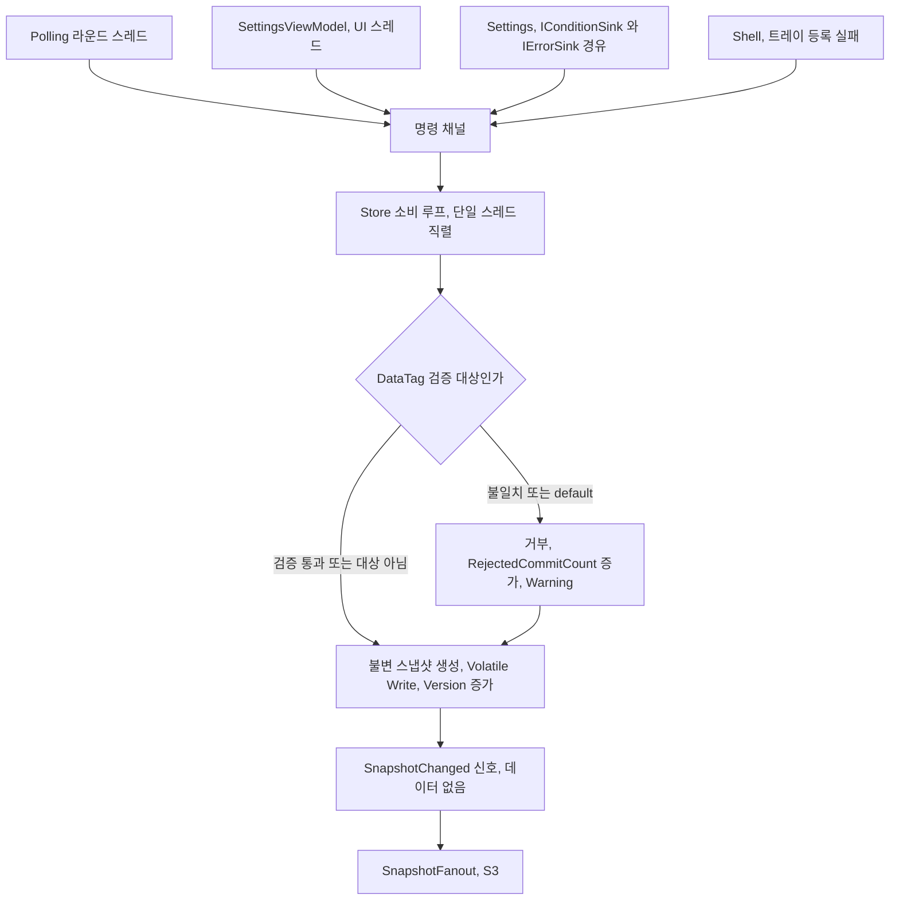

# S2 — 저수준 설계 (LLD): Core 절반 (`net8.0`)

| | |
|---|---|
| 문서 상태 | **제4판 — 최종 정합성 마감 지시서 반영. FR-08-6 영속 필드(B1) 신설, D-PL1 철회, ViewModelRefreshFailing 회귀 테스트 추가** |
| 작성일 | 2026-08-15 |
| 상위 문서 | `docs/design/01-hld.md` **개정 7판** (입력 명세, D1–D22 확정) · `docs/design/00-api-contract.md` (**데이터 계약, 구속력 있음**) · `docs/design/00-shell-measurements.md` (**Win32·렌더링 실측, 구속력 있음**) · `docs/REQUIREMENTS.md` 개정 2판 |
| 범위 | `src/PoeOverlay.Core` (`net8.0`) 의 8개 모듈 — `Domain` · `Localization` · `Pricing` · `Market` · `Store` · `Polling` · `Settings` · `Diagnostics` |
| **범위 밖** | `Shell` 전부(창·트레이·Win32 interop·오버레이 높이/클리핑/기하)와 `Presentation`의 뷰모델 셋·`SnapshotFanout`·`IOverlayModeService`. **→ S3.** 이들이 소비하는 것은 §10에서 *경계의 모양*까지만 정의하고 멈춘다 |
| 추상 수준 | 타입·관계·불변식·상태기계·알고리즘. **메서드 시그니처·JSON 속성명·오류 코드 문자열·테스트 프로젝트 배치는 S4** |
| 표기 규약 | **【측정】** = 프로브 빌드로 확인한 사실. 추론보다 우선하며 이와 어긋나는 설계는 무효다 · **【신규】** = 이 문서의 결정 · **→ S4** = 의도적 유예 · **【확인】** = 검증되지 않은 전제, 구현 착수 시 1회 확인 |

---

## 0. 개정 이력

### 0.1 제2판 — 측정이 초판의 세 가지 전제를 깼다

초판은 방향이 옳다는 판정을 받았다(추적 24개 ID 중 19 충족 / 5 부분 / **0 위반**). §1.5의 실패-값화, D-D4의 성공/실패 분리, D-MK1의 "존재하지 않는 필드는 잘못 쓸 수 없다", D-MK2의 엄격도 분리, D-ST1의 `DataTag`, §8.6의 값-큐잉, §4.6의 층상 폴백은 전부 유지된다. 제2판이 고치는 것은 **자기 방법론을 지키지 못한 자리**와 **측정이 반박한 자리**다.

**측정이 반박한 것**

| # | 【측정】 사실 | 반영 |
|---|---|---|
| M-1 | `NumberHandling=Strict`에서 `"primaryValue": "0.5"` 하나가 **문서 전체**를 죽인다. 건강한 line도 함께 사라진다. `1e300`(decimal 초과)·`NaN` 리터럴도 같다 | §5.5.2의 "관용은 line 원소에"는 **널 허용만** 산다. `lines`를 `JsonElement[]`로 받아 **원소별 역직렬화**로 전환 (§5.2/§5.5.2) |
| M-2 | **`required`는 JSON `null`을 막지 못한다.** `{"core":null}`이 성공적으로 역직렬화되고, 이어지는 `lines.Length`가 `NullReferenceException`을 던져 `JsonException`이 아니므로 `Market` 밖으로 샌다 | 골격 널 검사 2′ 신설 + `Market` 진입점 경계 `catch` + §9.5 허용 목록에 `Market` 행 (§5.5.3/§5.10/§9.5) |
| M-3 | **`default(구조체)`는 조용하다.** `default(ItemId).ToString()`이 **null**을 반환하고 사전 키로 정상 동작한다. `default(DataTag)`는 `League=null, DataEpoch=0`이며 기동 직후 기준값도 같아 **§6.4의 두 `!=` 검사를 통과한다** | `IsEmpty`/`TryCreate`/`ToString` 보정 + **Release에서 사는 관문**(§6.4) + `DataLeague` 기준값 도입 (§2.1/§2.11/§6.4) |
| M-4 | **`TryWrite`는 `Complete()` 이후 false**를 반환하고, `ReadAllAsync(취소된 토큰)`은 버퍼 5건 중 **0건**을 배수한다 | §6.6의 조건 2·3 전면 수정. `Post`가 반환값을 검사하고, `StopAsync`는 **취소 없이** 완료를 기다린다 (§6.1/§6.6) |
| M-5 | **`Pricing`이 세 곳에서 던진다.** `Pct(1e300)`·`Pct(1e30)`의 `(decimal)` 캐스트 `OverflowException`, `194.6m / 1e-28m`의 `OverflowException` | `Pct`를 `double`로 유지, `MinPrice` 하한 가드 신설 (§4.2/§4.4) |
| M-6 | **`{{0}}c`가 §4.6.2의 세 그물을 전부 통과**해 `{0}c`를 출력한다 — §4.6.1이 "기능의 소멸"이라 부른 그것. 그리고 3층의 근거는 틀렸다(`{0:X}`는 인자가 `string`이라 무해하다) | 2층을 **센티널 검증**으로 교체, 3층의 실직무를 **인자 개수 불일치**로 정정 (§4.6.2) |
| M-7 | §10.3의 `Ui(key, params string[])`로는 **원시 템플릿을 얻을 수 없다** — 빈 배열 서식이 `FormatException`을 던지고 그것이 `Localization` 안에서 터진다 | `TryGetTemplate` 분리 (§10.3) |
| M-8 | **`repollGate`가 신호를 삼킨다.** 틱이 이기면 버려진 대기자가 다음 `Release`를 가로채고 현재 대기자는 아무것도 보지 못한다 — 재폴링이 **매 틱마다 유실**된다. 덤으로 §7.2의 근거도 틀렸다: `PeriodicTimer`는 이미 놓친 틱 하나를 버퍼한다 | 트리거 채널 단일화 (§7.2). `pendingTick` 보존은 유지하되 **근거를 정정** |
| M-9 | **`PeriodicTimer.Period` 변경은 대기를 변경 시점부터 다시 시작한다** — 【구현 4단계 재측정으로 정정】. 초판이 인용한 관측(3000ms 대기 중 150ms → 156ms 발화)은 **두 해석 모두와 양립해 구별하지 못했다.** 재측정: 5초 주기를 t=3.01s에 30초로 바꾸자 **t=33.02s에** 발화(t=30이 아니다), 3초 주기를 1.0s 경과 시점에 200ms로 바꾸자 **1,216ms에** 발화(변경 후 ≈204ms) | §7.7의 【확인】 종결. PL18 기대값 정정 |
| M-10 | **`default(DateTimeOffset)`은 `0001-01-01`** — §10.5의 `PollingStopped`가 첫 30초 틱에서 참이 된다 | `Heartbeat.LastRoundAttemptAt`을 널 허용으로 (§2.8/§10.5) |
| M-11 | `MarketResult<T>` 구조체는 `WarningsAsErrors=nullable`에서 **소비 코드가 빌드되지 않는다**(CS8602). `MemberNotNullWhen`을 붙이면 `default`가 "성공"을 주장한다 | 추상 레코드 계층으로 교체 (§1.5/§5.6) |
| M-12 | `EquatableArray<T>`가 `GetHashCode`·`object.Equals`를 재정의하지 않으면 `HashSet`이 중복을 제거하지 못한다. 다만 §8.3의 **동등성 체인 자체는 성립**한다 | §2.4 보강, §8.3의 근거 문장 정정 |
| M-13 | CA2007은 **`await foreach`·`await using`을 잡지 않는다.** 둘 다 CA2007·CA1031은 기본 비활성이므로 `.editorconfig`의 severity가 곧 활성화다 | §1.4 명시 |
| M-14 | §5.3의 다섯 옵션은 **전부 .NET 8 기본값**이다. 위험은 `JsonSerializerDefaults.Web`이 `PropertyNameCaseInsensitive`를 켜 D8-b의 감지력을 파괴하는 것 | 옵션을 **테스트로 고정** (§5.3/§11.7) |
| M-15 | 확인된 정상: §4.3 서식 전 사례가 문자 단위로 재현(`999.96 → 1,000.0`, `1.845 → 1.85`, `3040.1499 → 3,040`), `194.6m/194.6m == 1m` 정확, `decimal`의 0 나눗셈은 예외(D-D3 근거 유지), D-C3의 폴더 범위 면제 동작, `Task.Delay(TimeSpan, TimeProvider, ct)` 존재, `FrozenDictionary`의 레코드 구조체 키 | 변경 없음 |

**차단 결함 (전부 해소)**

| # | 문제 | 조치 |
|---|---|---|
| B1 | **`LeagueResolution`을 `Resolved`로 만드는 생산자가 없어 첫 라운드 전체가 거부된다.** 앱이 영원히 `Loading`에 머문다 | 검증 기준값을 `(DataLeague, DataEpoch)`로 바꾸고 **`BeginNewLeague`가 셋을 원자적으로** 설정 (§2.11/§6.2/§6.4). §11.8에 S0 신설 |
| B2 | **`Settings → Store`가 §1.2를 위반**하는데 배선이 어디에도 없다. 조건이 배너에 도달할 유일한 경로 | `Domain`에 포트 인터페이스 신설(D-C5, §2.13). 의존을 역전시켜 §1.2를 그대로 지킨다 |
| B3 | **INV-5가 FR-03-3과 모순** — 리그 재확정 실패가 데이터를 지우게 만든다 | `DataLeague` 도입 후 INV-1/INV-3/INV-5 재작성 (§2.11) |
| B4 | `ErrorRecord`가 여전히 미정의 | §2.12에서 정의 |
| B5 | §11의 기대 문자열이 내장 사전과 충돌 | **영문으로 통일**하고 한국어는 주석으로 강등 (§11). `ui.price.unavailable` 신설 |
| B6 | 엄격 역직렬화 하에서 line 스킵 전략 미정 | `JsonElement[]` 원소별 역직렬화 채택 (§5.5.2) |
| B7 | `repollGate` 신호 유실 | 트리거 채널 단일화 (§7.2) |
| B8 | `"lines": null`이 폴링 루프를 영구히 죽인다 | 골격 널 검사 + 경계 catch + 허용 목록 등재 (§5.5.3/§5.10/§9.5) |
| B9 | **지속적 커밋 거부가 사용자에게 도달하지 않는다** — 화면이 무기한 정지하고 모든 지표가 정상을 가리킨다 | `CommitRejected` 조건 신설 + `RejectedCommitCount` 소비자 등록 + `settings.League` 정규화 (§6.4/§7.3/§10.5) |

**정정 17건**은 각 절에 반영했고, §12는 그대로 유지·확장했다.

### 0.2 제3판 — S3(`03-lld-shell.md` 제4판) §13의 검증된 42행 개정 목록을 반영

S3 제4판 §13이 원문 대조로 재검증한 42개 항목 가운데 이 문서(S2)를 대상으로 하는 개정 요구를 반영했다. 실패로 확인된 행은 없었다.

- **S3 §8.1/§10.1이 요구한 것(P4, S3 §13-28)** — §2.11의 `AppConditionKind` 저장 그룹에 `ViewModelRefreshFailing`을 신설했다(`LoggingUnavailable` 다음). 이 멤버 없이는 S3의 `Store` 조건 저장 시도가 런타임에 거부되고 D-PS10이 죽은 코드가 된다 — **이 개정이 S3 설계 전체를 구현 가능하게 만드는 단일 변경이다.**
- **S3 §1.4의 CA2007 면제 확장(D-SH1, S3 §13-39)** — §1.4 D-C3의 문서화된 예외를 `Presentation/` 폴더 하나에서 `Presentation/` + `Shell/` 프로젝트 전체(단 `Interop/`의 순수 I/O 지점은 개별 재활성)로 넓혔다.
- **S3 §8.4의 P1 논증(M8, S3 §13-41)** — §6.3에 "모든 `Store` 명령 적용은 예외 없이 `SnapshotChanged`를 발신한다"는 산문을 mermaid 간선 `AP → EV`의 귀결로 명시하고, §11.8에 회귀 테스트 항목(S16)을 추가했다.
- **§12-5 처리 완료로 등재(S3 §13-35)** — 인스턴스 신호 큐잉 주장의 범위를 좁히는 처방이 HLD D18-d 채널 행 개정(`SendMessageTimeout` 채택)으로 반영됐다.

세부 근거와 원문 대조는 `03-lld-shell.md` §13을 참조.

### 0.3 제4판 — 최종 정합성 마감 지시서 반영

검증 3종을 통합한 마감 지시서(`docs/design/_wip/final-consistency-punchlist.md`)의 지적 가운데 이 문서를 대상으로 하는 항목을 반영했다.

- **B1 — FR-08-6 영속 필드 신설.** §8.1 `AppSettings` 레코드에 `FirstRunAcknowledged`(`bool`) 위치 매개변수를 추가하고, §8.2 검증표에 행을 추가(불리언이므로 파싱 실패 시 `false`), §8.4 키 판독 경로(6번, 키별 판독)에 포함시켰다. HLD §7 스키마·§8 FR-08-6 소유 행과 1:1을 회복한다.
- **B7 — §7.9의 D-PL1을 철회한다.** S3 §2.2(D-SH2)가 이미 이 잠정안을 대체했다 — `PollingStopped`의 "라운드 재개"는 인-프로세스 재기동이 아니라 프로세스 재시작(`LoopExited` 갈래)과 하트비트 자연 회복(그 외 갈래)으로 성립하며, 이 결정에는 `Presentation → Polling` 간선이 필요 없다. §12.3의 "차단 후보 13+14"도 **처리 완료**로 각인한다.
- **§11.8에 회귀 테스트(S17) 추가** — `ViewModelRefreshFailing`이 §2.11의 저장 그룹에 실제로 등재돼 `Store`가 그 조건을 거부하지 않음을 단언한다(S3 P4/B3가 전제하는 개정이 실제로 성립하는지의 회귀).
- **§10.3의 `ITemplateSource` 라벨 완화** — "`Pricing` 전용" 주석이 S3 §9.3의 재사용(`ILocalizer : ITemplateSource`)과 문면상 어긋난다는 지적을 반영해 정정했다.
- **§12의 판정 재확인** — 이 문서가 신설한 이슈 1·9·11·16·24·33·34번은 HLD 개정 7판이 전부 반영했다(§12.3 참고 각주). 5번은 이미 이전 판에서 처리 완료로 등재돼 있었다.

---

## 1. 공통 규약 — 전 모듈에 선행하는 제약

### 1.1 물리 배치와 이름 공간

```
src/PoeOverlay.Core/
  Domain/         PoeOverlay.Core.Domain
  Domain/Ports/   PoeOverlay.Core.Domain.Ports
  Diagnostics/    PoeOverlay.Core.Diagnostics
  Localization/   PoeOverlay.Core.Localization
  Pricing/        PoeOverlay.Core.Pricing
  Market/         PoeOverlay.Core.Market
  Store/          PoeOverlay.Core.Store
  Polling/        PoeOverlay.Core.Polling
  Settings/       PoeOverlay.Core.Settings
  Presentation/   PoeOverlay.Core.Presentation   ← S3
```

**폴더 = 모듈 = 이름 공간.** 컴파일러가 강제하는 경계는 어셈블리 하나뿐이므로(HLD §2.1) 눈으로 검증 가능한 형태를 유지한다.

### 1.2 §2.3 의존 방향을 타입 수준으로 재진술

| 모듈 | 참조해도 되는 타입 | 참조하면 안 되는 것 |
|---|---|---|
| `Domain` | (없음) | 전부 |
| `Diagnostics` | (없음) | 전부. `Domain`조차 참조하지 않는다 — `LogEntry`의 카테고리는 `string`으로 받는다 |
| `Localization` | `Domain.ItemId`, `Diagnostics` | `Pricing`·`Store`·`Settings` |
| `Pricing` | `Domain.*`, `Localization.ITemplateSource` | **`Diagnostics` 포함 그 외 전부** (§1.5) |
| `Market` | `Domain.*`, `Diagnostics`, `IHttpClientFactory` | `Store`·`Settings`·`Polling`·`Pricing` |
| `Store` | `Domain.*`, `Diagnostics` | `Market`·`Settings`·`Polling`·`Localization` |
| `Settings` | `Domain.*`(**포트 포함**), `Diagnostics` | `Store`·`Market`·`Polling` |
| `Polling` | `Domain.*`, `Market`, `Store`, `Settings`, `Diagnostics`, `Pricing.StalenessPolicy` | `Presentation`·`Shell` |

**【신규 D-C1】 `Localization`의 허용 의존에 `Domain`을 추가한다.** HLD §2.2 표는 `Diagnostics`만 허용하지만 §2.3 그래프에는 `LOC --> DOM` 화살표가 있다. 아이템 이름 조회의 키가 `Domain.ItemId`이므로 그래프를 채택한다. → §12-11

**【신규 D-C2】 `Polling → Pricing`을 허용한다.** 단 **`Pricing.StalenessPolicy` 한 타입**에 한하며, 그 타입의 멤버는 `refreshIntervalMinutes` 하나만 받는 순수 정적 함수다. 근거: `RateMaxAge`·노후 임계·하트비트 임계가 세 모듈에서 필요한데 상수를 복제하면 주기 변경 시 한쪽만 갱신되는 사고가 난다. 무순환은 유지된다. **이것은 HLD §2.2의 `Polling` 의존 행을 넓히는 결정이므로 D-C1과 동일하게 §12에 등재한다.** → §12-34

**【신규 D-C5】 `Settings`(와 `Shell`)가 `Store`에 조건·오류를 싣는 경로는 `Domain`의 포트다.** §1.2는 `Settings → Store`를 금지하는데 §2.11은 `SettingsWriteFailed`·`SettingsCorrupt`·`SettingsReadOnly`가 "스토어를 통과하지 않으면 오버레이 배너에 도달할 수 없다"고 요구한다. 두 진술을 동시에 지키는 방법은 **의존 역전** 하나다.

```
Domain/Ports/
    interface IConditionSink { void Set(AppConditionKind kind, bool active, string? detail); }
    interface IErrorSink     { void Report(ErrorRecord error); }
```

`Store`가 둘을 구현하고(프로세스 내 유일 구현체), `Settings`·`Shell`은 **포트만** 안다. 기각한 대안 둘: ① `Shell`이 중계 — 조건이 UI 생사에 종속되고 `Shell`이 `Settings`의 내부 상태를 알아야 한다. ② §1.2 개정 — `Settings → Store` 화살표가 생기면 `Store`의 소비 루프가 다시 설정 경로와 얽힌다. 포트는 인터페이스 선언일 뿐이므로 D-D0의 "`Domain`에 로직 없음"과 충돌하지 않는다.

### 1.3 시각

- **`DateTimeOffset.UtcNow`가 유일한 시각 원천**이다. `DateTime.Now`·`DateTime.UtcNow`·`Environment.TickCount`를 쓰지 않는다.
- 그러나 **`DateTimeOffset.UtcNow`를 직접 부르는 코드도 없다.** 상태를 가진 모듈(`Market`·`Store`·`Polling`·`Settings`·`Diagnostics`)은 **`TimeProvider`를 주입**받아 `provider.GetUtcNow()`를 쓴다. 테스트는 `FakeTimeProvider`로 라운드·디바운스·만료를 결정적으로 구동한다.
- **`Pricing`에는 `TimeProvider`조차 없다.** 시각은 전부 `DateTimeOffset` 인자다(HLD §2.3 규칙 4). "테스트가 클록을 안 놓아도 된다"가 아니라 "**놓을 자리가 타입에 없다**"는 뜻이다.
- 저장·로그·비교는 전부 UTC. 지역 시각 변환은 View의 관심사(S3).
- 지속 타이머는 `PeriodicTimer`(폴링) 하나뿐이며 `TimeProvider` 기반. `Settings` 디바운스는 `TimeProvider.CreateTimer`. 【측정】 `Task.Delay(TimeSpan, TimeProvider, CancellationToken)`이 `net8.0`에 존재하므로 게이트웨이의 간격·에이징도 가짜 클록으로 구동된다.
- **`default(DateTimeOffset)`은 `0001-01-01`이며 "값 없음"이 아니다** 【측정】. 시각 필드에서 "아직 없음"을 표현할 때는 반드시 `DateTimeOffset?`을 쓴다(§2.8).

### 1.4 비동기

- **`Core` 내부의 모든 `await`에 `ConfigureAwait(false)`.** 근거: `host.Start()`가 동기화 컨텍스트 없는 스레드에서 호출되지만(HLD §3.5), 사용자 개시 조회는 UI 컨텍스트에서 시작되므로 `Market`·`Store`·`Settings` 코드가 UI 스레드로 재개될 수 있다.
- **`await foreach`와 `await using`도 포함한다** — `.ConfigureAwait(false)`를 명시적으로 붙인다. 【측정】 **CA2007은 이 둘을 잡지 않는다.** 하필 그 둘이 §6.3의 소비 루프와 §8.5의 원자적 쓰기, 즉 §1.4의 근거가 가장 강한 두 자리다.
- **문서화된 예외는 둘이다** — `Presentation` 폴더의 async 명령(S3, D-C3)과 `Shell/` 프로젝트 전체(S3, D-SH1 — UI 스레드 재개가 필요한 이벤트 핸들러 전반).
- **강제 수단 【신규 D-C3】**: `Directory.Build.props`에서 **`CA2007`을 오류로 승격**하고, `Presentation/`과 `Shell/`(단 `Interop/`의 순수 I/O 지점은 개별 `#pragma warning restore CA2007`로 재활성, S3 §1.4)에 `severity = none`을 **사유 주석과 함께** 둔다. 【측정】 폴더 범위 면제는 설계대로 동작한다. **CA2007·CA1031은 기본 비활성이므로 `.editorconfig`의 severity 지정이 곧 활성화**다 — "이미 켜져 있다"고 가정하면 아무것도 검사되지 않는다.
- `OperationCanceledException`은 **오류가 아니라 제어 흐름**이다. 실패값으로 변환하지 않고 그대로 전파한다.

### 1.5 실패 표현 — 예외 대신 값

| | |
|---|---|
| 규칙 | `Market`·`Settings`의 실패는 **반환값**이다. 예외는 프로그래밍 오류와 취소에만 쓴다 |
| 근거 | D15의 "결과 없는 catch 금지"를 강제 가능하게 만든다. 실패가 값이면 `Polling`의 유효성 게이트가 **순수 함수**가 되고 테스트가 예외 잡기가 아니라 값 단언이 된다 |
| 형태 | **추상 레코드 계층**이다 (§5.6). 【측정】 구조체 판은 `WarningsAsErrors=nullable`에서 소비 코드가 CS8602로 빌드되지 않고, `MemberNotNullWhen`을 붙이면 `default(MarketResult<T>)`가 "성공"을 주장하며 `Value`는 null인 상태가 된다 — 분석기가 승인한 NRE다 |
| `Pricing`의 실패 | 예외도 실패값도 없다. 입력이 불가능하면 `PriceDisplay.Unavailable`을 반환한다. **`Pricing`은 절대 던지지 않는다** — 바인딩 시점에 도는 코드가 던지면 D12의 허용 목록을 오염시킨다. 【측정】 초판은 세 경로에서 이 규약을 어겼다(§4.2/§4.4) |
| **경계 catch** | 그럼에도 `Market`의 카테고리 진입점에는 **경계 `catch (Exception)`**이 있다(§5.10). 【측정】 `required`가 JSON `null`을 막지 못해 `NullReferenceException`이 새어 나오기 때문이며, 그 catch는 §9.5의 허용 목록에 명시적으로 등재된다 |
| `Pricing`에 `Diagnostics`가 없는 이유 | 【신규 D-C4】 미지 `maxVolumeCurrency` 기록을 **`Market` 매핑 시점으로 옮긴다.** `Market`은 응답당 각 line을 정확히 1회 훑고 이미 억제 채널을 갖는다. **`Market`이 기록하고 `Pricing`이 판단한다.** 단 두 곳의 판정 술어가 같아야 한다 — 둘 다 `Trim()` + `OrdinalIgnoreCase`다(§4.1/§5.4) |

### 1.6 널 허용

`Nullable=enable` + `WarningsAsErrors=nullable`(HLD §9).

- `null!`·`default!`·`= null!` **금지.** 필요해지면 타입 설계가 틀린 것이다.
- 레코드 **클래스**는 위치 매개변수 또는 `required init` 속성만 쓴다.
- **구조체는 `default`를 막을 수 없다** 【측정】. 언어가 무인자 생성을 강제하므로 "무인자 생성자를 노출하지 않는다"가 성립하지 않는다. 규칙을 바꾼다: **구조체는 `default`를 정의된 무해한 상태로 취급해야 한다.**
  - `ToString()`은 절대 null을 반환하지 않는다 — `default(ItemId).ToString()`이 null을 돌려주는 것은 `object.ToString()` 계약 위반이다.
  - `IsEmpty` 속성을 두어 "비어 있음"을 **말할 수 있게** 한다.
  - **`Debug.Assert`는 방어가 아니다** — 사용자가 실행하는 유일한 빌드에서 사라진다. `default`가 실제로 해를 끼치는 지점에는 **Release에서도 사는 관문**을 둔다(§6.4).
- **"없음"이 의미를 가지면 `T?`가 아니라 명시적 케이스로 만든다** — `DivineRate?`의 부재가 UI에서 `RatePending`이라는 *상태*인 것처럼(D1).
- 컬렉션 속성은 `IReadOnlyList<T>`/`IReadOnlyDictionary<K,V>`이며 **절대 null이 아니다.**

### 1.7 직렬화

`System.Text.Json` + **소스 생성**. 경계마다 `JsonSerializerContext`가 하나씩 있다.

| 컨텍스트 | 모듈 | 방향 | 엄격도 |
|---|---|---|---|
| `NinjaJsonContext` | `Market` | 읽기 전용 | **엄격** (§5.3) |
| `SettingsJsonContext` | `Settings` | **쓰기 전용** | — |
| `LocalizationJsonContext` | `Localization` | 읽기 전용 | 관대 |

설정 **읽기**는 직렬화기를 쓰지 않고 `JsonDocument` 수동 판독이다(§8.4). `IConfiguration`/`IOptions<T>`는 쓰지 않는다(D14).

**【측정】 §5.3의 다섯 옵션은 전부 .NET 8 기본값이다.** 즉 §5.3을 적어 두는 것만으로는 아무것도 고정되지 않는다. 실제 위험은 누군가 `JsonSerializerDefaults.Web`을 쓰는 것이며 그러면 `PropertyNameCaseInsensitive`가 켜져 **D8-b의 감지력이 조용히 파괴된다.** 옵션 값을 **테스트가 단언한다**(§11.7 M22).

---

## 2. `Domain` — 타입 목록과 불변식

### 2.0 모듈 계약

**【신규 D-D0】 `Domain` 타입은 자기 검증을 하지 않는다.** 생성자에서 던지지 않고, 정규화하지 않고, 기본값을 채우지 않는다. 불변식의 **강제 책임은 생산자**(`Market` 매퍼, `Settings` 검증기, `Polling` 라운드)에 있고 `Domain`은 그것을 문서로 선언한다.

근거 둘. ① HLD §2.2가 "로직 없음"을 요구한다. ② D8은 매핑 실패를 **분류된 실패값**으로 다루라 하는데, 레코드 생성자가 던지면 그 실패가 예외 경로로 새어 §1.5를 깬다.

**단, 판정 없는 편의 멤버는 로직이 아니다.** `IsEmpty`·`ToString`·`TryCreate`는 §1.6이 요구하는 최소한이며 D-D0의 예외가 아니라 그 바깥이다.

### 2.1 식별자

```
readonly record struct ItemId(string Value)
    string  ToString()      => Value ?? string.Empty      // object.ToString 계약 준수
    bool    IsEmpty         => string.IsNullOrWhiteSpace(Value)
    static bool TryCreate(string? raw, out ItemId id)     // 생산자 전용
```

| 불변식 | |
|---|---|
| `Value`는 공백이 아니다 | 생산자(`Market` 매퍼·`Settings` 검증기)가 `TryCreate`로 강제 |
| 비교는 **서수, 대소문자 구분** | API가 소문자-하이픈만 내보낸다. `FrozenDictionary` 키로 정상 동작한다 【측정】 |
| `default(ItemId)`는 **무효** | 그러나 【측정】 조용하다 — `GetHashCode()`가 0을 반환하고 사전 키로 동작하며 보간 문자열에서 `[]`가 된다. **Debug 단언만으로는 부족**하므로 `Store.Apply`가 커밋 경로에서 관문을 둔다(§6.4) |
| 정규화하지 않는다 | 받은 그대로 보관 |

**FR-01-5(관심목록 키)와 FR-07-2(번역 키)가 같은 타입을 쓴다.** 세 개의 `string` 공간(슬러그 / 카테고리 토큰 / 사전 키)이 섞이는 것을 컴파일러가 막는다.

### 2.2 카테고리

```
enum ExchangeCategory : int      // 닫힌 18종, HLD §7.3
  Currency=1, Fragment=2, Runegraft=3, AllflameEmber=4, Tattoo=5, Omen=6,
  DjinnCoin=7, Ducat=8, EnshroudingCrystal=9, DivinationCard=10, Artifact=11,
  Oil=12, DeliriumOrb=13, Scarab=14, Astrolabe=15, Fossil=16, Resonator=17, Essence=18
```

| 규칙 | 내용 |
|---|---|
| 와이어 토큰 | **열거 멤버 이름이 곧 `type=` 질의 문자열**이다. 별도 매핑표를 두지 않는다 |
| **검증되지 않았다** | 18종 중 실측으로 확인된 것은 `Currency`·`Scarab`·`Essence` 셋뿐이고, 카테고리 목록 엔드포인트는 404다(계약 §1.2). **오타는 404가 아니라 HTTP 200 + 정상 형식 빈 본문**을 낳아 §5.5.3이 `EmptyLines`로, §7.7이 ×8 쿨다운으로 묻는다 — 철자 실수가 네트워크 장애와 구별되지 않는다. → §12-27 |
| 숫자 값 | 명시적으로 고정. 로그·정렬에 쓰이므로 재배열 시 과거 로그가 거짓이 된다 |
| 정렬 | 이 숫자 순서가 **결정적 순서**다 |
| **`Unknown` 멤버 없음** | 【신규 D-D1】 미지 문자열은 `CategoryRef`로 표현한다. `Unknown`을 두면 서로 다른 세 미지 문자열이 하나로 뭉개져 D17/Q2의 "**버리지 않고 보존**"이 성립하지 않는다 |

```
readonly record struct CategoryRef(string Raw, ExchangeCategory? Known)
    bool IsUnresolved => Known is null
```
- 불변식: `Known is not null ⇒ Raw == Known.Value.ToString()`.
- **`Settings`의 관심목록 항목에서만 쓴다.** `Market`·`Store`·`Polling`은 `ExchangeCategory`만 다룬다.

### 2.3 표시 통화

```
enum DisplayCurrency  { Auto, Chaos, Divine }     // 사용자 의도
enum ResolvedCurrency { Chaos, Divine }           // 해석 결과
```

**두 개인 이유**: `Pricing`의 출력과 서식 분기가 `Auto`를 받을 수 없어야 한다. 하나로 두면 모든 `switch`에 도달 불가능한 `Auto` 가지가 생긴다.

`DisplayCurrency?`의 `null`은 **"생략됨 = 전역 기본값 상속"**이며 명시적 `Auto`와 **다르다**(§4.1).

### 2.4 관심목록 항목과 `EquatableArray`

```
record WatchlistEntry(ItemId Id, CategoryRef Category, DisplayCurrency? DisplayCurrency)
```

| 불변식 | 강제자 |
|---|---|
| `Id.IsEmpty == false` | `Settings` 검증기 — 위반이면 **항목 자체를 버린다**(유일한 파기 사유) |
| 리스트 내 `Id` 유일 | `Settings` 검증기 — 중복은 **첫 항목 우선** |
| 순서 보존 | `Settings` — 사용자가 넣은 순서가 오버레이 행 순서다 |
| `Category.IsUnresolved`인 항목도 **보존** | `Settings`. 요청 집합에 들어가지 않고 "미해결" 행으로 표시된다 |

```
sealed class EquatableArray<T> : IReadOnlyList<T>, IEquatable<EquatableArray<T>>
    where T : IEquatable<T>
{
    // 생성 시 배열을 복사한다
    // Equals(EquatableArray<T>) · Equals(object) · GetHashCode() · == · != 전부 구현
    // 해시는 불변이므로 1회 계산 후 캐시
}
```

**【신규 D-D2】** `AppSettings.Watchlist`는 `IReadOnlyList<T>`가 아니라 이 래퍼를 쓴다. 레코드 기본 동등성이 참조 비교로 무너지면 "값이 그대로인 저장"이 매번 `SettingsChanged`를 발화시키고 D11의 재폴링 판정이 무한 재입력된다.

【측정】 **네 가지를 전부 구현해야 한다.** `Equals`만 재정의하면 내용이 같은 두 인스턴스의 해시가 달라 `HashSet<AppSettings>`가 중복을 제거하지 못하고 `w1.Equals((object)w2)`가 false가 된다. 그리고 **생성 시 복사**가 필수다 — 외부가 배열 참조를 쥔 채 원소를 바꾸면 캐시된 해시가 거짓말을 한다.

**하중을 지는 세부**: 동등성이 성립하는 이유는 `AppSettings`의 **선언 타입**이 `EquatableArray<T>`이기 때문이다. `IReadOnlyList<T>`로 되돌리면 **컴파일 오류 없이** D-D2의 무한 재입력이 되돌아온다.

### 2.5 아이템 시세

```
record ItemPrice(
    ItemId              Id,
    string?             ApiName,              // core.items[].name — 조인 실패 시 null
    decimal             PrimaryValue,         // core.primary(=chaos) 단위
    double?             VolumePrimaryValue,   // 결측 허용 (§12.1-4 로 보존, FR-04-1 로 미표시)
    string?             MaxVolumeCurrency,    // 원시 토큰. 정규화하지 않는다
    decimal?            MaxVolumeRate,        // 검산용. 계산 입력으로 쓰지 않는다
    double?             TotalChangePercent,   // sparkline.totalChange
    ExchangeCategory?   SelfReportedCategory) // core.items[].category, 계약 A6
```

| 불변식 | 비고 |
|---|---|
| `PrimaryValue > 0` **그리고** `>= MinPrice` | `Market`이 강제. 위반 line은 매핑에서 제외되고 D8-b에 계상된다. 하한이 필요한 이유는 §4.2 |
| `ApiName`이 null이어도 유효 | 폴백 체인 ④가 없어지고 ⑤로 내려갈 뿐이다 |
| **`VolumePrimaryValue`가 널 허용인 이유** | 비널로 두면 결측이 조용히 `0`이 된다. 그렇다고 결측만으로 line을 버리면 **표시하지도 않는 필드 때문에 가격을 버리는** 셈이다(FR-04-1). 널 허용이 유일하게 정직한 선택이다 |
| `MaxVolumeCurrency`는 **원시 그대로** | `Pricing`이 순수 스위치로 해석하고, 미지 값 기록은 `Market`이 한다(D-C4) |
| `MaxVolumeRate`는 보관만 | **어떤 계산 입력으로도 쓰지 않는다.** FR-04-5·D1. 【주의】 이 금지는 **산문뿐**이며 `core.rates`처럼 타입으로 막혀 있지 않다 — 그리고 행 5의 정답은 이 필드와 문자 단위로 같다(§4.3.6). → §12-28 |

### 2.6 카테고리 스냅샷 — 성공 데이터와 실패 상태를 분리

**【신규 D-D4】** D2의 `카테고리 → (항목 맵, 조회 시각, 상태, 리그, epoch)`를 **두 레코드로 쪼갠다.**

```
record CategorySnapshot(
    ExchangeCategory                        Category,
    IReadOnlyDictionary<ItemId, ItemPrice>  Items,
    decimal                                 MedianPrimaryValue,
    DateTimeOffset                          FetchedAt,
    string                                  League,
    int                                     DataEpoch,
    int                                     RawLineCount,
    SkipCounts                              Skips,
    IReadOnlyList<ItemId>                   SkippedIds,          // 상한 200
    bool                                    SkippedIdsTruncated,
    int                                     JoinMissCount,
    bool                                    ValidationBypassed)  // D8-e 강제 수용 (§7.5)

readonly record struct SkipCounts(int BlankId, int NonPositiveValue, int Duplicate, int ElementFault)
    int Total => BlankId + NonPositiveValue + Duplicate + ElementFault

record CategoryStatus(
    ExchangeCategory   Category,
    int                ConsecutiveFailures,
    DateTimeOffset?    LastAttemptAt,
    DateTimeOffset?    LastSuccessAt,
    DateTimeOffset?    CooldownUntil,
    FailureRecord?     LastFailure,
    int                ConsecutiveMedianJumps,
    DateTimeOffset?    LastForcedAcceptAt,
    bool               NeverNonEmpty)        // 한 번도 비어 있지 않은 적이 없다 (§12-27)
```

**분리 근거**: FR-03-3("실패가 값을 지우지 않는다")이 *구조적으로* 성립한다. 실패 경로는 `CategoryStatus`만 만지고 `CategorySnapshot`에는 손댈 방법이 없다.

| 불변식 | |
|---|---|
| `Items`는 **동결**됐다 | `FrozenDictionary`. 커밋 후 변경 없음 |
| `Items.Count >= 1` | `Market`이 강제(D8-a·b) |
| **모든 키가 `!IsEmpty`** | `Market`이 강제하고 `Store.Apply`가 Release에서 재확인한다(§6.4) |
| `MedianPrimaryValue > 0` | 매핑 시 1회 계산. D8-e를 O(1)로 만드는 유일한 수단 |
| `FetchedAt`은 **응답 매핑 완료 시각** | 요청 발행 시각이 아니다 |
| `League`/`DataEpoch` | 커밋 시점의 **데이터 세계** 태그. 라운드 태그가 아니다 — `RoundGeneration`은 붙지 않는다 |
| **`SkippedIds`** | 【신규】 스킵된 슬러그를 상한 200까지 보존한다. 없으면 "가격을 못 읽어서 빠진 항목"과 "존재하지 않는 항목"을 UI가 구별할 수 없고, HLD §6.4가 사용자에게 **멀쩡한 항목을 지우라고 말한다**(§10.5) |

### 2.7 `DivineRate`

```
record DivineRate(decimal ChaosPerDivine, DateTimeOffset AcquiredAt, string League, bool Inherited)
```

| 불변식 | |
|---|---|
| `ChaosPerDivine > 0` | `Polling`이 강제. `Currency` 응답 `id="divine"` line의 `primaryValue`(=194.6). **`core.rates.divine`의 역수는 금지**(D1) |
| **승계는 `AcquiredAt`을 다시 쓰지 않는다** | 승계 시 `Inherited=true`만 바꾼다. 갱신하면 만료 판정이 무한히 미뤄져 D9/D16 전체가 무력화된다. **이 레코드의 가장 중요한 불변식이다** |
| `League`도 다시 쓰지 않는다 | |
| `Inherited`는 단조 | 새 rate로 교체될 때까지 true |

### 2.8 라운드와 하트비트

```
record RoundContext(string League, int DataEpoch, int RoundGeneration,
                    int RoundNumber, DateTimeOffset StartedAt)
```
- `League`가 공백이 아니다. **리그 확정 이후에만 생성된다.**
- `DataEpoch`는 **데이터에 붙는 유일한 태그**이며 리그 변경에서만 증가한다.
- `RoundGeneration`은 **어떤 데이터에도 붙지 않는다.** `Polling` 내부에서만 읽히며 `Store`에 도달하지 않는다(§6.4).

```
enum RoundTrigger  { Startup, Scheduled, Repoll, LeagueChanged }
enum RoundOutcome  { Completed, PartiallyFailed, AllFailed, LeagueUnresolved, Canceled }
enum LoopExitKind  { Canceled, Faulted }

record Heartbeat(
    DateTimeOffset?  LastRoundAttemptAt,     // null = 아직 한 번도 시도하지 않았다
    int              LastRoundNumber,
    DateTimeOffset?  LastRoundCompletedAt,
    RoundOutcome?    LastOutcome,
    bool             LoopExited,
    LoopExitKind?    ExitKind,
    DateTimeOffset?  ExitedAt)
```

- 불변식: `LoopExited ⇒ ExitKind is not null && ExitedAt is not null`.
- `LastRoundAttemptAt`은 **성공·실패와 무관하게** 매 회차 시작에 기록된다(D20).
- **널 허용인 이유** 【측정】: `default(DateTimeOffset)`은 `0001-01-01`이므로 비널로 두면 §10.5의 정체 판정이 **첫 30초 틱에서 참**이 된다 — 오버레이가 `Loading`과 "폴링 중단" 배너를 동시에 띄운다. `null ⇒ 정체 아님`.

### 2.9 리그

```
record LeagueEntry(string Id, string Name)
enum   LeagueListStatus { Ok, Suspicious, Failed }
record LeagueList(IReadOnlyList<LeagueEntry> Entries, DateTimeOffset FetchedAt,
                  LeagueListStatus Status, string? FailureCode)
```

| 불변식 | |
|---|---|
| `Ok ⇒ Entries.Count >= 1` | |
| `Suspicious ⇒ Entries.Count >= 1` | 첫 원소가 `Standard`/`Hardcore`(계약 A4/D6). 목록 자체는 유효하므로 드롭다운은 채워진다 |
| `Failed ⇒ Entries.Count == 0 && FailureCode is not null` | |
| `Market`은 **판정만 하고 처분하지 않는다** | `Suspicious → LeagueUnresolved` 전이는 `Polling`의 결정이다(D6) |

```
record LeagueResolution(LeagueResolutionState State, string? League, string? ReasonCode)
enum   LeagueResolutionState { Pending, Resolved, Unresolved }
```
- `Resolved ⇔ League is not null`. `Unresolved ⇒ ReasonCode is not null`.

### 2.10 조회된 카테고리 목록 슬롯

```
record FetchedListing(IReadOnlyDictionary<ExchangeCategory, CategorySnapshot> ByCategory,
                      string League, int DataEpoch)
```

**【신규 D-D5】 라운드 커밋 맵과 합치지 않고 별도 슬롯으로 둔다.** 여기 담기는 것은 **문맥 검사(D8-c/e)를 통과하지 않은** 데이터다. 하나의 맵에 섞으면 검증 등급이 다른 데이터가 오버레이 표시 경로로 흘러들고 그 사실을 타입으로 구별할 수 없다. 교차 검색만이 두 슬롯을 함께 본다.

**관심목록 편집은 이 슬롯을 무효화하지 않는다.** 무효화 축은 리그 하나뿐이다(D9).

### 2.11 최상위 스냅샷

```
record MarketSnapshot(
    // ── HLD 가 요구한 여섯 가지 ──────────────────────────────
    IReadOnlyDictionary<ExchangeCategory, CategorySnapshot> Categories,   // 1
    DivineRate?                                            Rate,         // 2
    LeagueList?                                            Leagues,      // 3
    FetchedListing?                                        Listing,      // 4
    Heartbeat                                              Heartbeat,    // 5
    ErrorRecord?                                           LastError,    // 6
    // ── 부속 필드 ───────────────────────────────────────────
    IReadOnlyDictionary<ExchangeCategory, CategoryStatus>  CategoryStatuses,
    LeagueResolution                                       LeagueResolution,
    IReadOnlyDictionary<AppConditionKind, ConditionState>  Conditions,
    string?                                                DataLeague,   // ← 신규
    int                                                    DataEpoch,
    long                                                   Version,
    int                                                    RejectedCommitCount,
    int                                                    ConsecutiveEmptyCommitRounds)
```

| 필드 | 없으면 |
|---|---|
| `CategoryStatuses` | D-D4의 분리가 갈 곳이 없다. 실패 배지·쿨다운·재시도 UI의 유일한 출처 |
| `LeagueResolution` | `Leagues`(목록)와 "이번 라운드가 어느 리그로 확정됐는가"는 다른 것이다 |
| **`DataLeague`** | 【신규 D-D6】 **커밋 검증의 기준값이자 데이터가 속한 세계.** `LeagueResolution.League`를 기준으로 쓰면 두 가지가 깨진다 — ① 기동 직후 `null`이라 **첫 라운드의 모든 커밋이 거부**되고, ② 2회차에 리그 확정이 실패해 `Unresolved`가 되면 이미 받은 데이터의 소속을 말할 수 없다(INV-1이 공허해진다) |
| `Conditions` | 셸·설정이 생산하는 상태가 스토어를 통과하지 못하면 배너에 도달할 수 없다 |
| `DataEpoch` | 커밋 검증의 기준값. **`RoundGeneration`은 여기 없다** — 취소 토큰을 스냅샷에 실으면 `Store`가 취소를 오염으로 분류하게 되고 D9가 나누라고 한 두 사건이 다시 뭉개진다 |
| `Version` | 단조 증가. "몇 번 게시됐는가"를 단언하는 유일한 수단 |
| `RejectedCommitCount` | D9의 "조용히 버리지 않는다"를 **관측 가능하게** 만든다 |
| **`ConsecutiveEmptyCommitRounds`** | 【신규】 커밋이 한 건도 착지하지 않은 연속 라운드 수. `CommitRejected` 조건의 유일한 근거이며, 이것이 없으면 지속적 거부가 **모든 지표가 정상인 채로** 화면을 정지시킨다(§6.4) |

```
enum AppConditionKind {
    // 저장되는 것 (Conditions 사전에 들어간다)
    LeagueUnresolved, CommitRejected,
    SettingsWriteFailed, SettingsCorrupt, SettingsReadOnly, SettingsUnreadable,
    TrayUnavailable, LoggingUnavailable, ViewModelRefreshFailing,
    // 저장되지 않는 것 (표시 시점 파생 — Store 는 이 멤버를 쓰지 않는다)
    FetchFailed, RatePending, RateInherited, PollingStopped, ItemUnresolved, ItemDropped }

record ConditionState(bool Active, DateTimeOffset Since, string? Detail)
```

- **파생 여섯은 `Conditions`에 절대 들어가지 않는다.** 【S4 §19.8 개정】 `FetchFailed`가 저장 그룹에서 파생 그룹으로 옮겨졌다 — 저장 그룹에 선언돼 있었으나 **생산자도 소비자도 없었고**, 실제 표시는 §10.5가 `CategoryStatuses`에서 파생하고 있었다. `snapshot.Conditions[FetchFailed]`는 애초에 영원히 부재였다. 열거 멤버로 남기는 것은 S3의 배너·툴팁 집계기가 저장된 것과 파생된 것을 같은 축으로 다루기 위함이며, `Store`가 이 멤버로 `SetCondition`을 받으면 **거부한다**(Release에서도).
- `RatePending`이 파생으로 이동한 이유는 §10.5에, `SettingsUnreadable`의 신설 이유는 §8.7에 있다.

**최상위 불변식**

```
INV-1  DataLeague is not null
         ⇒ ∀ c ∈ Categories.Values : c.League == DataLeague
         ∧ (Rate    is null or Rate.League    == DataLeague)
         ∧ (Listing is null or Listing.League == DataLeague)
INV-2  ∀ c ∈ Categories.Values : c.DataEpoch == DataEpoch
INV-3  Listing is not null ⇒ Listing.DataEpoch == DataEpoch
INV-4  DataLeague is null ⇒ Categories.Count == 0 ∧ Rate is null ∧ Listing is null
INV-5  LeagueResolution.State 가 Resolved 에서 Unresolved 로 후퇴해도
         Categories · Rate · Listing 은 그대로 유지된다.
         데이터를 비우는 명령은 BeginNewLeague 하나뿐이다.
INV-6  Version 은 단조 증가하며 Volatile.Write 한 번에 정확히 1 증가한다
INV-7  DataEpoch 는 단조 증가하며 DataLeague 가 바뀌는 커밋에서만 증가한다.
         watchlist · refreshIntervalMinutes 변경은 DataEpoch 를 건드리지 않는다.
INV-8  BeginNewLeague 는 DataLeague · DataEpoch · LeagueResolution 셋을
         하나의 명령 안에서 함께 바꾼다. 셋 중 둘만 바뀐 상태는 존재할 수 없다.
```

> **INV-5는 초판의 정반대다.** 초판은 `State != Resolved ⇒ Categories.Count == 0`을 요구했는데, 1회차가 성공한 뒤 2회차에서 리그 엔드포인트가 죽으면 그 불변식을 지키는 유일한 방법이 **데이터를 버리는 것**이고, 그것은 FR-03-3("마지막 성공 값을 계속 표시한다")의 정면 위반이다. 만족 가능하지도, 바람직하지도 않은 불변식이었다. `DataLeague`가 데이터의 소속을 따로 들고 있으므로 후퇴는 표시 상태(배너)만 바꾼다.

**재태깅 문제는 소멸한다.** 관심목록 편집이 `DataEpoch`를 올리지 않으므로 기존 스냅샷의 태그는 여전히 현재 세계와 일치하고, 재태깅할 대상이 없다. 태그가 실제로 낡는 유일한 사건은 리그 변경이며 그때는 재태깅이 아니라 **전량 폐기**가 정답이다.

### 2.12 실패와 오류 레코드

```
enum FailureKind { Network, Timeout, HttpStatus, RateLimited, Deserialization,
                   EmptyLines, NoPricedLines, FieldMissingRatio,
                   PrimaryCurrencyMismatch, DivineLineMissing, MedianJump,
                   LeagueListInvalid, MappingFault }

record FailureRecord(FailureKind Kind, string Code, DateTimeOffset At,
                     int? HttpStatus, string? Detail, string? ExceptionType)

record ErrorRecord(DateTimeOffset At,
                   string  Module,        // "Polling" | "Market" | "Settings" | "Store" | "Shell"
                   string  Code,          // FailureRecord.Code 와 같은 문자열 공간
                   string  MessageKey,    // ui.error.* — 표시 문자열이 아니라 키다
                   string? Detail,        // 서식된 짧은 보조 문자열 (경로·카테고리명). 번역 대상 아님
                   string? Category,
                   string? League,
                   int?    RoundNumber,
                   string? ExceptionType)
```

- **`Canceled`가 `FailureKind`에 없다.** 취소는 실패가 아니라 제어 흐름이다(§1.4).
- **`ErrorRecord`가 문자열이 아니라 `MessageKey`를 나르는 이유**: 오버레이 배너와 트레이 툴팁이 이 값을 표시하는데, 영문 리터럴을 실으면 FR-07-1을 위반한다. 표시 시점에 `Localization`이 `MessageKey`를 푼다.
- `Exception` 객체를 싣지 않는다 — `Domain`이 수명·직렬화 문제를 갖게 된다.
- **`ErrorRecord`(`Domain`)와 `Diagnostics`의 최근 오류 링(`LogEntry`)은 다른 것이다.** §9.3.

### 2.13 포트 인터페이스 (D-C5)

```
Domain/Ports/
    interface IConditionSink { void Set(AppConditionKind kind, bool active, string? detail); }
    interface IErrorSink     { void Report(ErrorRecord error); }
```

`Store`가 유일한 구현체다. `Settings`·`Shell`은 이 둘만 알고 `Store`를 모른다. 두 메서드 모두 **동기이며 즉시 반환**한다 — 내부적으로 명령 채널에 넣을 뿐이다.

### 2.14 나머지 열거

```
enum ChangeDirection { Up, Down, Flat, Unknown }     // 글리프는 Pricing, 색은 View (HLD §6.3)
enum DisplayState    { Loading, Ready, Failed }      // HLD §6.5. Loading 은 흡수 상태가 아니다
enum RequestPriority { Polling, UserInitiated }      // D13
enum PriceForm       { ChaosOnly, ChaosWithDivine, ChaosReciprocal, DivineOnly,
                       DivineReciprocal, ChaosRatePending, RatePending, Unavailable }
```

---

## 3. `Localization`

### 3.1 두 개의 키 공간

| 공간 | 키 | 출처 | 폴백 ④ 가능 |
|---|---|---|---|
| `Ui` | `ui.*` 점 표기 | 개발자가 정의 | 아니오 |
| `ItemName` | poe.ninja 슬러그 — FR-07-2 | API가 정의 | **예** (`core.items[].name`) |

두 공간은 **같은 JSON 파일 안에서 접두사로 구분**한다. `ui.`로 시작하면 `Ui`, 아니면 `ItemName`. FR-07-3이 "**파일 추가만으로** 언어가 늘어난다"를 요구하므로 언어당 파일이 하나여야 한다.

### 3.2 발견

```
디렉터리 = {AppContext.BaseDirectory}/Localization/
파일     = *.json,  파일 이름(stem) = 언어 태그
태그 검증 = ^[a-z]{2,3}(-[A-Z][a-z]{3})?(-[A-Z]{2})?$      위반 파일은 무시 + Warning 1회
```

- **정규식을 넓혔다.** 초판의 `^[a-z]{2}(-[A-Z]{2})?$`는 문자 하위태그를 거부해 `zh-Hans`·`sr-Latn`을 넣으면 파일이 무시된다 — 그 언어들에 대해 FR-07-3의 "코드 변경 0"이 거짓이 된다. 남은 한계(3자리 지역 코드, 확장 하위태그)는 문서화된 제한이다. → §12-29
- **기동 시 전 파일을 로드한다** 【신규 D-L1】. 근거 둘: 폴백 ②가 항상 디스크 `en`을 필요로 하고, D10의 "`language` 변경 → 전 문자열 재계산"이 UI 스레드에서 일어나므로 그 경로에 **파일 I/O가 있어서는 안 된다**.
- 각 사전은 `FrozenDictionary<string,string>`(서수, **대소문자 구분**)으로 동결 【측정】.
- 파싱 실패한 파일은 **그 언어만** 탈락시키고 Warning.
- 언어 표시 이름: 사전 자체의 `ui.language.selfName` → 없으면 태그. **`CultureInfo`를 쓰지 않는다.**

### 3.3 내장 바닥 (D3)

`Localization/en.json`을 **`EmbeddedResource`로도 포함**한다. 동일 파일이 출력 디렉터리에도 복사된다.

| 층 | 정체 | 없을 수 있나 |
|---|---|---|
| ② 디스크 `en` | 배포된 `Localization/en.json` | 예 |
| ③ 내장 `en` | 어셈블리 리소스 | **아니오. 최종 바닥** |

②와 ③은 같은 내용이지만 **별개의 층**이다. 디스크 `en.json`을 고쳐 번역을 실험할 수 있어야 하고, 그것이 깨져도 UI가 원시 키로 렌더되면 안 된다.

### 3.4 폴백 체인

```
Resolve(space, key, apiName, current):
  1. if current != "en" and Hit(dict[current], key)  -> (value, level 1)
  2. if Hit(diskEn, key)                             -> (value, level 2)
  3. if Hit(embeddedEn, key)                         -> (value, level 3)
  4. if space == ItemName && !IsBlank(apiName)       -> (apiName, level 4)
  5.                                                 -> (key, level 5)

Hit(dict, key) := dict.TryGetValue(key, out v) && !IsBlank(v)
```

| 세부 규칙 | 근거 |
|---|---|
| **빈 문자열·공백 값은 "적중"이 아니다** | 번역자가 `"key": ""`로 남긴 자리는 채워지지 않은 자리다 |
| `current == "en"`일 때 1·2단계 통합 | 같은 표를 두 번 조회하지 않는다 |
| ④는 `ItemName` 공간에만 | `ui.*` 키에는 `apiName` 개념이 없다 |
| ⑤는 키를 **그대로** 반환한다 | 화면에 `ui.footer.attribution`이 보이면 그것이 진단이다 |

**관측**

| 도달 층 | 수준 | 억제 키 |
|---|---|---|
| ⑤ | **Warning**, 세션 1회 | (현재 언어, 공간, 키) |
| ④ | **Debug**, 세션 1회 + 종료 시 총계 | (현재 언어, 슬러그) 【신규 D-L2】 |

억제 키에 언어를 포함하므로 언어를 바꾸면 새 언어에 대해 다시 보고된다.

### 3.5 스레드와 언어 전환

- 사전 표는 로드 후 **불변**이다.
- `CurrentLanguage`는 참조 하나이며 `Volatile.Write`/`Volatile.Read` 쌍으로 교체·조회한다. **쓰기는 UI 스레드 전용**(Debug 단언).
- `LanguageChanged`는 게시 **후** 발생.
- 요청 언어가 발견 목록에 없으면 `en`으로 낙착 + Warning.

### 3.6 `Pricing`이 쓰는 키

전체 카탈로그 → **S4**. 값은 **내장 `en`의 정본**이며, §4.6의 컴파일 시점 상수와 문자 단위로 같아야 한다(§11.11).

| 키 | 내장 `en` 값 | 인자 | 번역 시(한국어 예시, 참고) |
|---|---|---|---|
| `ui.price.chaos` | `{0}c` | 값 | `{0}c` |
| `ui.price.divine` | `{0}d` | 값 | `{0}d` |
| `ui.price.chaosWithDivine` | `{0}c ({1}d)` | 카오스, 디바인 | `{0}c ({1}d)` |
| `ui.price.chaosRatePending` | `{0}c (rate pending)` | 카오스 | `{0}c (환율 대기)` |
| `ui.price.perChaos` | `{0} per 1c` | 개수 | `1c당 {0}개` |
| `ui.price.perDivine` | `{0} per 1d` | 개수 | `1d당 {0}개` |
| `ui.price.ratePending` | `rate pending` | — | `환율 대기` |
| **`ui.price.unavailable`** | `—` | — | `—` |
| `ui.price.change` | `{0}{1}%` | 글리프, 절대값 | 동일 |
| `ui.time.justNow` | `just now` | — | `방금` |
| `ui.time.secondsAgo` / `.minutesAgo` / `.hoursAgo` / `.daysAgo` | `{0}s ago` / `{0}m ago` / `{0}h ago` / `{0}d ago` | N | `{0}초 전` … |

- **`ui.price.unavailable`은 신설이다.** §10.4가 `PriceDisplay.Text`를 비널로 요구하는데 `Unavailable` 케이스에 문자열이 없었다.
- 한국어의 `ui.price.perDivine`은 **인자 위치가 다르다** — 문자열 연결이 아니라 템플릿이어야 하는 이유다.
- **1차 릴리스는 영문만 채운다**(FR-07-3). 따라서 §11의 기대 문자열은 전부 영문이다.

### 3.7 템플릿 자리표시자 검증 — **로드 시점** 【신규 D-L3】

`Localization`은 사전을 동결하기 전에, `ui.` 접두 키의 값에 대해 **자리표시자 정합성**을 검사한다.

| | |
|---|---|
| 검사 | 키가 기대하는 인자 개수 `n`(중앙 표에서 온다)에 대해, 템플릿이 `{0}`…`{n-1}`을 전부 갖고 `{n}` 이상을 갖지 않는다. `{{`/`}}` 이스케이프를 인식한다 |
| 위반 시 | **그 항목만 사전에서 탈락**시킨다(= 폴백 체인이 다음 층으로 내려간다) + `(언어, 키)`당 1회 Warning |
| 왜 로드 시점인가 | §4.6의 검사는 **렌더마다** 돌고 **아무것도 기록하지 않는다.** 그래서 번역자가 `ko.json`에 `"{0}c ({2}d)"`를 넣으면 앱은 조용히 **영원히** 폴백하고, 상수와 번역이 같은 문자열인 경우(`{0}c`)에는 증상이 **완전히 없다.** 로드 시점 검증만이 "당신의 번역에 문제가 있다"를 말할 수 있다 |
| 의존 | `Localization`은 `Diagnostics`를 참조할 수 있고 D-L1에 따라 이미 전 사전을 기동 시 로드한다. 새 비용이 없다 |

§4.6의 세 그물은 **최종 안전망으로 남는다** — 사전을 우회한 경로(내장 리소스 자체가 깨진 경우)와 이 검사가 놓친 형태를 위해서다.

---

## 4. `Pricing` — 순수 계산

가장 테스트 중요도가 높은 모듈이다. 상태는 `ITemplateSource` 참조 하나뿐, 클록 없음, 부작용 없음, **예외 없음**.

### 4.1 표시통화 해석 (FR-04-3 / HLD §6.2)

```
Resolve(entryPref: DisplayCurrency?, globalDefault: DisplayCurrency, token: string?) -> ResolvedCurrency

  pref = entryPref ?? globalDefault          // null == "생략" == 전역 상속
  if pref == Chaos  -> Chaos                 // 즉시 종료. token 을 보지 않는다
  if pref == Divine -> Divine

  // pref == Auto
  if token is null or blank -> Chaos
  switch token.Trim() with OrdinalIgnoreCase:
      "chaos"  -> Chaos
      "divine" -> Divine
      _        -> Chaos
```

| 규칙 | 정확한 의미 |
|---|---|
| 우선순위 | 항목별 → 전역 → `auto` 해석 |
| **명시적 `Auto` ≠ 생략** | 항목이 `"displayCurrency": "auto"`면 **전역이 `chaos`여도** auto 해석을 한다. 생략이면 전역을 따른다 |
| 미지 토큰 폴백 | `chaos` — `core.primary`가 보증된 유일한 단위다 |
| 기록 | **여기서 하지 않는다.** `Market`이 매핑 시점에 세션 1회 Info로 기록한다(D-C4) |
| **술어 일치** | `Market`의 "미지 값" 판정도 **반드시 `Trim()` + `OrdinalIgnoreCase`**여야 한다. 서수로 판정하면 `"Chaos"`가 한쪽에서는 정상, 다른 쪽에서는 미지로 기록된다 → §12-30 |

### 4.2 FR-04-4 다섯 행 — 결정 절차

입력: `v = ItemPrice.PrimaryValue`, `rate: DivineRate?`, `display: ResolvedCurrency`, `now`, `rateMaxAge`.

```
const decimal MinPrice = 1e-9m;             // 【신규 D-PR8】

// 0. rate 게이트 — 시각은 인자로 들어온다
// 【구현 2단계 정정】 rate에도 MinPrice 하한이 필요하다. `> 0`만 요구하면
// D-PR8이 막으려던 `194.6m / 1e-28m` 오버플로에 **양수 rate를 통해 그대로 도달**한다 —
// 하한이 v에만 걸려 있었기 때문이다. 이것이 usableRate가 null이 되는 두 번째 사유다
usableRate = (rate is not null
              && rate.ChaosPerDivine >= MinPrice
              && (now - rate.AcquiredAt) <= rateMaxAge) ? rate : null

// 1. 방어
if v <= 0 || v < MinPrice -> Unavailable(NonPositiveOrTooSmall)   // 나눗셈에 도달하지 않는다

// 2. d 계산
d = usableRate is null ? null : v / usableRate.ChaosPerDivine

// 3. 분기
display == Chaos:
    v >= 1 :
        d is null  -> ChaosRatePending  : tmpl(chaosRatePending, Num(v))
        d >= 1     -> ChaosWithDivine   : tmpl(chaosWithDivine, Num(v), Num(d))       // 행 1
        else       -> ChaosOnly         : tmpl(chaos, Num(v))                         // 행 2
    v <  1 :
                   -> ChaosReciprocal   : tmpl(perChaos, Num(1 / v))                  // 행 3
display == Divine:
        d is null  -> RatePending       : tmpl(ratePending)
        d >= 1     -> DivineOnly        : tmpl(divine, Num(d))                        // 행 4
        else       -> DivineReciprocal  : tmpl(perDivine,
                                               Num(usableRate.ChaosPerDivine / v))    // 행 5
```

**【신규 D-PR8】 하한 가드 `MinPrice`.** 【측정】 `194.6m / 1e-28m`은 `OverflowException`을 던진다. `PrimaryValue > 0`에는 하한이 없으므로 행 5(그리고 행 3의 `1/v`)가 실제로 이 경로에 도달할 수 있고, 그러면 §1.5의 "`Pricing`은 절대 던지지 않는다"가 깨져 D12의 허용 목록이 오염된다. `1e-9c`는 어떤 실재 시세도 아니므로 `Unavailable`로 보내는 것이 정직하다. `Market` 매퍼도 같은 하한을 스킵 사유로 쓴다(§5.5.4).

**여덟 개의 출력 형태를 열거값으로 노출한다**(§2.14). 테스트가 문자열이 아니라 **분기**를 단언할 수 있게 하기 위한 것이며, 사전이 바뀌어도 테스트가 깨지지 않는다.

#### 반드시 지켜야 할 다섯 가지

**(1) 비대칭.** 카오스 표시는 임계를 **둘** 검사한다(`v >= 1`, 그 다음 `d >= 1`). 디바인 표시는 **하나**만(`d >= 1`). *"카오스 항목은 rate 없이도 동작한다"는 **행 3에만 참**이다* — 행 1과 행 2의 구별에 rate가 필수다.

**(2) rate 부재가 행 1을 행 2로 무너뜨리면 안 된다.** `359.7c`만 출력하면 행 2와 **문자 단위로 동일**해지고, 괄호의 부재가 "1디바인 미만"이라는 거짓 정보를 **적극적으로** 전달한다. 그래서 `ChaosRatePending`이라는 별도 형태와 별도 템플릿을 둔다.

**(3) 행 5는 `r / v`이지 `1 / d`가 아니다.** `1/(v/r)`은 나눗셈 두 번이고 `decimal` 나눗셈이 각각 자리를 잘라 오차가 겹친다. 실측 검산: `194.6 / 0.06401 = 3040.1499…` → 0자리 반올림 → **3,040** = API의 `maxVolumeRate` 3040.

**(4) 임계 비교에 엡실론을 쓰지 않는다.** `d >= 1m`, `v >= 1m` 그대로. 【측정】 `194.6m / 194.6m == 1m`이 정확히 성립한다.

**(5) 세 개의 역수 출력은 전부 `> 1`이다.** 행 3은 `v < 1`에서 `1/v`, 행 5는 `d < 1`에서 `r/v = 1/d`. **FR-04-4가 인쇄하는 모든 크기는 1 이상**이다.

### 4.3 숫자 서식 — `Num`

> §4 이후의 신규 결정은 모듈 두 글자 접두사를 쓴다(`D-PR`·`D-MK`·`D-ST`·`D-PL`·`D-SE`·`D-DG`). `D-S` 하나로는 `Store`와 `Settings`가 구별되지 않기 때문이다. **각 번호는 정확히 하나의 결정을 가리킨다.**

#### 4.3.1 정의역 — `[1, ∞)` 【신규 D-PR1】

§4.2의 다섯 호출 지점을 전수 확인하면 **`Num`에 1 미만이 들어오는 경로가 하나도 없다.**

| 호출 | 인자 | 하한 보장 |
|---|---|---|
| `chaos` / `chaosWithDivine` / `chaosRatePending` | `v` | 분기 조건이 `v >= 1` |
| `chaosWithDivine` / `divine` | `d` | 분기 조건이 `d >= 1` |
| `perChaos` | `1 / v` | `v < 1` ⇒ `1/v > 1` |
| `perDivine` | `r / v` | `d < 1` ⇔ `v < r` ⇒ `r/v > 1` |

**`Num`의 정의역을 `[1, ∞)`로 선언한다.** §4.2 점 (5)를 서식 계층에서 다시 형식화한 것이다 — 점 (5)는 *분기 설계*의 성질이고 이것은 *서식기의 계약*이며, 여섯 번째 행이 추가될 때 깨지는 쪽이 후자다. **릴리스에서도 던지지 않는다**: 1 미만이 들어오면 소수 3자리 대역으로 서식한다(§11.2가 `0.5 → 0.500`을 고정한다 【측정】).

#### 4.3.2 대역표 【신규 D-PR2】

반올림 **전** 값 `x`로 대역을 판정하고, 그 대역의 소수 자릿수로 반올림한 뒤 서식한다.

| 대역 (반올림 전) | 소수 자릿수 | 유효숫자 | 예 |
|---|---|---|---|
| `x >= 1000` | **0** | 4자리 이상 | `3040.1499 → 3,040` |
| `10 <= x < 1000` | **1** | 3~4자리 | `359.7` · `43.5` · `15.5` |
| `1 <= x < 10` | **2** | 3자리 | `1.85` |
| `x < 1` (계약 위반) | 3 | — | `0.5 → 0.500` |

- **후행 0을 제거하지 않는다.** `1.00d`를 `1d`로 줄이지 않는다. ① `1d`는 정수처럼 읽혀 행 4/행 5의 경계(정확히 1디바인)에서 어느 쪽인지 판별할 수 없게 된다. ② 같은 대역의 값이 서로 다른 폭을 가지면 D19의 높이·줄바꿈 재계산에 잡음이 섞인다.
- **대역 경계에서 재판정하지 않는다.** `999.96`은 대역 `[10,1000)`으로 판정되어 1자리로 반올림되고 `1000.0`이 된다. 반복 재판정은 종료 증명이 필요해지는데 얻는 것이 없다.
- **그룹 구분은 대역이 아니라 반올림 결과의 정수부가 결정한다.** 그래서 `999.96 → 1,000.0`이다. 구현에서는 한 호출로 성립한다(§4.3.4).

#### 4.3.3 반올림 방식

**`MidpointRounding.AwayFromZero`.**

- 정의역이 전부 양수이므로 "0.5는 올린다"는 통념과 정확히 일치한다.
- `ToEven`은 `1.845 → 1.84`를 만든다 【측정】. 사용자가 암산으로 검산할 수 있는 앱에서 이 결과는 버그로 보고된다.
- **서식기의 암묵적 반올림에 의존하지 않는다.** `decimal.Round(x, digits, AwayFromZero)`로 먼저 반올림하고 그 결과를 서식한다.

중간 계산은 절대 반올림하지 않는다. `r / v`는 한 번의 나눗셈이고 반올림은 서식 직전 1회뿐이다.

#### 4.3.4 문화권 — `InvariantCulture` 고정 【신규 D-PR3】

| | |
|---|---|
| 결정 | 그룹 구분자 `,`, 소수 구분자 `.`, 그룹 크기 3. **`CultureInfo.InvariantCulture` 고정** |
| 근거 | §3.2가 이미 `CultureInfo`를 쓰지 않기로 했다 — 발견된 태그가 CLR이 아는 문화권이라는 보장이 없다. 서식이 문화권을 따라가려면 `Localization`이 문화권 정보를 실어 날라야 하는데, 그 순간 D3의 「숫자 서식은 사전 조회 성공에 의존하지 않는다」가 무너진다 |
| 구현 | `decimal.Round(x, digits, AwayFromZero).ToString("N" + digits, InvariantCulture)`. `"N"`이 대역 규칙과 그룹 규칙을 동시에 만족시킨다 |
| 유예 | 언어별 구분자가 필요해지면 `ui.format.group`/`ui.format.decimal` 키를 도입하되 **상수 폴백을 반드시 함께 둔다** → §12-23 |

#### 4.3.5 템플릿에 넘기는 것은 문자열이다 【신규 D-PR4】

**`string.Format`의 인자로 `decimal`·`double`을 넘기지 않는다. 이미 서식된 `string`만 넘긴다.**

숫자를 그대로 넘기면 `string.Format`이 **현재 스레드의 `CultureInfo`**로 서식하므로 같은 코드가 UI 스레드 문화권에 따라 다른 결과를 낸다. 대역 규칙도 반올림 방식도 통째로 우회된다. 규약이 아니라 인자 타입으로 막는다 — 서식 헬퍼는 `params string[]`만 받는다.

| 책임 | 소유 |
|---|---|
| 자릿수·반올림·구분자·글리프 | **`Pricing`** (사전 조회 성공에 의존하지 않는다) |
| 둘러싸는 어구와 인자 **위치** | `Localization` |

부수 효과 하나 【측정】: 인자가 `string`이므로 **`{0:X}` 같은 서식 지정자는 무해하다** — `string`은 `IFormattable`이 아니라 지정자가 무시된다. 이 사실이 §4.6.2의 3층 근거를 바꾼다.

#### 4.3.6 실측 검산 — 명세의 예시 재현

| # | `v` | `r` | display | `PriceForm` | 템플릿(en) | **출력(en)** | 번역 시 |
|---|---|---|---|---|---|---|---|
| 1 | 359.7 | 194.6 | Chaos | `ChaosWithDivine` | `{0}c ({1}d)` | **`359.7c (1.85d)`** | 동일 |
| 2 | 43.5 | 194.6 | Chaos | `ChaosOnly` | `{0}c` | **`43.5c`** | 동일 |
| 3 | 0.0644 | — | Chaos | `ChaosReciprocal` | `{0} per 1c` | **`15.5 per 1c`** | `1c당 15.5개` |
| 4 | 359.7 | 194.6 | Divine | `DivineOnly` | `{0}d` | **`1.85d`** | 동일 |
| 5 | 0.06401 | 194.6 | Divine | `DivineReciprocal` | `{0} per 1d` | **`3,040 per 1d`** | `1d당 3,040개` |

중간값: ① `359.7 / 194.6 = 1.848407…` → `1.85` ② `43.5 / 194.6 = 0.2235…` → `d < 1` → 행 2 ③ `1 / 0.0644 = 15.5279…` → `15.5` ⑤ `194.6 / 0.06401 = 3040.14997…` → `3,040` = 계약 §3의 `maxVolumeRate`.

> **두 스냅샷이 섞여 있다.** 행 3의 `15.5`는 `v = 0.0644`(REQUIREMENTS §6, 이른 시점), 행 5의 `3,040`은 `v = 0.06401`(계약 §3)에서 나온다. 같은 `v`로 통일하면 명세의 두 예시 중 하나가 재현되지 않는다. **명세가 두 시점의 관측을 나란히 인용**한 것이며 §11은 두 경우를 모두 고정한다.
>
> **주의**: 행 5의 정답 `3040`은 응답의 `maxVolumeRate` 필드와 **문자 단위로 같다.** 그 필드를 그대로 인쇄하는 지름길이 매력적이고, **§11의 P5는 그 지름길을 잡아내지 못한다** — 둘의 출력이 같기 때문이다. → §12-28

### 4.4 변동 방향과 글리프 (HLD §6.3)

#### 4.4.1 반환 형태

```
record ChangeDisplay(ChangeDirection Direction, string Glyph, string Text)
```

`Pricing`이 방향·글리프·문자열을, **View가 브러시**를 소유한다. 글리프 `▲`/`▼`는 **`Pricing`의 컴파일 시점 상수**이며 사전 키가 아니다 — 사전이 글리프를 공급하면 번역자가 깨진 문자를 넣어 방향 표시가 사라질 수 있고, 그것은 번역이 아니라 의미의 파괴다.

| 상태 | `Direction` | `Glyph` | `Text` |
|---|---|---|---|
| 상승 | `Up` | `▲` | `▲30.5%` |
| 하락 | `Down` | `▼` | `▼6.2%` — **절대값**. 부호는 글리프가 나른다 |
| 데드존 | `Flat` | `""` | `0.0%` |
| 값 없음 | `Unknown` | `""` | **`""`** |

View는 `Direction`으로 브러시와 가시성을 고른다. `Flat`과 `Unknown`을 문자열로 구별하려 하면 트리거가 문자열 비교가 되어 언어를 바꿀 때 깨진다.

#### 4.4.2 백분율 서식 `Pct` — **`double`로 계산한다**

```
Pct(x: double) := Math.Round(Math.Abs(x), 1, MidpointRounding.AwayFromZero)
                      .ToString("N1", InvariantCulture)
```

**【측정】 `decimal` 캐스트는 던진다.** `(decimal)1e30`과 `(decimal)1e300` 모두 `OverflowException`이며 **둘 다 `IsFinite`가 참**이므로 §4.4.4의 가드가 통과시킨다. `Math.Round(double)`은 던지지 않는다. 1000 이상이면 그룹 구분이 붙는다(`1,204.5%`). 대역 분기 없음 — 변동률은 크기 대역이 의미를 갖지 않는다.

#### 4.4.3 반올림과 데드존 — **판정은 반올림 후에 한다** 【신규 D-PR5】

HLD §6.3은 같은 표에서 두 가지를 말한다: 임계는 `x > +0.05` / `x < -0.05`이고, 데드존 행의 설명은 「그 외 (**0.0%로 반올림**)」이다. 경계에서 어긋난다.

| `x` | 부등호 그대로 | 「0.0%로 반올림」 그대로 |
|---|---|---|
| `0.05` | `Flat` + `0.1%` ← **글리프 없이 0이 아닌 숫자** | `Up` + `▲0.1%` |
| `0.049` | `Flat` + `0.0%` | 같음 |

**괄호 주석을 채택한다.**

```
p = Math.Round(Math.Abs(x), 1, AwayFromZero)
Direction = p == 0 -> Flat : x > 0 -> Up : Down
```

근거 셋. ① **불변식이 구성적으로 성립한다** — "글리프가 있으면 숫자가 `0.0%`가 아니고, 없으면 `0.0%`이다". ② `x`는 `double`이고 `0.05`는 이진 부동소수로 정확히 표현되지 않으므로(`0.05000000000000000277…`) 부등호 판정은 이미 우연에 기대고 있다. ③ 두 규칙이 **같은 한 번의 반올림**을 공유한다.

부작용 하나: `x = -0.03`은 `Flat` + `0.0%`로 렌더되어 **부호가 사라진다.** 의도된 것이다 — 데드존은 "방향이 없다"는 판정이지 "작은 하락"이라는 판정이 아니다. → §12-18

#### 4.4.4 값 없음의 정의

`TotalChangePercent`가 `null`이거나 **`double.IsFinite`가 거짓**이면 `Unknown`.

**【측정】 이 가드는 JSON 경로에서 도달 불가능하다.** 엄격 판독기가 `NaN` 리터럴을 이미 거부하기 때문이다. 반대로 **진짜 위협이었던 `1e300`은 `IsFinite`가 참이라 이 가드를 통과했고**, `Pct`의 캐스트에서 터졌다. 가드는 방어적으로 유지하되(비-JSON 경로가 생길 수 있다) **실질 방어는 §4.4.2의 `double` 유지**임을 기록한다.

### 4.5 Vintage와 나이 (D16)

#### 4.5.1 `effectiveAsOf`

```
effectiveAsOf = form 이 rate 에 의존하면  min(category.FetchedAt, rate.AcquiredAt)
                                    아니면 category.FetchedAt
```

#### 4.5.2 여덟 형태 중 rate에 의존하는 것은 넷이다

| `PriceForm` | rate 의존 | `effectiveAsOf` | 비고 |
|---|---|---|---|
| `ChaosWithDivine` | 값 + 분기 | `min` | 출력에 `d`가 보인다 |
| **`ChaosOnly`** | **분기만** | **`min`** | **출력에 rate가 보이지 않는데 나이를 상속한다** |
| `DivineOnly` | 값 + 분기 | `min` | |
| `DivineReciprocal` | 값 + 분기 | `min` | |
| `ChaosReciprocal` | 없음 | `FetchedAt` | 행 3만 rate 독립 |
| `ChaosRatePending` | 없음 | `FetchedAt` | rate 부재가 이 형태의 원인이다 |
| `RatePending` | 없음 | `FetchedAt` | |
| `Unavailable` | 없음 | `FetchedAt` | |

**`ChaosOnly`가 이 표의 핵심이다.** `43.5c`에는 디바인 수치가 없지만, *이 형태에 도달했다는 사실 자체*가 `d < 1` 판정의 산물이고 그 판정은 rate로 했다. rate가 낡았으면 `43.5c`도 낡은 것이며, 승계된 rate로 판정했으면 **`43.5c`도 승계 표식을 받아야 한다.**

#### 4.5.3 `StalenessPolicy`

D-C2가 허용한 `Polling → Pricing`의 유일한 용도다. **`refreshIntervalMinutes` 하나만 받는 순수 정적 함수 집합.**

| 정책 | 값 | 소비자 |
|---|---|---|
| `RateMaxAge(interval)` | `max(30분, 3 × interval)` | `Polling`(승계) · `Pricing`(게이트) · S3(표시) |
| `RowStaleAfter(interval)` | `2 × interval` | S3(행 노후 표식) |
| `HeartbeatStaleAfter(interval)` | `2 × interval + 1분` | S3(30초 타이머) |

세 모듈이 각자 상수를 들면 주기 변경 시 한쪽만 갱신되는 사고가 난다. **`Polling`과 `Pricing`이 같은 값을 써야 한다** — `Polling`이 승계한 rate를 `Pricing`이 만료로 판정하면 스토어의 rate가 화면에 영영 나타나지 않는다.

#### 4.5.4 만료의 귀결

D16의 「rate가 `RateMaxAge`를 넘으면 디바인 병기를 아예 억제한다」는 §4.2 0단계의 게이트가 **이미 구현하고 있다.** 게이트가 닫히면 `ChaosWithDivine`은 `ChaosOnly`가 아니라 **`ChaosRatePending`**이 된다. 만료는 "1디바인 미만"이 아니다.

#### 4.5.5 승계의 시각적 구별 【신규 D-PR6】

| | |
|---|---|
| `Pricing`이 주는 것 | `PriceDisplay.RateInherited: bool` + `EffectiveAsOf` |
| 주지 **않는** 것 | 색·불투명도·아이콘 |
| **문자열을 덧붙이지 않는다** | `359.7c (1.85d, 승계)` 같은 접미를 붙이지 않는다. 다섯 형태의 길이 차이가 더 벌어져 D19의 재계산 트리거가 늘고, 폭이 가장 좁은 표면에서 정작 시세를 밀어낸다 |
| 그러나 색만으로는 부족하다 | 오버레이는 전 영역 클릭 통과라 **툴팁을 띄울 표면이 없다.** 그래서 §10.5가 `RateInherited`를 파생 상태로 올려 배너/푸터 한 줄에 도달할 경로를 만든다 |

#### 4.5.6 `now`는 인자다 — 그리고 렌더 패스당 하나다 【신규 D-PR7】

**한 번의 렌더 패스는 하나의 `now`를 공유한다.** 행마다 `now`를 새로 얻으면 첫 행과 마지막 행이 rate 만료 여부에 대해 **서로 다른 결론**에 도달할 수 있다. 재현되지 않고 스크린샷으로만 남는 종류의 결함이다. 호출자(S3의 팬아웃)가 패스 시작에 `now`를 한 번 포착해 전 행과 §10.5의 파생 계산 전부에 넘긴다 — 그래야 `RatePending` 판정이 `Pricing`의 게이트와 **정의상** 일치한다(§10.5).

#### 4.5.7 상대 시각 (`ui.time.*`)

| 조건 (`Δ = now - at`) | 키 | 인자 |
|---|---|---|
| `Δ < 0` | `justNow` | — (시계 역행 클램프) |
| `Δ < 10초` | `justNow` | — |
| `Δ < 60초` | `secondsAgo` | `floor(Δ.TotalSeconds)` |
| `Δ < 60분` | `minutesAgo` | `floor(Δ.TotalMinutes)` |
| `Δ < 24시간` | `hoursAgo` | `floor(Δ.TotalHours)` |
| 그 외 | `daysAgo` | `floor(Δ.TotalDays)` |

- **버림이며 반올림이 아니다.** 2분 59초는 `2m ago`다.
- 버림이 나이를 과소 표시하는데도 안전한 이유: **노후 *판정*은 서식이 아니라 원시 `TimeSpan` 비교로 한다**(§4.5.3). 이 분리가 없으면 "`10m ago`인데 노후 표식이 없다"는 모순이 임계 근처에서 생긴다.
- 인자는 **정수이며 그룹 구분을 하지 않는다.**

### 4.6 상수 폴백 — 사전 부트스트랩 방어

#### 4.6.1 왜 폴백 체인 ⑤로 충분하지 않은가

체인은 ⑤에서 **키 문자열을 그대로** 반환한다. `ui.state.leagueUnresolved`가 화면에 뜨면 그것이 진단이다 — 의도된 설계다. 그런데 `ui.price.*`에 같은 일이 벌어지면:

```
string.Format("ui.price.chaos", "43.5")   →   "ui.price.chaos"
```

**숫자가 사라진다.** 자리표시자가 없는 문자열에 인자를 넘기면 인자는 조용히 버려진다. 상태 문구가 키로 보이는 것은 진단이지만 시세가 키로 보이는 것은 **기능의 소멸**이다.

#### 4.6.2 기제 — 세 층

```
static class PriceTemplates          // Pricing 내부, const 만
    const Chaos            = "{0}c"
    const Divine           = "{0}d"
    const ChaosWithDivine  = "{0}c ({1}d)"
    const ChaosRatePending = "{0}c (rate pending)"
    const PerChaos         = "{0} per 1c"
    const PerDivine        = "{0} per 1d"
    const RatePending      = "rate pending"
    const Unavailable      = "—"
    const Change           = "{0}{1}%"
    const JustNow / SecondsAgo / MinutesAgo / HoursAgo / DaysAgo

Tmpl(key, fallbackConst, args: string[]):
    if !templates.TryGetTemplate(key, out s)  -> s = fallbackConst      // ① 체인 ⑤ 도달
    if !SentinelOk(s, args.Length)            -> s = fallbackConst      // ② 센티널 검증
    try    return string.Format(InvariantCulture, s, args)
    catch (FormatException)                                             // ③ 인자 개수 불일치
           return string.Format(InvariantCulture, fallbackConst, args)
```

**① 원시 템플릿을 얻는 경로가 따로 있어야 한다.** 【측정】 `Ui(key, params string[])`로는 불가능하다 — 인자 없이 부르면 빈 배열 서식이 `FormatException`을 던지고 그 예외가 **`Localization` 안에서** 터져 `Pricing`의 세 그물이 아예 보지 못한다. 그래서 §10.3이 `ITemplateSource.TryGetTemplate`을 분리한다.

**② 센티널 검증** 【신규 D-PR9】. 초판의 "`{0}`이 있는지 훑는다"는 【측정】 **`{{0}}c`를 통과시킨다** — 결과가 `{0}c`, 즉 §4.6.1이 "기능의 소멸"이라 부른 바로 그것이다. 대신:

```
SentinelOk(template, n):
    각 슬롯 i 에 고유 센티널 S_i 를 만들고 (충돌 불가능한 제어 문자열)
    r = string.Format(Invariant, template, S_0 … S_{n-1})     // 실패하면 false
    모든 S_i 가 r 안에 정확히 1회 이상 나타나면 true
```
한 번의 통과로 ① `{{`/`}}` 이스케이프 ② 인자 개수 불일치 ③ 자리표시자 누락을 전부 잡는다. **템플릿당 1회 계산해 캐시**하므로 렌더 경로 비용은 0이다(템플릿 개수는 두 자리).

**③ `try/catch(FormatException)`의 실직무는 인자 개수 불일치다.** 초판이 든 근거(`{0:X}` 서식 지정자)는 【측정】 **틀렸다** — D-PR4가 모든 인자를 `string`으로 만들었고 `string`은 `IFormattable`이 아니므로 지정자가 무시된다. 진짜로 던지는 것은 `{0}{1}%`에 인자를 하나만 넘기는 경우다. ②가 캐시된 결과를 쓰므로 ③은 캐시가 채워지기 전이나 예상 밖 형태를 위한 최종 그물이다.

세 층 모두 §9.5의 "결과 없는 catch 금지"를 만족한다 — 관측 가능한 결과가 **폴백 문자열 자체**다(`Pricing`에는 로거가 없다).

#### 4.6.3 상수와 내장 사전의 이중화

`PriceTemplates`의 값은 내장 `en.json`의 같은 키와 **문자 단위로 같아야** 한다. **강제 수단은 테스트다**(§11.11): 내장 리소스를 읽어 전 키가 상수와 일치하는지 단언한다. 새 키를 상수 없이 추가하면 그 테스트가 실패한다.

#### 4.6.4 범위 — **`ui.state.*`도 포함한다**

초판은 상수 폴백을 `Pricing`이 쓰는 키로 한정하고 `ui.state.*`는 "자리표시자가 없거나, 있어도 사라지는 것이 값이 아니라 문구의 일부"라고 적었다. **틀렸다.** HLD §6.4는 각 상태에 **지속 시간 표시를 요구**하고 그 자신의 예시가 `환율 대기 3분째`다. 사라지는 것은 **숫자**이며, "환율 대기 째"는 §4.6.1의 진단과 다를 바 없다.

**결정**: 자리표시자를 가진 모든 `ui.*` 키는 상수 폴백을 갖는다. `Pricing`이 쓰는 것은 여기서 확정하고, `ui.state.*`·`ui.tray.*`는 S3가 **같은 기법으로** 확정한다. 이는 권고가 아니라 S2의 결정이다. → §12-26

---

## 5. `Market` — poe.ninja 접근 창구

### 5.1 모듈 계약

| | |
|---|---|
| 책임 | HTTP 발행, 역직렬화, `core.items` 조인, 매핑, **구조 유효성 검사(D8-a/b/d)**, `NinjaGateway`, 리그 목록 판정 |
| 하지 않는 것 | 문맥 검사(D8-c/e), 커밋 판정, epoch 관리, `Suspicious → LeagueUnresolved` 전이 |
| 실패 표현 | **반환값** `MarketResult<T>` (§5.6). 예외는 프로그래밍 오류와 취소뿐 |
| **경계 catch** | 카테고리 진입점에 `catch (Exception)` 하나 (§5.10) |
| 시각 | `TimeProvider` 주입. `FetchedAt`은 **매핑 완료 시각** |
| 상태 | `NinjaGateway`(프로세스 전역 1개), 억제 채널 참조. 그 외 무상태 |

### 5.2 와이어 DTO

`internal`이며 **`Market` 밖으로 나가지 않는다.** 경계를 넘는 것은 `Domain` 타입뿐이다.

```
// 전부 프로퍼티다. System.Text.Json 은 IncludeFields 없이 필드를 무시한다.
sealed class NinjaOverviewDto { CoreDto?  Core  { get; init; }
                                JsonElement[]? Lines { get; init; } }   // ← 원소별 역직렬화
sealed class CoreDto         { string?   Primary   { get; init; }
                               string?   Secondary { get; init; }
                               CoreItemDto[]? Items { get; init; } }
sealed class CoreItemDto     { string? Id { get; init; } string? Name { get; init; }
                               string? Image { get; init; } string? Category { get; init; }
                               string? DetailsId { get; init; } }
sealed class LineDto         { string?  Id { get; init; } decimal? PrimaryValue { get; init; }
                               double?  VolumePrimaryValue { get; init; }
                               string?  MaxVolumeCurrency  { get; init; }
                               decimal? MaxVolumeRate      { get; init; }
                               SparklineDto? Sparkline     { get; init; } }
sealed class SparklineDto    { double? TotalChange { get; init; } double[]? Data { get; init; } }
sealed class LeagueDto       { string? Id { get; init; } string? Name { get; init; } }
```

| 결정 | 근거 |
|---|---|
| **프로퍼티로 쓴다** | 【측정】 `System.Text.Json`은 `IncludeFields=true` 없이 **필드를 완전히 무시**한다. 초판의 필드 표기는 전 필드가 기본값이 되는 코드였다 |
| **`Lines`가 `JsonElement[]`다** | §5.5.2의 결론. 원소별 역직렬화만이 D8-b의 표본을 만든다 |
| **골격 멤버가 전부 널 허용** | 【측정】 `required`는 JSON `null`을 막지 못한다(`{"core":null}`이 성공한다). 널 허용으로 선언하고 **2′단계에서 명시적으로 소비**하는 것이 §1.6의 "없음이 의미를 가지면 명시적 케이스로"와 일치한다 |
| **`core.rates`를 두지 않는다** 【신규 D-MK1】 | D1이 역수 사용을 금지한다. **존재하지 않는 필드는 잘못 쓸 수 없다** — D-D1의 논법과 같다 |
| `sparkline.data`는 읽되 `Domain`에 싣지 않는다 | 1차 범위에 스파크라인이 없다 |
| `image`·`detailsId` | 읽지만 매핑하지 않는다 |

정확한 `[JsonPropertyName]`과 컨텍스트 배치 → **S4**.

### 5.3 "엄격"의 정의

| # | 규칙 | 근거 |
|---|---|---|
| 1 | `PropertyNameCaseInsensitive = false` | 필드명이 바뀌면 **조용히 기본값이 채워지는 것**이 D8-b가 막으려는 사고다 |
| 2 | `NumberHandling = Strict` | 서버가 타입을 바꾸면 계약 위반이며 감지해야 한다 |
| 3 | `AllowTrailingCommas = false`, `ReadCommentHandling = Disallow` | 응답은 기계가 만든다 |
| 4 | **미지 멤버는 무시한다** (`UnmappedMemberHandling.Skip`) | poe.ninja가 필드를 **추가**하는 것은 정상적인 진화다. 실패로 만들면 어느 날 아침 앱이 통째로 죽는다. 우리가 잡아야 하는 것은 **사라진 필드**다 |
| 5 | `DefaultIgnoreCondition = Never` | 결측을 결측으로 보이게 한다 |

**"엄격"은 "미지 멤버 거부"가 아니라 "관용적 변환 거부"다.**

**【측정】 다섯 항목 전부 .NET 8 기본값이다.** 즉 이 표를 적는 것만으로는 아무것도 고정되지 않는다. 실질 위험은 누군가 `JsonSerializerDefaults.Web`을 쓰는 것이며 그러면 1번이 뒤집혀 D8-b의 감지력이 조용히 사라진다. **§11.7 M22가 생성된 컨텍스트의 옵션 값을 단언한다.**

### 5.4 `core.items` 조인 (계약 A1/A2)

```
1. dict = new Dictionary<string, CoreItemDto>(core.Items.Length, StringComparer.Ordinal)
   각 item 에 대해 TryAdd(item.Id, item)          // 중복 id 는 첫 항목 우선
2. line 매핑 중 dict.TryGetValue(line.Id, out it) 로 이름·카테고리 획득
3. 실패하면 ApiName = null, JoinMissCount++
```

| 규칙 | 근거 |
|---|---|
| **응답당 사전 1회 구축. 선형 탐색 금지** | 계약 A2. `lines` 수백 × `items` 수백이면 O(n²)가 되고 그 비용이 UI 스레드에 착지하는 경로가 있다 |
| 용량을 미리 잡는다 | 재해시 회피 |
| 비교자는 **서수** | `ItemId`의 비교 규약과 같다 |
| **조인 실패는 실패가 아니다** | 폴백 ④가 없어지고 ⑤로 내려갈 뿐이다. `JoinMissCount`로 계수만 한다 |
| `core.items`에만 있는 id | 무시 |
| `core.items[].category` 불일치 (A6) | **거부하지 않고** 세션 1회 Warning. 이 축으로 데이터를 버리면 A6이 이득이 아니라 위험이 된다 |
| 미지 `maxVolumeCurrency` 판정 | **`Trim()` + `OrdinalIgnoreCase`** — §4.1과 같은 술어여야 한다(D-C4) |

### 5.5 구조 유효성 검사

#### 5.5.1 §1.5가 함의했으나 답하지 않은 질문

D8-b는 「필수 필드 누락 … **비율이 임계 초과**」다. 역직렬화가 엄격하고 그 필드가 `required`라면 첫 결손 line에서 예외가 던져져 **비율을 셀 표본이 만들어지지 않는다.**

#### 5.5.2 해소 — 원소별 역직렬화 【신규 D-MK2】

초판은 "엄격은 문서 골격에, 관용은 line 원소에"로 답하고 `LineDto`의 필드를 널 허용으로 두었다. **측정이 그 답의 절반을 깼다.**

【측정】 `NumberHandling=Strict`에서 `"primaryValue": "0.5"` 하나가 **문서 전체**를 죽인다 — 두 line 중 두 번째만 문자열이어도 건강한 첫 line까지 사라진다. `1e300`(decimal 초과)과 `NaN` 리터럴도 같다. 널 허용은 **널만** 관용할 뿐 **타입 불일치는 전혀** 관용하지 못한다.

**결정: `Lines`를 `JsonElement[]`로 받고 원소마다 독립적으로 역직렬화한다.**

```
foreach (var el in doc.Lines):
    try   { line = JsonSerializer.Deserialize<LineDto>(el, NinjaJsonContext.LineDto); }
    catch (JsonException) { skips.ElementFault++; continue; }        // 이 원소만 잃는다
    ...엄격 판정...
```

| 대안 | 기각 사유 |
|---|---|
| (b) `JsonConverter<LineDto>`가 원소 실패를 흡수 | 변환기 안에서 판독기 위치를 복구해야 하고, 실패를 삼키는 코드가 **소스 생성 경로 안**에 숨는다 |
| (c) 현행 유지 + M10의 기대를 `Deserialization`으로 | D8-b의 20% 임계와 소표본 예외가 **영원히 무의미**해진다 — 타입 개편은 언제나 100% 실패이므로 비율을 셀 일이 없다 |

**답**: 골격이 깨지면 D8-b는 도달하지 않으며 **그것이 정상이다.** line 원소가 깨지면 — 누락이든 타입 불일치든 — **반드시 D8-b에 계상된다.**

#### 5.5.3 검사 순서

```
1.  HTTP (게이트웨이 + 복원력 파이프라인)     실패 -> Network / Timeout / HttpStatus / RateLimited
2.  골격 역직렬화 (엄격)                      실패 -> Deserialization
2'. 골격 널 검사:                             실패 -> Deserialization
      doc is null || doc.Core is null || doc.Core.Items is null || doc.Lines is null
      || string.IsNullOrEmpty(doc.Core.Primary)
3.  d. core.primary != "chaos"               실패 -> PrimaryCurrencyMismatch
4.  a. Lines.Length == 0                     실패 -> EmptyLines
5.  core.items 사전 구축
6.  line 원소별 역직렬화 + 엄격 판정, 사유별 계수
7.  b. skips.Total / RawLineCount > 0.20     실패 -> FieldMissingRatio  (또는 아래 분화 코드)
8.  a'. mapped == 0                          실패 -> NoPricedLines
9.  중앙값 계산 -> CategorySnapshot
```

**2′단계가 없으면 폴링 루프가 영구히 죽는다** 【측정】. `{"lines":null}`은 성공적으로 역직렬화되고 4단계의 `.Length`가 `NullReferenceException`을 던지는데, 그것은 `JsonException`이 아니므로 `Market`의 어떤 catch에도 걸리지 않고 `Polling`의 최종 방어선까지 올라간다. 사용자 개시 경로에서는 UI 스레드에 착지해 D12의 허용 목록을 오염시킨다.

**d를 a보다 먼저 둔다.** 미지 카테고리의 빈 응답도 `primary:"chaos"`를 담고 있으므로 결과는 같지만, `core.primary`가 깨졌는데 "빈 응답"으로 분류하면 **전제 붕괴가 다른 사건으로 오분류**된다.

**7과 8의 순서를 고쳤다.** 초판은 7단계의 조건에 `mapped == 0`을 포함시켜 8단계를 **도달 불가능하게** 만들었다. 이제 7은 비율만 보고, "가격이 하나도 없다"는 8이 `NoPricedLines`로 따로 보고한다 — 이것은 스키마 붕괴가 아니라 **정상적인 시장 상태**(그 카테고리에 아직 매물이 없다)일 수 있고, 그 둘을 같은 코드로 뭉개면 §7.7이 정상 상태에 ×8 쿨다운을 건다.

#### 5.5.4 임계와 사유 분화

| | |
|---|---|
| 판정 | `skips.Total / RawLineCount > 0.20` |
| 소표본 예외 | `RawLineCount < 5`이면 비율을 보지 않는다(8단계만 적용) |
| **사유별 분화** | 지배적 사유가 `NonPositiveValue`면 코드 `AllNonPositive`, `ElementFault`면 `ElementFaultRatio`, `BlankId`면 `MissingIdRatio`. 셋 다 아니면 `FieldMissingRatio` |
| **`Detail`에 내역을 싣는다** | `FailureRecord.Detail`은 이미 있는 필드이므로 `Domain`이 로직을 얻지 않는다. `blank=0 nonpos=5 dup=0 fault=0` |
| 근거 | 실측 응답의 결손은 0건이므로 정상 잡음은 0에 가깝다. 20%면 한두 건의 이상치는 통과시키고 필드 개편(≈100%)은 확실히 잡는다. 【확인】 실사용 조정 |

**line 스킵 사유**: `Id` 널·공백 / `PrimaryValue` 널·`<= 0`·`< MinPrice` / `Id` 중복(첫 항목 우선) / 원소 역직렬화 실패. **스킵된 슬러그는 `CategorySnapshot.SkippedIds`에 상한 200까지 보존한다**(§2.6, §10.5).

**중앙값**은 매핑 성공분을 정렬한 **하위 중앙값**(`sorted[(n-1)/2]`)이다. 짝수 개의 평균은 존재하지 않는 값을 만들고, D8-e는 크기 비교만 하므로 실재값이 낫다.

### 5.6 실패 표현

```
abstract record MarketResult<T>
{
    private MarketResult() { }
    public sealed record Ok(T Value)             : MarketResult<T>;
    public sealed record Fail(FailureRecord Why) : MarketResult<T>;
}
```

**【측정】 구조체 판을 버린 이유.** 제약 없는 `T`에서 `T?`는 값 형식에 아무 의미가 없고(`MarketResult<int>.Value`는 그냥 `int`), `WarningsAsErrors=nullable` 하에서 자연스러운 소비 코드 `if (r.Failure is null) return r.Value.N;`이 **CS8602로 빌드되지 않는다.** §1.6이 `!`를 금지하므로 우회로도 없다. `[MemberNotNullWhen]`을 붙이면 컴파일은 되지만 `default(MarketResult<T>).IsSuccess`가 참이면서 `Value`가 null인 상태가 생겨 **분석기가 승인한 NRE**가 된다. 추상 레코드는 `default`가 존재할 수 없고 `switch`에 완전성 검사가 붙는다. 라운드당 18~19개 할당은 아무것도 아니다.

### 5.7 `NinjaGateway` (D13)

프로세스 전역 1개. **입장 제어만 하고 HTTP를 부르지 않는다.**

| 규칙 | 값 |
|---|---|
| 동시성 상한 | **2** |
| 최소 발행 간격 | **250ms** (직전 **발행** 시각 기준) |
| 우선순위 | `Polling` > `UserInitiated` |
| **한 논리 요청 = 한 슬롯** | 재시도는 슬롯 **안에서** 일어난다. 재시도마다 슬롯을 재획득하면 슬롯을 쥔 채 재획득을 기다리는 교착이 생긴다 |
| 논리 요청 총 타임아웃 | 90초 【확인】. D13이 거부한 것은 표준 핸들러의 **기본값 30초**이지 총 타임아웃 개념 자체가 아니다 |

**우선순위 기제**: 두 개의 대기 큐(우선·일반)에 `TaskCompletionSource`를 담고, 슬롯 반납 시 릴리스 루프가 우선 큐부터 깨운다. **네 가지 함정을 명시한다** 【측정】.

| # | 함정 | 처방 |
|---|---|---|
| (i) | 기본 `TaskCompletionSource`의 연속은 **`SetResult`를 부른 스레드에서 동기 실행**된다 — 깨워진 호출자의 HTTP 발행이 **우리 락 안에서** 돈다 | `TaskCreationOptions.RunContinuationsAsynchronously` 필수. 그리고 락을 쥔 채 `await`하지 않는다 |
| (ii) | 이미 취소된 TCS에 대한 `TrySetResult`는 **false**를 반환한다. 반환값을 무시하면 **슬롯이 영구히 샌다** — 두 번 새면 게이트웨이가 죽고, §7.7의 쿨다운이 그것을 네트워크 장애로 위장한다 | 반환값을 검사하고 **다음 대기자로 계속** 진행한다 |
| (iii) | 잃어버린 깨우기: 빈 큐로 릴리스가 끝난 직후 도착한 요청은 아무도 깨워 주지 않는다 | **입장 경로 자체가 발행을 시도**한다 |
| (iv) | 250ms 하한을 릴리스 루프에서만 검사하면 입장 경로의 발행이 그것을 건너뛴다. 그리고 D-MK3의 10초 에이징을 릴리스 시점에만 평가하면 90초짜리 요청 둘이 두 슬롯을 쥔 동안 **승격이 일어나지 않는다** | 하한은 **모든 발행 경로**에서 검사한다. 에이징은 `Task.Delay(…, TimeProvider, ct)`로 구동해 `FakeTimeProvider`로 몰 수 있게 한다 |

**【신규 D-MK3】 기아 방지**: 사용자 개시 요청이 10초 이상 대기하면 다음 슬롯을 무조건 받는다. 사용자는 스피너를 보고 있고 폴링은 아무도 보고 있지 않다.

**취소**: 대기 중 취소는 큐에서 즉시 제거. 슬롯 보유 중이면 HTTP로 전파. 슬롯은 `finally`에서 반드시 반납한다.

### 5.8 복원력 파이프라인 (D13)

| 요소 | 값 |
|---|---|
| 시도별 타임아웃 | 10초 |
| 재시도 | 3회, 지수 백오프 2초 기준, **지터 on** |
| 재시도 조건 | 타임아웃, `HttpRequestException`, 5xx, 408, **429**, 503 |
| **서킷 브레이커** | **없음**. 대신 카테고리 쿨다운(§7.7) |
| `HttpClient.Timeout` | `InfiniteTimeSpan` — 두 타임아웃이 겹치면 어느 쪽이 발동했는지 로그로 구별할 수 없다 |
| 압축 | `AutomaticDecompression` 허용 |
| User-Agent | 식별 가능한 고정 문자열 |

**429 / `Retry-After`**

```
delay = 헤더 없음 -> 백오프 : Delta 있음 -> Delta : Date 있음 -> max(0, Date - now)
delay = clamp(delay, 0, 60초)
실제 대기 = max(delay, 백오프 값)
```
서버 지시는 **하한**이지 상한이 아니다. 클램프 후에도 논리 요청 총 타임아웃을 넘기면 그 회차는 카테고리 실패다 — D13의 "라운드 예산"이 가리키는 것이 이 값이다. → §12-20

### 5.9 리그 목록과 판정

```
GET /poe1/api/economy/leagues  ->  LeagueDto[]
정규화: id 가 널·공백인 원소 제거 / 중복 id 제거(첫 항목 우선) / **순서 절대 보존**
Judge: HTTP·역직렬화 실패 -> Failed(코드)
       Count == 0        -> Failed(EmptyLeagueList)
       [0].Id 가 "Standard" 또는 "Hardcore" -> Suspicious
       그 외              -> Ok
```

| 규칙 | 근거 |
|---|---|
| **정렬 금지** | 배열 순서가 현재 챌린지 리그를 알려주는 **유일한 신호**다 |
| 빈 배열은 `Failed` | §2.9 불변식이 `Suspicious ⇒ Count >= 1`을 요구하고, 빈 목록은 드롭다운도 못 채운다 |
| `Suspicious`도 `Entries`를 채운다 | 설정 창 드롭다운이 비면 안 된다(D6) |
| **판정만 하고 처분하지 않는다** | 전이는 `Polling`의 결정이다 |
| 관측 | `Suspicious`는 **세션 1회 Warning** |

### 5.10 경계 catch 【신규 D-MK4】

`Market`의 카테고리·리그 진입점(공개 메서드)은 전체를 `try/catch (Exception ex)`로 감싸고 `Fail(FailureRecord{ Kind = MappingFault, Code = "MappingFault", ExceptionType = ex.GetType().Name })`으로 변환한다. `OperationCanceledException`은 재던진다.

| | |
|---|---|
| 왜 필요한가 | 【측정】 `required`가 JSON `null`을 막지 못해 `NullReferenceException`이 나오고, 그것은 `JsonException`이 아니므로 §1.5의 "실패는 값" 규약을 뚫는다. 2′단계가 알려진 구멍을 막지만 **알려지지 않은 구멍**이 남는다 |
| 왜 초판에 없었나 | §9.5의 허용 목록에 **`Market` 행이 아예 없었다.** 목록에 없으면 그 catch를 쓸 수 없고, 쓸 수 없으면 예외가 새어 나간다. 목록의 부재가 결함의 구조적 원인이었다 |
| 결과 | Error 기록 + 실패값. §9.5에 등재됨 |

---

## 6. `Store` — 소비자는 하나, 생산자는 여럿

### 6.1 모듈 계약

| | |
|---|---|
| 보유 | `MarketSnapshot` 참조 1개 + 명령 채널 + **소비 루프(자기 소유)** |
| 구현 | `IConditionSink`, `IErrorSink` (§2.13) |
| 허용 의존 | `Domain`, `Diagnostics` — 그래서 루프를 자기가 가져도 의존 방향에 무리가 없다 |
| 수명 | `IHostedService`. `StartAsync`에서 루프 기동, `StopAsync`에서 완료 + 배수(§6.6) |
| **등록 순서** | `Store`는 **`Polling`보다 먼저** 등록한다. 호스트는 **역순으로 정지**하므로 `Polling`이 먼저 멈추고 그 다음 `Store`가 채널을 닫는다. **이것이 진짜 이유다** — `Polling`의 최외곽 `finally`가 채널 완료보다 먼저 돌아야 D20의 마지막 기록이 살아남는다(§6.6). 초판이 든 이유("첫 렌더 지연")는 부수 효과이며, 그것을 다른 방법으로 해결한 사람이 등록 순서를 바꾸면 D20이 조용히 죽는다 |

### 6.2 명령 채널

```
Channel.CreateUnbounded<StoreCommand>(new(){
    SingleReader = true, SingleWriter = false, AllowSynchronousContinuations = false })
```

| 옵션 | 이유 |
|---|---|
| Unbounded | 유계면 `TryWrite`가 정상 운전 중에도 실패할 수 있다 |
| `SingleReader = true` | 소비자가 하나라는 사실을 런타임에도 알린다 |
| **`AllowSynchronousContinuations = false`** | true면 소비 루프의 연속이 **생산자 스레드**(UI 스레드 포함)에서 이어져 §3.1의 스레드 배치가 조용히 깨진다 |

```
readonly record struct DataTag(string League, int DataEpoch)
```

| 명령 | 생산자 | `DataTag` 검증 | 효과 |
|---|---|---|---|
| `BeginNewLeague(string league, int newDataEpoch)` | `Polling` | **아니오 — 기준값을 바꾸는 명령** | `DataLeague`·`DataEpoch`·`LeagueResolution(Resolved)` **동시 설정** + `Categories`·`Statuses`·`Rate`·`Listing` 비우기 (INV-8) |
| `CommitCategory(DataTag, CategorySnapshot)` | `Polling` | **예** | `Categories` 항목 교체 + 성공 기록 |
| `RecordCategoryFailure(DataTag, ExchangeCategory, FailureRecord)` | `Polling` | **예** | `CategoryStatuses`만. **`Categories`에 손댈 수 없다**(D-D4) |
| `CommitRate(DataTag, DivineRate?)` | `Polling` | **예** | rate 슬롯 |
| `SetFetchedListing(DataTag, ExchangeCategory, CategorySnapshot)` | `SettingsViewModel` | **예** | 조회 목록 슬롯 병합 |
| `SetLeagueList(LeagueList)` | `Polling` · `SettingsViewModel` | **아니오** | 리그 목록 슬롯 |
| `SetLeagueUnresolved(string reasonCode)` | `Polling` | 아니오 | `LeagueResolution`만 후퇴. **데이터는 그대로**(INV-5) |
| `RecordHeartbeatAttempt` / `…Outcome` / `RecordLoopExit` | `Polling` | **아니오** | 하트비트 |
| `SetLastError(ErrorRecord)` | `Polling` · `Settings`(포트) · `Market` 경유 | 아니오 | |
| `SetCondition(kind, active, detail)` | `Polling` · `Settings`(포트) · **`Shell`**(포트) | 아니오 | `Conditions`. **파생 여섯(§2.11)은 거부** |

**검증하지 않는 것들의 근거가 검증하는 것들보다 중요하다.**

- **`BeginNewLeague`가 세 가지를 한 명령으로 바꾸는 것이 B1의 해소다.** 초판은 커밋 검증을 `LeagueResolution.League`와 비교했는데 그 값을 `Resolved`로 만드는 생산자가 어디에도 없었다 — 기동 직후 `null`이므로 **첫 라운드의 모든 커밋이 거부되고 앱이 영원히 `Loading`에 머문다.** 기준값을 `DataLeague`로 바꾸고, 그 값을 `LeagueResolution`과 **함께** 세우는 명령을 하나만 두면 "둘 중 하나만 바뀐 창"이 존재할 수 없다.
- **리그 목록에 검증을 걸면 D6이 자기모순이 된다.** 리그 목록은 리그에 종속된 데이터가 아니라 **리그를 고르기 위한** 데이터다. `LeagueUnresolved`에서 목록을 넣지 못하면 수동 선택 드롭다운이 영영 빈다.
- **하트비트에 검증을 걸면 D20이 무력화된다.** 하트비트는 데이터가 아니라 생존 신호다.
- `SetCondition`의 생산자에 **`Shell`**이 있다(포트 경유). HLD §3.4의 슬롯 표에는 그 행이 없다 → §12-15.

**`Post`는 `TryWrite`의 반환값을 검사한다.** 【측정】 `Complete()` 이후 `TryWrite`는 false다. false면 **`Diagnostics`에 Error를 남긴다** — 그 로그가 그 명령의 마지막 흔적이기 때문이다(§6.6).

### 6.3 소비 루프 — `Store` 소유



```
ConsumeAsync(lifetimeToken):                  // 취소는 하드 타임아웃용이지 정상 종료 수단이 아니다
  try:
    await foreach (cmd in reader.ReadAllAsync().ConfigureAwait(false)):
        try:    Apply(cmd)
        catch (Exception ex):
            Log(Error, "store.apply", cmd.Kind, ex)
            SetLastError(ErrorRecord{ Module="Store", Code="ApplyFault", … })   // ← 상태를 남긴다
  finally:
    Log(Error, "store.loop.exited")
```

| 규칙 | 근거 |
|---|---|
| **`Apply` 예외가 루프를 죽이지 않는다** | 루프가 죽으면 `Store`가 쓰기 불능이 되는데, 그것이 바로 소비 루프를 `Polling`에서 옮긴 이유다 |
| **그러나 생존만으로는 부족하다** | 명령의 유실이 **완전히 비가시적**이었다: `RejectedCommitCount`는 움직이지 않고(거부가 아니다), `Version`도 움직이지 않으며(스냅샷이 안 만들어졌다), 이어지는 하트비트는 정상 적용되어 `RoundOutcome = Completed`가 된다. **같은 catch 안에서 `lastError`를 갱신한다** |
| **명령 하나 = 스냅샷 하나 = `Version` +1** | 병합 최적화를 하지 않는다. 게시 비용은 참조 교체 + 이벤트 하나이고 팬아웃이 이미 UI post를 병합한다. 병합하면 `Version`이 타이밍 의존이 되어 §2.11이 그 필드를 둔 이유가 사라진다 |
| 핸들러 안에서 `Post`하는 것 | 채널이 있으므로 **교착이 아니다.** 그래도 §3.4의 규약은 유지한다 — 인과가 흐려지는 문제다 |

**모든 `Store` 명령 적용(`AP`)은 새 스냅샷을 낳고 예외 없이 `SnapshotChanged`(`EV`)를 발신한다** — 병합 최적화를 하지 않는다는 결정(본 절)의 직접적 귀결이다. `Set`/`Report`도 예외가 아니다(S3 §8.4 P1 논증이 기대는 전제, S3 §13-41).

### 6.4 검증 — 거부하고, 기록하고, **누적을 본다**

```
Validate(cmd):                                   // DataTag 를 가진 명령에만
    if current.DataLeague is null                       -> Reject("NoBaseline")
    if cmd.Tag.League is null or ""                     -> Reject("DefaultTag")   // ← default 방어
    if cmd.Tag.DataEpoch != current.DataEpoch           -> Reject("EpochMismatch")
    if cmd.Tag.League    != current.DataLeague          -> Reject("LeagueMismatch")

Apply(CommitCategory):
    if snapshot.Items.Keys.Any(k => k.IsEmpty)          -> Reject("EmptyItemId")   // Release 에서도 산다
```

**【신규 D-ST1】 명령은 `RoundContext`가 아니라 `DataTag`를 싣는다.** `RoundContext` 전체를 실으면 `Store`가 `RoundGeneration`을 **볼 수 있게** 되고, 볼 수 있으면 언젠가 검증에 쓰인다. 그 순간 취소가 "거부"로 계상되어 D9가 나누라고 한 두 사건이 다시 뭉개진다. → 이는 HLD §3.4/§4.2의 문언("커밋 명령에 `RoundContext` 동봉")을 정정하는 결정이므로 §12에 등재한다. **부수 효과**: `RoundNumber`가 `Store`에 도달하지 않으므로 §9.1의 `LogEntry.RoundNumber`는 거부 경고에서 비어 있다. → §12-33

**【신규 D-ST3】 `default` 방어는 Release에서 살아야 한다.** 【측정】 `default(DataTag)`는 `League=null, DataEpoch=0`이고 기동 직후에는 기준값도 `null`/`0`이라 **두 `!=` 비교를 모두 통과한다.** 불변식이 하중을 지는 바로 그 한 지점에서 열린 채로 실패한다. 그래서 널·공백 검사를 명시적으로 앞에 두고, `Debug.Assert`에 의존하지 않는다. 같은 이유로 `CommitCategory`는 **빈 `ItemId` 키를 가진 스냅샷을 거부**한다 — `default(ItemId)`는 사전 키로 정상 동작하므로 매퍼가 놓치면 아무도 못 잡는다.

| | |
|---|---|
| 거부의 수준 | **Warning**. 취소는 `Polling`에서 **Debug**로 끝난다(D9) |
| **거부도 게시한다** | 카운터가 스냅샷 필드이므로 거부는 새 스냅샷을 만들고 `Version`을 올린다. 데이터 슬롯 참조는 그대로다 |
| `lastError`는 건드리지 않는다 | 일시적 거부는 사용자에게 보일 오류가 아니다 |

**【신규 D-ST4】 지속적 거부는 반드시 사용자에게 도달한다.**

```
라운드 종료 시:
   착지한 커밋(CommitCategory + RecordCategoryFailure)이 하나라도 있으면
       ConsecutiveEmptyCommitRounds = 0        // 취소된 라운드여도 리셋한다 —
                                               // 취소 이전에 착지한 커밋은 진짜 증거다
   0건이고 RoundOutcome == Canceled 이면
       변화 없음                                // 【구현 3단계 정정】 아래 참조
   0건이고 그 외의 결말이면
       ConsecutiveEmptyCommitRounds++
   >= 2  -> SetCondition(CommitRejected, true, detail: 마지막 거부 코드)
   == 0  -> SetCondition(CommitRejected, false)

BeginNewLeague 는 ConsecutiveEmptyCommitRounds 를 0 으로 되돌리고
   CommitRejected 조건과 마지막 거부 코드를 함께 지운다 (INV-8 의 정신).
   RejectedCommitCount 는 수명 전체 관측 카운터이므로 리셋하지 않는다 (D9).
```

> **【구현 3단계 정정】 취소는 거부가 아니다.** 초판은 「착지한 커밋이 0건이면 ++」로만 적어 `RoundOutcome.Canceled`를 구별하지 않았다. 그러면 리그 변경과 관심목록 편집이 연달아 일어나 라운드가 두 번 취소되는 것만으로 `CommitRejected` 배너가 뜬다 — `Validate`가 불린 적이 없어 `detail`은 `null`이고, `RejectedCommitCount`는 옳게 0인 채로. **D-ST1이 명령에 `RoundContext` 대신 `DataTag`만 싣기로 한 근거가 정확히 이 뭉개짐을 막기 위해서였는데**, 빈 라운드 카운터에서 되살아났다. §7.8이 「취소는 오염이 아니라 취소다」라고 적은 것과 같은 구별이다.
>
> **`RoundOutcome.LeagueUnresolved`도 같은 모양이다** — 거부가 아닌 이유로 아무것도 착지시키지 않는다. 생산자(`Polling`)가 아직 없어 도달 불가이므로 **S4 구현 단계에서 함께 판정한다.**


**이것이 없으면 화면이 무기한 정지한다.** `RecordCategoryFailure`**도** 검증 대상이므로 실패조차 기록되지 않아 `ConsecutiveFailures`가 0에 머물고 배지가 뜨지 않는다. 하트비트는 무검증이라 계속 적용되어 `PollingStopped`도 뜨지 않는다. `RoundOutcome`은 `MarketResult`로 판정하므로 `Completed`를 보고하고 `DisplayState`는 `Ready`다. `RejectedCommitCount`에는 **소비자가 없었다.** 사용자는 거부가 시작된 순간의 가격을 정상 서식으로 계속 본다.

현실적 방아쇠는 버그가 아니다: §7.3 4단계가 `settings.League`를 **정규화 없이** 채택하는데 D6은 리그명 **자유 입력**을 허용한다. 그래서 §7.3이 `Trim()`을 강제한다.

### 6.5 `Volatile.Write` / `Volatile.Read`

| 반쪽 | 무엇을 막는가 |
|---|---|
| 기록 측 `Volatile.Write` | 스냅샷 **객체 내부 필드 초기화**가 참조 게시보다 늦게 보이는 것 |
| 독자 측 `Volatile.Read` | 참조를 읽은 **뒤의 필드 읽기**가 참조 읽기보다 앞당겨지는 것 |

한쪽만 두면 독자가 **초기화되지 않은 필드가 보이는 객체**를 만질 수 있다. x86-64에서는 우연히 동작하고 ARM64에서 깨진다. `readonly`는 ECMA-335에서 Java `final` 같은 게시 보장을 주지 않는다. 접근자 안에 `Volatile.Read`를 가둔다 — 호출자가 잊을 수 없어야 한다.

### 6.6 종료 계약 — 【측정】이 초판을 뒤집은 자리

| 초판의 조건 | 측정 결과 | 제2판 |
|---|---|---|
| ② "Unbounded 채널이라 `TryWrite`는 항상 성공한다" | **거짓.** `Complete()` 이후 false를 반환한다(`WriteAsync`는 `ChannelClosedException`) | `Post`가 반환값을 검사하고 false면 Error를 남긴다. 그 로그가 마지막 흔적이다 |
| ③ "`StopAsync`가 채널을 완료하고 남은 명령을 배수한다" | **거짓.** `ReadAllAsync(취소된 토큰)`은 버퍼 5건 중 **0건**을 배수하고 던진다 | `StopAsync`: ① `Writer.Complete()` ② 루프 완료를 **취소 없이** 대기 ③ 토큰은 **하드 타임아웃**으로만 쓴다. `ReadAllAsync`에 정상 종료용 토큰을 주지 않는다 |

**성립 조건 셋 (수정본)**

1. **`finally`는 생산자일 뿐이다.** 단일 소비자 성질은 `Polling`의 생사와 무관하다.
2. **`Post`는 동기 `TryWrite`이며 반환값을 본다.** `await WriteAsync(취소된 토큰)`이면 즉시 취소되어 마지막 기록이 유실된다.
3. **`Polling`의 최외곽 `finally`가 채널 완료보다 먼저 돌아야 한다.** 이것을 보장하는 것은 등록 순서(역순 정지)이며, §6.1이 그 이유를 명시적으로 적는 이유다.

### 6.7 교차 검색 (FR-01-1 / D7)

```
SearchResult Search(string query, SearchOptions options)

record SearchResult(IReadOnlyList<SearchHit> Hits, SearchOutcome Outcome,
                    IReadOnlyList<ExchangeCategory> UnfetchedCategories, bool Truncated)
record SearchHit(ItemId Id, string? ApiName, ExchangeCategory Category,
                 SearchSource Source, decimal PrimaryValue, DateTimeOffset FetchedAt)
enum SearchSource  { RoundCommitted, UserFetched }
enum SearchOutcome { Found, NotInCache, CacheEmpty }
```

**매칭 술어 (초판 미정의)** 【신규 D-ST5】

```
q = query.Trim()
if q.Length == 0 -> Hits 비움, Outcome 은 캐시 상태로만 판정
match(id, apiName) := id.Value.Contains(q, OrdinalIgnoreCase)
                   || (apiName is not null && apiName.Contains(q, OrdinalIgnoreCase))
                   || (options.ExtraMatch?.Invoke(id, apiName) ?? false)
```
**`OrdinalIgnoreCase`다.** §2.1이 `ItemId`의 *동일성*에 서수·대소문자 구분을 요구하는 것과 모순되지 않는다 — 동일성과 검색은 다른 연산이며, 대소문자를 구분하면 `"Vivid"`가 아무것도 찾지 못하면서 어떤 명시된 규칙도 위반하지 않는다.

**`ExtraMatch` 계약** 【신규 D-ST6】: `Store`는 `Localization`을 참조할 수 없으므로(§1.2) 지역화된 이름 매칭은 호출자가 주입한다. 규약 셋 — ① **순수해야 한다**(`Store`를 변경하면 안 되며 §3.4의 재진입 규약이 그대로 적용된다) ② **던지면 그 항목만 불일치로 처리**하고 세션 1회 Warning을 남긴다(검색 전체를 죽이지 않는다) ③ `Store`의 순회 **안에서** 실행되므로 I/O를 하지 않는다.

- **두 슬롯을 함께 본다.** 같은 id가 양쪽에 있으면 **라운드 커밋 우선** 1건만 반환한다(문맥 검사를 통과한 데이터). `Source`로 출처가 타입에 남는다.
- 정렬: ① 완전 일치 ② 접두 일치 ③ 부분 일치, 동순위는 **카테고리 열거 숫자 순 → 슬러그 서수**. 상한 200, 초과 시 `Truncated`.

**세 결과를 하나의 빈 목록으로 뭉개지 않는다**

| `Outcome` | 판정 | UI가 말해야 하는 것 |
|---|---|---|
| `Found` | `Hits.Count > 0` | 결과 + 카테고리 라벨 |
| `NotInCache` | 캐시는 있는데 일치 없음 | "캐시에 없습니다" + **아직 받지 않은 카테고리 목록** |
| **`CacheEmpty`** | `Categories.Count == 0 && Listing is null` | **"아직 첫 갱신이 끝나지 않았습니다"** |

`CacheEmpty`를 `NotInCache`로 말하면 사용자는 **기다리면 될 일에 카테고리를 골라 조회한다** — 불필요한 네트워크(NFR-02)이고, 그 조회 중 첫 라운드가 도착해 같은 데이터가 두 번 들어온다. 셋을 구별하는 것은 문구의 친절이 아니라 **행동을 갈라놓는 판정**이다.

---

## 7. `Polling` — 라운드

### 7.1 소유 상태

| 상태 | 비고 |
|---|---|
| `dataEpoch`, `roundGeneration` | **두 카운터의 유일한 소유자.** `dataEpoch`는 `BeginNewLeague`로 전파, `roundGeneration`은 전파하지 않는다 |
| `roundNumber` | 단조 증가. 로그의 상관 키 |
| `PeriodicTimer` (`TimeProvider` 기반) | 유일한 지속 타이머 |
| 라운드 범위 `CancellationTokenSource` | |
| **트리거 채널** | §7.2 |
| 마지막 확정 리그 | 리그 변경 감지용 |

### 7.2 루프 골격 — 트리거를 하나의 채널로 모은다 【신규 D-PL2】

```
// 틱 펌프 (별도 태스크)
Task<bool>? pendingTick = null;
while (!stop.IsCancellationRequested):
    pendingTick ??= timer.WaitForNextTickAsync(stop).AsTask()
    if (await pendingTick) { pendingTick = null; triggers.Writer.TryWrite(Scheduled) }

// 재폴링 요청자 (SettingsChanged 핸들러)
triggers.Writer.TryWrite(Repoll)          // 병합은 소비 측에서

// 라운드 루프
await foreach (var t in triggers.Reader.ReadAllAsync(stop).ConfigureAwait(false)):
    var trigger = Coalesce(t)             // 즉시 읽을 수 있는 트리거를 모아 하나로
    await RunRound(trigger)
```

**초판의 `Task.WhenAny(timerTask, semaphore.WaitAsync())`는 신호를 삼켰다** 【측정】. 틱이 이기면 버려진 `WaitAsync`가 큐에 남고, 다음 `Release()`에서 **버려진 대기자가 허가를 가져가** 현재 대기자는 아무것도 보지 못한다(`CurrentCount = 0`). 즉 **틱이 이긴 라운드마다 재폴링이 하나씩 사라진다** — 사용자가 관심목록을 고쳐도 아무 일이 없고, 하트비트는 정상이라 `PollingStopped`도 뜨지 않는다. 완벽하게 조용한 실패다.

채널 하나로 모으면 유실 축 자체가 사라진다. 대기자가 없으면 트리거는 **버퍼에 남고**, 병합은 소비 측에서 결정적으로 일어난다.

**`pendingTick` 보존은 유지하되 근거를 정정한다.** 【측정】 `PeriodicTimer`는 이미 **놓친 틱 하나를 버퍼한다**(60ms 주기에서 250ms 유휴 후 `WaitForNextTickAsync`가 0ms에 즉시 반환, 그 다음이 47ms). 따라서 초판이 든 "버리면 틱을 잃는다"는 **틀렸다.** 보존은 여전히 옳지만(불필요한 태스크 생성을 피한다) 그 잘못된 근거가 비대칭 구조를 정당화했고 그 비대칭이 실제 결함을 낳았다.

### 7.3 라운드 알고리즘

| # | 단계 | 세부 |
|---|---|---|
| 1 | **하트비트 기록** | `roundNumber++` 후 `RecordHeartbeatAttempt`. **어떤 조기 반환보다도 먼저**(D20) |
| 2 | 설정 스냅샷 | `settings = settingsSource.Current` 1회. 라운드 끝까지 이 값으로 진행 |
| 3 | 리그 목록 조회 | `Ok`/`Suspicious`/`Failed` 그대로 `SetLeagueList`. **실패도 커밋한다** |
| 4 | 리그 확정 | 아래 표. **`settings.League`는 `Trim()`으로 정규화한다** |
| 5 | 세대 처리 | 확정 리그가 **`DataLeague`와 다르면**(기동 직후에는 `null`이므로 항상 다르다) `dataEpoch++`, `roundGeneration++`, **`BeginNewLeague` 커밋** |
| 6 | `RoundContext` 생성 | |
| 7 | 카테고리 집합 도출 | §7.4 |
| 8 | 게이트웨이 경유 병렬 조회 | 결과는 `MarketResult`이므로 예외가 아니다 |
| 9 | 문맥 검사 D8-c/e | §7.5 |
| 10 | rate 추출·승계 | §7.6 |
| 11 | 카테고리별 커밋 | **개별 명령**이므로 부분 커밋이 구조적으로 성립 |
| 12 | 집계 | `RoundOutcome` → `RecordHeartbeatOutcome` → `lastError`·조건 → **`ConsecutiveEmptyCommitRounds` 판정**(§6.4) |
| 13 | `Period` 재조정 | |

**4단계 — 리그 확정**

| 조건 | 처분 |
|---|---|
| `settings.League?.Trim()`이 비어 있지 않다 | **그대로 채택.** 목록 조회 실패와 무관하다 |
| `null`이고 목록이 `Ok` | 첫 원소 채택(FR-02-3) |
| `null`이고 목록이 `Suspicious`/`Failed` | `SetLeagueUnresolved` + `RoundOutcome.LeagueUnresolved`로 종료. **데이터는 지우지 않는다**(INV-5) |

**정규화가 필수인 이유**: D6이 자유 입력을 허용하므로 사용자가 `"Allflame "`을 넣을 수 있고, 그러면 커밋 태그와 기준값이 영원히 불일치해 §6.4의 시나리오가 그대로 재현된다. 대소문자는 **정규화하지 않는다** — poe.ninja의 리그 id는 대소문자를 구분하고, 임의로 접으면 존재하지 않는 리그를 조회하게 된다.

**불변식**: 5단계를 건너뛴 라운드는 이미 `DataLeague == ctx.League`이며 `LeagueResolution.State == Resolved`다. 즉 **커밋 가능한 라운드에는 언제나 기준값이 서 있다.**

### 7.4 카테고리 집합

```
set = watchlist 의 Category.Known 들 distinct  ∪ { Currency }  −  쿨다운 중
정렬 = ExchangeCategory 숫자 순      // Currency = 1 이므로 자동으로 맨 앞
```

- **`Currency`가 맨 앞인 것이 우연이 아니다.** rate를 먼저 확보하면 같은 라운드의 다른 카테고리가 승계 판정을 덜 겪는다.
- 미해결 카테고리 항목은 요청 집합에 들어가지 않는다. 그 행은 `ItemUnresolved`가 아니라 **설정 미해결**이다(§10.5).
- **`Currency`도 쿨다운에서 면제하지 않는다.** 면제하면 실패 중인 엔드포인트를 매 주기 때린다. 쿨다운은 유한하고 rate 부재는 **설계된 상태**다.

### 7.5 문맥 검사

**D8-c** — `Currency` 응답에 `id == "divine"` line이 없으면 `DivineLineMissing`으로 그 카테고리 실패. 같은 응답의 건전성 자체를 의심하는 것이므로 `Currency` 데이터도 커밋하지 않는다.

**D8-e — 중앙값 급변**

| | |
|---|---|
| 판정 | `ratio = max(new, prev) / min(new, prev) > 5` → 거부(`MedianJump`) |
| **직전 스냅샷이 없으면** | **통과한다.** 명시하지 않으면 구현자가 "비교 불가 = 거부"로 짜고, 그러면 앱이 영원히 첫 데이터를 갖지 못한다 |
| 비교 대상 | **같은 리그의** 직전 스냅샷. 리그 전환 시 스토어가 비므로 자동 성립 |
| **강제 수용** | `ConsecutiveMedianJumps >= 2`면 다음 급변을 **수용**한다. 없으면 진짜 급등 후 그 카테고리가 영구히 갱신 불가가 된다 |
| **강제 수용은 표시된다** 【신규 D-PL3】 | `CategorySnapshot.ValidationBypassed = true`, `CategoryStatus.LastForcedAcceptAt` 기록, **Warning + `lastError`**, 최소 한 라운드 동안 UI에 표식 유지 |
| **래치 리셋 규칙** 【신규 D-PL3】 | `ConsecutiveMedianJumps`는 **급변 없는 성공 커밋에서 0으로** 돌아간다. 리셋 규칙이 없으면 두 번 튄 카테고리는 D8-e가 **영구히 꺼진다** |

**왜 표시가 필요한가**: 강제 수용은 평범한 성공으로 커밋되어 `ConsecutiveFailures`가 리셋되고 배지가 사라지고 노후 표식이 걷힌다 — 즉 **"회복됐다"는 적극적 신호**를 보낸다. 그런데 원인이 진짜 급등이 아니라 응답 형식 변경이었다면 그 나쁜 값이 새 기준선이 되어 이후 모든 라운드가 D8-e를 통과한다. 거부보다 위험한 사건이 거부보다 조용해서는 안 된다.

### 7.6 rate 추출과 승계

```
추출: Currency 스냅샷의 Items[ItemId("divine")].PrimaryValue
      AcquiredAt = 그 CategorySnapshot.FetchedAt          // now 가 아니다
승계: 새 rate 실패 시 prev = current.Rate
      prev != null && prev.League == ctx.League
                   && (now - prev.AcquiredAt) <= RateMaxAge(interval)
        -> prev.Inherited ? prev : prev with { Inherited = true }
      else null
```

| 규칙 | 근거 |
|---|---|
| `AcquiredAt = FetchedAt` | `now`를 쓰면 §4.5의 `min()`이 같은 응답에서 온 두 값에 대해 다른 시각을 갖는다 |
| **승계가 `AcquiredAt`을 다시 쓰지 않는다** | §2.7의 가장 중요한 불변식 |
| 이미 `Inherited`면 새 레코드를 만들지 않는다 | 무의미한 `Version` 증가와 재발행을 막는다 |
| **rate 유무는 커밋 판정에 관여하지 않는다** | D1 |

### 7.7 쿨다운과 재폴링

```
CooldownUntil = lastAttemptAt + interval × min(2^(ConsecutiveFailures - 1), 8)
성공 시 ConsecutiveFailures = 0, CooldownUntil = null
```

- **상한 배수 8**, **영구 제외 없음**.
- **쿨다운으로 제외된 카테고리는 그 라운드의 실패로 계상하지 않는다.** 계상하면 쿨다운이 스스로를 연장한다.
- 설정 창의 "지금 재시도"는 **쿨다운을 무시한다.**

**재폴링 (D11)** — `SettingsChanged(old, new)` diff:

| 변경 키 | `dataEpoch` | `roundGeneration` | 라운드 취소 | 재폴링 |
|---|---|---|---|---|
| `League` | **++** | ++ | 예 | **즉시** |
| `Watchlist` 추가 | 불변 | ++ | 예 | **추가된 카테고리 중 스냅샷에 없는 것이 있을 때만** |
| `Watchlist` 삭제만 | 불변 | ++ | 예 | 없음 |
| `RefreshIntervalMinutes` | 불변 | 불변 | **아니오** | 없음. `Period` 재설정만 |
| 그 외 | 불변 | 불변 | 아니오 | 없음 |

- 디바운스 창 **2초**, **직전 라운드 완료 후 최소 60초** 【확인】. 하한 미충족이면 **버리지 않고 지연**한다.
- 진행 중이면 트리거 채널에 남겨 두고 현재 라운드 종료 직후 실행한다 — **중첩 금지**.
- **【측정 · 구현 4단계 정정】 `PeriodicTimer.Period` 변경은 대기를 변경 시점부터 다시 시작한다.** 초판은 「소급 적용」이라 적고 함의를 「5분 → 30분이 대기를 25분 늘린다」로 계산했다. **둘 다 틀렸다** — 인용한 관측(3000ms 대기 중 150ms → 156ms)은 「마감이 틱 시작 + 새 주기」와 「마감이 변경 시점 + 새 주기」 **어느 쪽으로도 설명돼 구별하지 못했다.** 구현 4단계에서 두 시나리오로 재측정: 5초 → 30초를 t=3.01s에 적용하자 **t=33.02s**(t=30이 아님), 3초 → 200ms를 1.0s 경과 시점에 적용하자 **1,216ms**(변경 후 ≈204ms).

  **함의는 기록된 것보다 나쁘다.** 이미 흘려보낸 대기가 버려지고 **온전한 새 주기가 처음부터 다시** 시작된다 — 5분 주기를 3분째에 30분으로 바꾸면 다음 갱신은 33분 뒤다. 주기를 **늘릴 때 변경 직후 1회 라운드를 돌리는 것**은 선택이 아니라 사실상 필수다 → §12-31.

### 7.8 라운드 취소

```
roundGeneration++ → 라운드 CTS 취소 → HTTP 취소 → OperationCanceledException
커밋 직전 재확인: if (ctx.RoundGeneration != current) return;   // Debug 기록
```

| 규칙 | 근거 |
|---|---|
| 취소 **이전** 커밋은 남는다 | `dataEpoch`가 같으므로 오염이 아니다. 지우면 편집이 멀쩡한 데이터를 파괴한다 |
| 취소 **이후**에는 아무것도 커밋하지 않는다 | |
| 취소는 **Debug** | 오염이 아니라 취소다. `RejectedCommitCount`를 올리지 않는다 |
| **하트비트 결과를 `Canceled`로 기록한다** | 기록하지 않으면 편집이 잦은 세션에서 `LastRoundCompletedAt`이 정체되어 오탐한다 |

### 7.9 최외곽 `finally`

| | |
|---|---|
| `ExitKind` | `stopToken.IsCancellationRequested` → `Canceled`, 아니면 `Faulted` |
| 기록 수단 | **동기 `TryWrite` + 반환값 검사**(§6.6) |
| 호스트 | `Ignore`이므로 프로세스는 산다 |
| **자동 재기동을 하지 않는다** | 원인을 숨기고, 같은 예외가 반복되면 로그를 덮는다 |

**【철회】 D-PL1(잠정안)은 S3 §2.2(D-SH2)로 대체됐다.** 이 절의 잠정 결정("설정 창의 '지금 재시도'가 죽은 루프를 1회 재기동한다")은 스스로 지적했듯 `Presentation → Polling` 간선을 요구했고 그 간선은 HLD §2.2/§2.3에 없었다. S3는 그 배선을 만드는 대신 **인-프로세스 재개를 두지 않기로 결정했다** — `PollingStopped`의 해제는 `LoopExited` 갈래에서는 애플리케이션 재시작으로만, 그 외 갈래(하트비트 노후)에서는 다음 라운드의 하트비트 갱신으로 자연히 성립한다(D-SH2, HLD §6.4 개정). 새 의존 간선은 필요 없다. §12.3의 "차단 후보 13+14"는 **처리 완료**로 각인한다.

---

## 8. `Settings`

### 8.1 `AppSettings`

```
record AppSettings(int SchemaVersion, string? League, int RefreshIntervalMinutes,
                   string Language, DisplayCurrency DefaultDisplayCurrency,
                   WindowSettings Window, EquatableArray<WatchlistEntry> Watchlist,
                   bool FirstRunAcknowledged)
record WindowSettings(double X, double Y, double Width, double Height,
                      HeightMode HeightMode, double Opacity)
enum HeightMode { Auto, Explicit }
```
HLD §7 스키마와 1:1이며 **`heightMode`**(D19)와 **`FirstRunAcknowledged`**(FR-08-6, `bool`, 기본 `false`, 최상위 — S3 §6.5/D-SH6, 키 이름은 → S4)를 포함한다. `AppSettings.Default`를 정적 속성으로 둔다.

### 8.2 검증·클램프

| 키 | 규칙 | 위반 시 |
|---|---|---|
| `schemaVersion` | `== 1` | `> 1` → **읽기 전용** · `< 1`/누락 → 1로 취급 |
| `league` | `Trim()` 후 비지 않음 | 공백 → `null` |
| `refreshIntervalMinutes` | `[5, 60]` | 클램프 |
| `language` | 발견된 사전 중 하나 | `en` |
| `defaultDisplayCurrency` | `auto｜chaos｜divine` | `auto` |
| `window.x/y` | **유한수인지만** 본다 | 기본값 |
| `window.width/height` | 유한수 + `[240, 4000]` | 클램프 |
| `window.heightMode` | `auto｜explicit` | `auto` |
| `window.opacity` | `[0.2, 1.0]` | 클램프 |
| `watchlist[].id` | `Trim()` 후 비지 않음 | **항목 파기 — 유일한 파기 사유** |
| 중복 `id` | 유일 | 첫 항목 우선 |
| `watchlist[].category` | 18종 | **`CategoryRef(raw, null)`로 보존** |
| `watchlist[].displayCurrency` | 3종 | **`null`(생략)로 취급** |
| `firstRunAcknowledged` | 없음 — 불리언이므로 파싱 실패 시 `false` | `false` |

- **화면 적합성은 `Settings`가 검증하지 않는다.** 작업영역은 픽셀·모니터 개념이고 §2.3 규칙 2에 따라 `Shell`의 몫이다.
- **미지 `displayCurrency`를 `auto`로 강제하지 않는다.** 강제하면 §4.1의 "명시적 `Auto` ≠ 생략"이 훼손된다.
- **정정이 있어도 파일을 자동으로 다시 쓰지 않는다.**

### 8.3 `SettingsChanged(old, new)`와 `EquatableArray`

| | |
|---|---|
| 계약 | 이벤트가 **값 두 개**를 싣는다. 소비자가 자기 키만 diff한다 |
| 발신 조건 | `!old.Equals(new)` |
| 순서 | `Volatile.Write` **후** 발신 |
| 스레드 | 갱신 요청 스레드(대개 UI). 소비자는 플래그만 세운다 |

**하중**: `Watchlist`가 참조 비교로 떨어지면 ① 매 저장마다 `SettingsChanged`가 발화하고 ② `Polling`이 `roundGeneration`을 올려 진행 라운드를 취소하고 재폴링을 걸며 ③ 그 재폴링이 저장을 유발하는 경로가 하나라도 있으면 무한 재입력이 된다.

**【측정】 동등성 체인은 실제로 성립한다** — `AppSettings` → `EquatableArray` → `WatchlistEntry` → `ItemId`/`CategoryRef`/`DisplayCurrency?`. **초판의 근거 문장은 정정한다**: 레코드 *클래스*여도 값 동등성은 유지된다. 체인을 끊는 것은 **평범한 클래스**, **인터페이스 타입 멤버**, **원시 배열/`List<T>`** 셋이다. 그리고 성립의 근거는 `AppSettings`의 **선언 타입**이 `EquatableArray<T>`라는 것뿐이므로, `IReadOnlyList<T>`로 되돌리면 **컴파일 오류 없이** 무한 재입력이 돌아온다.

### 8.4 읽기 — `JsonDocument` 수동 판독

**왜 역직렬화기가 아닌가** (다섯 가지, 각각 독립적으로 결정적):

1. **부분 무효를 보존해야 한다.** `"refreshIntervalMinutes": "five"` 하나로 사용자가 관심목록 전부를 잃는다.
2. **미지 카테고리·무효 항목 보존**(D17/Q2)은 역직렬화기가 제공하지 않는다.
3. **파손과 항목 무효를 구별**해야 격리 여부가 갈린다. 문서가 JSON이 아닌 것과 문서는 JSON인데 값이 이상한 것은 다른 사건이다.
4. **미래 `schemaVersion`을 읽기 *전에* 판정**해야 한다 — 문서를 열어 키 하나만 보고 정책을 정하는 동작은 역직렬화기의 모양이 아니다.
5. D14와 같은 계열 — 구성 공급자는 쓰기·격리·검증 실패 복구·부분 무효 보존을 지원하지 않는다.

**쓰기는 소스 생성 직렬화기를 그대로 쓴다. 읽기와 쓰기의 비대칭은 의도다** — 쓰기에는 위 문제가 하나도 없다.

```
1. 파일 없음                 -> Defaulted(NoFile)      // 정상 경로. 파일은 첫 쓰기에 생긴다
2. 읽기 I/O 실패             -> IoFailed  + 쓰기 차단 + SettingsUnreadable 조건
3. JsonDocument.Parse 실패   -> Corrupt   + 격리 + 쓰기 차단 + SettingsCorrupt 조건
4. 루트가 객체가 아님        -> Corrupt   + 격리 + 쓰기 차단
5. schemaVersion 판독        -> 미래 버전이면 ReadOnly + 쓰기 차단 + SettingsReadOnly 조건
6. 키별 판독(`firstRunAcknowledged` 포함) + §8.2 검증  -> Loaded(settings, corrections)
```

```
abstract record SettingsLoadResult
    Loaded(AppSettings Settings, IReadOnlyList<string> Corrections)
    Defaulted(string ReasonCode)
    IoFailed(string Path, string ExceptionType)
    Corrupt(string QuarantinePath)
    ReadOnly(AppSettings Settings)
```

**【신규 D-SE1】 `SettingsUnreadable` 조건을 신설한다.** 2번은 격리를 하지 않으므로(파일을 만질 수 없다) `SettingsCorrupt`가 걸리지 않고, 아무것도 시도하지 않았으므로 `SettingsWriteFailed`도 아니다. 즉 **초판에는 이 상태에 대응하는 `AppConditionKind`가 없었다.** 결과: 사용자가 빈 관심목록을 보고 아무 경고 없이 15분 걸려 재구성하고, 전부 적용·재폴링되는 것을 본 뒤 **다음 기동에서 전부 잃는다** — D17이 막겠다고 선언한 바로 그 시나리오다. → HLD §6.4에 행 추가 필요, §12-32

### 8.5 원자적 쓰기와 백업

```
1. 디렉터리 보장
2. settings.json.tmp 에 쓴다 (UTF-8, 들여쓰기 — 사람이 열어보는 파일이다)
3. Flush(flushToDisk: true)
4. 기존 파일이 있으면  File.Replace(tmp, settings.json, settings.bak.json)
   없으면              File.Move(tmp, settings.json)
5. 실패 -> 짧은 백오프 3회 재시도 -> SettingsWriteFailed + lastError + tmp 정리
```

- `File.Replace`가 **백업 인자를 갖고 있어 교체와 백업이 한 호출**로 끝난다. 같은 디렉터리이므로 볼륨 제약이 없다.
- 재시도가 필요한 이유: 안티바이러스·인덱서의 일시적 공유 위반은 흔하고 수십 ms 뒤에 사라진다.
- `await using`을 쓰는 자리이므로 **`ConfigureAwait(false)`를 명시**한다(§1.4 — CA2007이 잡지 않는다 【측정】).
- **의미 차이를 기록한다**: D17은 백업을 "마지막으로 성공 **로드**한 설정"이라 하나 `File.Replace`는 "마지막으로 성공 **쓴** 설정"을 남긴다. 후자를 채택한다 — 직전에 성공적으로 쓴 파일이 곧 로드 가능한 파일이다. → §12-24

### 8.6 디바운스 — 값으로 큐잉

| | |
|---|---|
| 타이머 | `TimeProvider.CreateTimer`, 창 1초 【확인】 |
| **큐에 들어가는 것** | **`AppSettings` 값 하나**. 창 참조도, 지연 평가 델리게이트도 아니다 |
| 갱신 API | `Update(AppSettings next)` — **값만 받는다** |
| 근거 | 【측정】 `SizeToContent="Height"` 활성 중 `Height` DP가 레이아웃마다 덮어써지고 대입은 조용히 무시된다(`500 → 136 → 680 → 300 → 102 → 68`). flush 시점에 창을 읽으면 **사용자가 정한 값이 아니라 그 순간의 콘텐츠 높이**가 저장된다(D19). `Func<AppSettings, AppSettings>`를 받으면 그 델리게이트 안에서 창을 읽을 수 있다 — **규약이 아니라 타입으로 막는다** |
| read-modify-write | UI 스레드가 단독 기록자이므로 안전하다(D10) |
| `FlushAsync()` | **멱등**이며 모든 경로에서 호출 가능. 대기 중 변경이 없으면 즉시 완료 |
| 종료 flush 실패 | 로그 디렉터리에 흔적 파일을 남기고 **다음 기동 시 1회 보고 후 삭제**(D17) |

### 8.7 파손·격리·쓰기 차단 세션

| | |
|---|---|
| 격리 파일명 | `settings.corrupt-{yyyyMMddTHHmmssZ}.json` — UTC, **서수 정렬이 시간 순서와 일치**한다. 충돌 시 `-2` 접미 |
| 격리 방법 | **`File.Move`.** 복사 후 삭제는 중간 실패 시 두 벌을 남긴다 |
| 개수 상한 | 10개. 초과 시 가장 오래된 것부터 삭제 |
| 쓰기 차단 중 `Update` | 메모리 상태는 갱신하고 `SettingsChanged`도 발신하되 **디스크 쓰기만 건너뛴다.** 세션 1회 기록 |

**세 가지 차단 사유를 구별한다** 【신규 D-SE2】. `WritesBlocked` 불리언 하나 뒤에 서로 다른 사건이 숨어 있으면 해제 규칙을 쓸 수 없다.

```
enum WriteBlockReason { None, Corrupt, Unreadable, FutureSchema }
```

| 사유 | 진입 | 해제 | `Acknowledge()` |
|---|---|---|---|
| `Corrupt` | 파싱 실패 → 격리됨 | **사용자 확인 = 쓰기 재개**(D17) | **허용** |
| `Unreadable` | 읽기 I/O 실패, 격리 못 함 | 다음 기동에서 읽기 성공 | **금지** |
| `FutureSchema` | `schemaVersion > 1` | 다음 기동(파일 교체 후) | **금지** |

- **`Acknowledge()`는 `Corrupt`에서만 허용된다.** `Unreadable`에서 허용하면 **읽지 못한 파일을 덮어쓰게** 되어 §8.4 2번이 쓰기를 막은 근거를 정면으로 뒤집는다 — 읽을 수 있었을지도 모르는 사용자 데이터가 사라진다. `FutureSchema`도 같다: 미래 버전 파일을 구 버전 형식으로 덮어쓰는 것이 읽기 전용 모드의 취지에 반한다.
- **`Acknowledge()`의 효과**: `WritesBlocked = false`, `SettingsCorrupt` 해제, **그리고 즉시 현재 메모리 상태를 디스크에 쓴다.** 배너만 끄고 그때까지의 편집을 버리면 D17이 막으려던 사고가 그대로 일어난다.
- `SettingsWriteFailed`는 acknowledge 대상이 **아니다.** 해제는 **성공적 쓰기**뿐이다(HLD §6.4).

---

## 9. `Diagnostics`

### 9.1 로그 항목과 로깅 추상화

```
record LogEntry(DateTimeOffset At, LogLevel Level, string Module, string Message,
                string? League, int? DataEpoch, int? RoundNumber, string? Category,
                string? Code, string? ExceptionType)
```
`Domain`을 참조하지 않으므로 전부 원시 타입이다(§1.2).

| 결정 | 근거 |
|---|---|
| **`Microsoft.Extensions.Logging`의 `ILogger` 위에 자체 `FileLoggerProvider`** | 호스팅·`IHttpClientFactory`·Resilience가 이미 그 추상화로 로그를 낸다. 자체 인터페이스를 따로 두면 **재시도 로그가 파일에 남지 않는다** — 정작 진단이 가장 필요한 경로다. `ILogger`는 모듈이 아니라 플랫폼 추상화이므로 §1.2와 어긋나지 않는다 |
| 서드파티 로거 미사용 | G1(본인 전용 로컬 빌드), 요구는 롤링 파일 하나 |
| 줄 형태 | **한 항목 = 한 줄**, 고정 폭 접두 + `key=value` 꼬리 |
| 왜 JSON Lines가 아닌가 | 사람이 읽는다. `rg`/`findstr`로 걸려야 한다 |
| 개행·제어문자 | **이스케이프한다.** 한 항목이 여러 줄이 되면 grep이 깨진다 |
| 예외 | 타입명 + 메시지 첫 줄. **스택트레이스는 Error 이상만** |
| 상관 필드 | `Module`·`League`·`RoundNumber`는 **스코프**로 |
| **`RoundNumber`의 구멍** | D-ST1에 따라 `Store`는 `DataTag`만 받으므로 **커밋 거부 경고에는 `RoundNumber`가 비어 있다.** 거부와 라운드를 로그에서 상관시키려면 `Polling`이 커밋 직전에 Debug 한 줄을 남겨야 한다 → §12-13 |

### 9.2 롤링 파일

| | |
|---|---|
| 경로 | `%APPDATA%\PoeOverlay\logs\poeoverlay-{yyyyMMdd}.log` |
| 롤 | 일자 + 크기 상한 10MB 시 `-2`, `-3` |
| 보존 | 14일. 기동 시 1회 정리 |
| 쓰기 | **`Channel` + 스레드풀 소비자.** 전용 스레드를 만들지 않는다(§3.1) |
| 버퍼 포화 | 상한 10,000. 초과 시 가장 오래된 것을 버리고 **유실 건수를 독립 항목으로 즉시 기록한다** |
| flush | 종료 시 채널 완료 → 배수 → `Flush(true)` |

**유실 통지를 다음 항목에 얹지 않는다** 【신규 D-DG1】. 초판은 "다음 항목에 붙인다"였는데, **포화 직후 크래시하면 통지도 함께 사라진다** — 하필 로그가 가장 필요한 순간이다. 유실은 그 자체로 한 항목이며, 그 항목만은 버퍼 상한을 무시하고 넣는다.

### 9.3 최근 오류 링 — **소유는 `Diagnostics`다**

| | |
|---|---|
| 소재 | **`Diagnostics`.** 크기 64, `LogEntry`를 담는다 |
| 등급 | **Warning 이상만.** Debug/Info까지 넣으면 64칸이 소음으로 찬다 |
| 스레드 | 고정 배열 + `Interlocked` 인덱스. 읽기는 **복사본 스냅샷** |
| **`Store.LastError`와 다른 것이다** | `LastError`는 `ErrorRecord`(`Domain`, §2.12)이며 "지금 배너에 띄울 한 건"이다. 링은 `LogEntry`이며 "설정 창에서 열람할 최근 N건"이다 |

**HLD §3.4의 한 단어 오기**: 「설정 창이 필요로 하는 것(카테고리 목록, 카테고리별 실패 상태, 미해결 슬러그, **최근 오류 링**)은 … `Store`에서 직접 읽는다」. 앞의 셋은 `Store`가 맞지만 **최근 오류 링의 출처는 `Diagnostics`다.** `Store`에 두면 `Store`가 로깅 관심사를 갖고, 링을 채우려면 모든 모듈이 `Store`에 오류를 밀어 넣어야 해서 생산자 표가 다시 터진다. → §12-1

### 9.4 세션 1회 억제 채널

| 채널 | 억제 키 | 수준 |
|---|---|---|
| 미해결 i18n 키 (⑤) | (언어, 공간, 키) | Warning |
| 아이템명 API 폴백 (④) | (언어, 슬러그) | Debug |
| 사전 템플릿 자리표시자 위반 (§3.7) | (언어, 키) | Warning |
| 미지 `maxVolumeCurrency` | 원시 토큰 | Info |
| 리그 순서 이상 | — | Warning |
| `core.items[].category` 불일치 | (요청 type, 응답 category) | Warning |
| 쓰기 차단 상태의 갱신 시도 | 차단 사유 | Warning |
| `ExtraMatch` 예외 (§6.7) | 예외 타입 | Warning |

**모든 의도적 폐기를 보고한다** 【신규 D-DG2】.

- 채널별 상한 512. **포화 진입 시 채널당 1회 로그를 남긴다** — 초판은 포화 후 그냥 조용해졌고, 조용해진 사실 자체가 기록되지 않았다.
- **종료 시 전 채널의 억제 총계를 덤프한다.** 초판은 일곱 채널 중 하나(아이템명 폴백)만 총계를 약속했다. "세션당 1회"의 유용한 해석은 "총계를 알 수 있다"이며, 총계가 없으면 억제는 그냥 은폐다.

### 9.5 결과 없는 catch 금지 (D15) — 강제 수단

**규칙**: 모든 `catch`는 ① Warning 이상 기록 ② 실패값 반환 ③ 상태 갱신 중 **최소 하나**를 한다.

**자동 강제**: `CA1031`(일반 예외 형식 catch)을 경고로 켜고 허용 자리에만 `#pragma` + 사유. 【측정】 **CA1031은 기본 비활성**이므로 `.editorconfig`의 severity 지정이 곧 활성화다.

**일반 catch가 허용되는 자리의 전수 목록** — 여기 없는 곳의 일반 catch는 결함이다.

| # | 자리 | 관측 가능한 결과 |
|---|---|---|
| 1 | `Polling.ExecuteAsync` 최외곽 | Error + `lastError` + `RecordLoopExit` |
| 2 | `Store` 소비 루프의 `Apply` | Error + **`lastError` 갱신**(§6.3) |
| 3 | **`Market` 카테고리·리그 진입점** (D-MK4) | Error + `Fail(MappingFault)` |
| 4 | `Market`의 line 원소 역직렬화 | `skips.ElementFault++` → D8-b에 계상 |
| 5 | `Diagnostics` 파일 쓰기 | `LoggingUnavailable` 조건 |
| 6 | `Settings` 파일 I/O | 실패값 + 조건(§8.7) |
| 7 | `Store.Search`의 `ExtraMatch` 호출 | 그 항목만 불일치 + 세션 1회 Warning |
| 8 | (S3) 팬아웃 post 델리게이트 · 트레이 콜백 · `DispatcherUnhandledException` | S3 |

**3번의 부재가 §5.10의 구조적 원인이었다** — 목록에 없으면 그 catch를 쓸 수 없고, 쓸 수 없으면 `NullReferenceException`이 `Market` 밖으로 샌다.

**`Pricing`의 `catch (FormatException)`은 이 표에 없다.** 그것은 **특정 예외 형식**을 잡으므로 CA1031의 대상이 아니며, 허용 목록은 *일반* catch의 목록이다. 초판이 둘을 섞어 적었다.

### 9.6 로깅 자체의 실패

디렉터리 생성 불가·권한 없음이면 `LoggingUnavailable = true`를 노출하고 `Debug.WriteLine`으로만 흘린다. **이 상태는 `AppConditionKind`에 있어야 한다** — 이 문서의 조용한 실패 방어 대부분이 "로그에 남는다"에 기대고 있으므로, 로그가 없다는 사실이야말로 사용자가 알아야 할 최상위 사건이다. HLD §6.4에 행이 없다. → §12-17

---

## 10. 경계 — Core가 S3에 내놓는 것

**이 절은 *모양*까지만 정의하고 멈춘다.** 시그니처는 S4, 뷰모델 내부는 S3다.

### 10.1 스냅샷 읽기 경로

```
IMarketSnapshotSource
    MarketSnapshot Current { get; }        // 접근자 안에 Volatile.Read 를 가둔다
    event EventHandler SnapshotChanged     // 신호만. 데이터를 싣지 않는다
```
네이티브 구독자는 **`SnapshotFanout` 하나**. 세 뷰모델은 팬아웃에 붙는다.

### 10.2 설정

```
ISettingsSource
    AppSettings Current { get; }
    event SettingsChangedHandler Changed        // (old, new)
    void Update(AppSettings next)               // 값만. 델리게이트 없음 (§8.6)
    Task FlushAsync()                           // 멱등
    void Acknowledge()                          // Corrupt 에서만 허용 (§8.7)
    WriteBlockReason BlockReason { get; }
```

### 10.3 지역화 — **두 표면으로 나눈다** 【신규 D-L4】

```
ITemplateSource                                  // Pricing이 주 소비자. Presentation도 재사용한다(ILocalizer : ITemplateSource, S3 §9.3)
    bool TryGetTemplate(string key, out string template)

ILocalizer : ITemplateSource                     // S3 전용
    string Ui(string key, params string[] args)
    string ItemName(ItemId id, string? apiName)
    IReadOnlyList<LanguageInfo> Languages
    string CurrentLanguage { get; }
    void   SetLanguage(string tag)               // UI 스레드 전용
    event  EventHandler LanguageChanged
```

**【측정】 분리가 없으면 §4.6.2가 구현 불가능하다.** `Tmpl`은 원시 템플릿을 얻어 검사해야 하는데, `Ui(key)`를 인자 없이 부르면 `string.Format(Invariant, "{0}c", 빈 배열)`이 **`Localization` 안에서** `FormatException`을 던진다 — `Pricing`의 세 그물이 아예 보지 못하고, `Pricing`이 절대 던지지 않는다는 §1.5도 깨진다. `TryGetTemplate`은 서식을 하지 않으므로 던질 것이 없다.

§10.3 자신의 논리(두 키 공간을 메서드로 가른다)를 한 단계 더 적용한 것이다.

### 10.4 `Pricing` 표면

```
PriceDisplay   Format(ItemPrice, DivineRate?, ResolvedCurrency, DateTimeOffset now, TimeSpan rateMaxAge)
ChangeDisplay  Change(double? totalChangePercent)
string         Relative(DateTimeOffset at, DateTimeOffset now)
ResolvedCurrency Resolve(DisplayCurrency?, DisplayCurrency, string? token)
static class StalenessPolicy
    TimeSpan RateMaxAge(int intervalMinutes)
    TimeSpan RowStaleAfter(int intervalMinutes)
    TimeSpan HeartbeatStaleAfter(int intervalMinutes)

record PriceDisplay(PriceForm Form, string Text, DateTimeOffset EffectiveAsOf, bool RateInherited)
```
`Text`는 **절대 널이 아니다** — `Unavailable`도 `ui.price.unavailable`(`—`)을 갖는다. `now`는 **패스당 하나**를 공유한다(D-PR7).

### 10.5 S3가 계산해야 하는 파생 상태

**전부 §4.5.6의 같은 `now`를 쓴다.**

| 파생값 | 입력 | 규칙 |
|---|---|---|
| **`PollingStopped`** | `Heartbeat`, `now`, `interval` | `LoopExited` **또는** (`LastRoundAttemptAt is not null` **그리고** `now - it > HeartbeatStaleAfter`). **`null`이면 정체가 아니다** — 【측정】 `default(DateTimeOffset)`을 쓰면 첫 30초 틱에서 `Loading`과 "폴링 중단"이 동시에 뜬다 |
| **`RatePending`** | `Rate`, `now`, `interval` | `Rate is null || (now - Rate.AcquiredAt) > RateMaxAge`. 지속 시간은 **`AcquiredAt + RateMaxAge`부터** 잰다 |
| **`RateInherited`** | `Rate.Inherited` | 승계 중임을 배너/푸터 한 줄로 알린다 |
| **`CommitRejected`** | `Conditions[CommitRejected]` | 저장된 조건이지만 **소비자를 여기 명시한다** — 배너 + 트레이 오류 변형 + 설정 창의 리그 값 확인 안내 |
| 행 상태 (4갈래) | 아래 표 | |
| 행 단위 노후 | `now - CategorySnapshot.FetchedAt > RowStaleAfter` | 원시 `TimeSpan` 비교. 서식된 문자열로 판정하지 않는다 |
| `최근 갱신 N분 전` | 성공 카테고리의 `max(FetchedAt)` | "전 카테고리가 성공한 마지막 회차"는 기능적으로 죽은 표시다 |
| 실패 배지 개수 | `ConsecutiveFailures > 0`인 카테고리 수 | |
| `DisplayState` | 첫 라운드 완료 여부 + `RoundOutcome` | `Loading`은 흡수 상태가 아니다 |

**`RatePending`이 파생이어야 하는 이유** 【신규 D-PL4】 — `PollingStopped`와 정확히 같은 논증이다. 저장하면 `Polling`이 라운드 시점의 `now`로 판정하고 `Pricing`이 렌더 시점의 `now`로 판정해 **최대 한 주기 동안 모든 행이 `rate pending`을 표시하는데 `Conditions[RatePending]`은 비활성**인 창이 생긴다 — 지속 시간 표시도, 트레이 신호도, 설정 창 안내도 없다. 그리고 뒤늦게 활성화되면 `Since`가 "폴링이 알아챈 시각"이라 사용자는 몇 분째 못 쓰고 있던 rate에 대해 `환율 대기 0분째`를 본다. 파생으로 옮기고 D-PR7의 공유 `now`를 쓰면 `Pricing`의 게이트와 **정의상** 일치한다.

**행 상태 4갈래** 【신규 D-PL5】 — 초판은 둘로만 갈라 사용자에게 거짓말을 했다.

| 조건 | 상태 | 문구의 취지 |
|---|---|---|
| 그 카테고리 스냅샷이 없다 | `Loading` | 아직 못 받았다 |
| 스냅샷이 없고 `ConsecutiveFailures > 0` | `FetchFailed` | 조회가 실패했다 |
| 스냅샷에 있고 `SkippedIds`에 포함 | **`ItemDropped`** | **"가격을 읽을 수 없습니다 — 항목은 존재합니다"** |
| 스냅샷에 있고 `SkippedIds`에도 없다 | `ItemUnresolved` | "항목 없음 — 제거하거나 다시 검색" |

`primaryValue: 0`은 흔하다(매물이 없는 정상 상태). 그 line이 스킵되면 항목이 **성공한** 스냅샷에서 사라지고, 초판의 규칙은 곧바로 `ItemUnresolved`로 판정해 HLD §6.4가 **멀쩡한 항목을 지우라고 안내**한다. `SkippedIds`(§2.6)가 이 구별의 유일한 근거다.

또한 **`SkipCounts`는 현재 기록 전용이다** — 19%가 떨어져 나간 스냅샷과 깨끗한 스냅샷이 UI에서 구별되지 않는다. 푸터에 한 줄(`n개 항목의 가격을 읽지 못했습니다`)을 둘지는 S3의 판단이지만, **데이터는 여기까지 와 있다.**

### 10.6 검색 표면

```
ISearchSource
    SearchResult Search(string query, SearchOptions options)
record SearchOptions(int Limit, Func<ItemId, string?, bool>? ExtraMatch)
```
초판의 §10에는 이 표면이 아예 없어 **S3가 FR-01-1에 도달할 선언된 경로가 없었다.** 계약은 §6.7.

### 10.7 Core가 **주지 않는** 것

픽셀·모니터·작업영역·창 기하 검증·높이 상한·클리핑 판정·`외 n개 더`의 N·DPI·브러시·아이콘 변형. 근거는 §2.3 규칙 2와 D19의 소유 행("계산이 픽셀·모니터를 다루므로 `Shell`의 뷰 계층이 소유한다. 뷰모델은 **행이 몇 개인지만** 안다").

**뷰모델이 `Window`·`HwndSource`·`Screen`·`Rect`를 타입으로 알지 못하는 것이 이 경계의 유일한 강제 수단이다** — `net8.0`에는 그 타입들이 없다.

### 10.8 `DispatcherTimer`가 `net8.0`에 없다

HLD §3.3은 30초 타이머의 소유를 「`SnapshotFanout` 계열」이라 적었다. 그런데 `SnapshotFanout`은 `Presentation`(= `net8.0`)에 있고 **`DispatcherTimer`는 `WindowsBase`(`net8.0-windows`)에 있다.** 그대로는 컴파일되지 않는다.

```
IUiTicker { event EventHandler Tick;  void Start(TimeSpan period);  void Stop(); }
```
구현은 `Shell`의 `DispatcherTimer`, 테스트는 수동 구동. **소유는 `Presentation`, 구동은 `Shell`.** 이렇게 해야 `PollingStopped`·`RatePending` 임계 판정이 UI 없이 테스트된다 — D20의 유일한 감시 장치가 테스트 불가능한 자리에 있으면 안 된다. → §12-4

---

## 11. 테스트 계획

**공통 규약**

- `FakeTimeProvider`로 전부 구동한다. `Task.Delay`·`Thread.Sleep` 금지.
- HTTP는 `HttpMessageHandler` 스텁 + **계약 문서의 실측 본문을 고정 자산**으로 쓴다. 실 네트워크 호출 금지.
- **`Pricing` 테스트는 내장 `en` 사전 실물**을 쓴다(§11.10이 등가를 보장한다). 따라서 **기대 문자열은 전부 영문**이다 — 1차 릴리스가 영문만 채우기 때문이다(FR-07-3). 한국어 형태는 §3.6의 참고 열이며 테스트 대상이 아니다.
- **S3 로직은 테스트하지 않는다.** Core 전용 테스트 프로젝트가 도달할 수 없다. §10.5의 파생 규칙 중 순수 함수로 뽑을 수 있는 것(`StalenessPolicy` 비교식)만 여기서 검증하고 나머지는 S3.
- 프로젝트 배치·명명 → S4.

### 11.1 `Pricing` — FR-04-4 (`r = 194.6`)

| # | `v` | display | rate | 기대 `PriceForm` | **기대 출력(en)** |
|---|---|---|---|---|---|
| P1 | 359.7 | Chaos | 있음 | `ChaosWithDivine` | `359.7c (1.85d)` |
| P2 | 43.5 | Chaos | 있음 | `ChaosOnly` | `43.5c` |
| P3 | 0.0644 | Chaos | 있음 | `ChaosReciprocal` | `15.5 per 1c` |
| P3′ | 0.06401 | Chaos | 있음 | `ChaosReciprocal` | `15.6 per 1c` |
| P4 | 359.7 | Divine | 있음 | `DivineOnly` | `1.85d` |
| **P5** | **0.06401** | Divine | 있음 | `DivineReciprocal` | **`3,040 per 1d`** |
| P6 | 359.7 | Chaos | **없음** | `ChaosRatePending` | `359.7c (rate pending)` |
| P7 | 0.0644 | Chaos | **없음** | `ChaosReciprocal` | `15.5 per 1c` |
| P8 | 359.7 | Divine | **없음** | `RatePending` | `rate pending` |
| P9 | 194.6 | Divine | 있음 | `DivineOnly` | `1.00d` |
| P10 | 1 | Chaos | 있음 | `ChaosOnly` | `1.00c` |
| P11 | 0.9999 | Chaos | 있음 | `ChaosReciprocal` | `1.00 per 1c` |
| **P12** | 0 | Chaos | 있음 | `Unavailable` | **`—`** |
| P12′ | −5 | Chaos | 있음 | `Unavailable` | `—` |
| **P12″** | 1e-12 | Divine | 있음 | `Unavailable` | `—` — **D-PR8. 이 행이 없으면 `OverflowException`이 난다** 【측정】 |
| **P13** | 359.7 | Chaos | **만료** | `ChaosRatePending` | `359.7c (rate pending)` — D16 |
| P14 | 359.7 | Chaos | `ChaosPerDivine <= 0` | `ChaosRatePending` | 게이트 |

**P5는 `maxVolumeRate` 지름길을 잡지 못한다.** 정답과 그 필드가 문자 단위로 같기 때문이다(§4.3.6). → §12-28

### 11.2 `Pricing` — 숫자 서식 【측정 재현】

| 입력 | 기대 | 검증 대상 |
|---|---|---|
| 3040.1499 | `3,040` | ≥1000 → 0자리 + 그룹 |
| 999.96 | `1,000.0` | 대역은 반올림 전, 그룹은 반올림 후 |
| 1.845 | `1.85` | AwayFromZero (`ToEven`이면 `1.84`) |
| 15.6226 | `15.6` | |
| 1 | `1.00` | 후행 0 유지 |
| 1000000 | `1,000,000` | |
| **0.5** | **`0.500`** | D-PR1의 릴리스 거동 — 던지지 않고 3자리로 서식한다 |

### 11.3 `Pricing` — 표시통화 해석 (FR-04-3)

초판에 **`Resolve` 테스트가 하나도 없었다.** 문서 자신이 미묘하다고 부른 구분이다.

| # | 항목별 | 전역 | 토큰 | 기대 |
|---|---|---|---|---|
| R1 | `null`(생략) | `Chaos` | `"divine"` | **`Chaos`** — 생략은 전역 상속 |
| R2 | `Auto`(명시) | `Chaos` | `"divine"` | **`Divine`** — 명시적 `Auto` ≠ 생략 |
| R3 | `Divine` | `Chaos` | `"chaos"` | `Divine` — 토큰을 보지 않는다 |
| R4 | `null` | `Auto` | `"DIVINE"` | `Divine` — `OrdinalIgnoreCase` |
| R5 | `null` | `Auto` | `" chaos "` | `Chaos` — `Trim()` |
| R6 | `null` | `Auto` | `"exalted"` | `Chaos` — 미지 토큰 폴백 |
| R7 | `null` | `Auto` | `null` / `"  "` | `Chaos` |

### 11.4 변동 방향

| `x` | 기대 |
|---|---|
| 30.46 | `Up`, `▲30.5%` |
| −6.2 | `Down`, `▼6.2%` |
| 0.049 | `Flat`, `0.0%` |
| **0.05** | **`Up`, `▲0.1%`** — D-PR5 |
| −0.03 | `Flat`, `0.0%` — 부호 소실은 의도 |
| `null` | `Unknown`, `""` |
| **1e300** | **던지지 않는다** 【측정】 — `Up`, `▲1,000,000,…%` 형태. `decimal` 캐스트였다면 `OverflowException` |
| `NaN` | `Unknown`, `""` (JSON 경로에서는 도달 불가) |

### 11.5 상대 시각

| Δ | 기대 |
|---|---|
| 9초 | `just now` |
| 61초 | `1m ago` |
| 59분 59초 | `59m ago` |
| 25시간 | `1d ago` |
| −5초 | `just now` |

### 11.6 `Localization` — 폴백 5층과 로드 시 검증

| # | 시나리오 | 기대 |
|---|---|---|
| L1 | `ko`에 키 있음 | ① `ko` 값 |
| L2 | `ko`에 없음, 디스크 `en`에 있음 | ② |
| L3 | `ko`·디스크 `en` 없음 | ③ **내장** |
| L4 | `ItemName`, 전 사전에 없음, `apiName` 있음 | ④ + Debug 1회 |
| L5 | `apiName`도 없음 | ⑤ 슬러그 + Warning 1회 |
| L6 | `ko`에 `"key": "  "` | ①을 건너뛰고 ② |
| L7 | `current == "en"` | ①·② 통합, 표 조회 1회 |
| L8 | 억제 키에 언어 포함 | 언어 전환 후 같은 키가 **다시** 보고된다 |
| **L9** | `ko.json`에 `"ui.price.chaosWithDivine": "{0}c ({2}d)"` | **로드 시 탈락 + Warning 1회**(§3.7). 렌더는 폴백하되 **원인이 로그에 있다** |
| **L10** | `zh-Hans.json` | 발견된다 — 넓힌 정규식 |

### 11.7 `Market`

| # | 입력 | 기대 |
|---|---|---|
| M1 | `lines: []` (미지 카테고리 실측 본문) | `EmptyLines` |
| M2 | 20행 중 5행 `primaryValue: 0` (25%) | **`AllNonPositive`**, `Detail`에 `nonpos=5` |
| M3 | 20행 중 2행 (10%) | 성공, `Skips.Total = 2`, `Items.Count = 18`, `SkippedIds.Count = 2` |
| M4 | 3행 중 1행 무효 | 성공 — 소표본 예외 |
| M5 | `core.primary: "divine"` | `PrimaryCurrencyMismatch`, **`lines`를 보기 전에** |
| M6 | `core.items`에 없는 id | `ApiName = null`, `JoinMissCount = 1`, 실패 아님 |
| M7 | items 500 × lines 500 | 사전 1회 구축 (선형 탐색 금지 → S4에서 계수 단언) |
| M8 | `core` 키 자체 없음 | `Deserialization` |
| **M9** | 20행 전부 `id` 누락 | **`MissingIdRatio`** — §5.5.2 회귀 【측정 확인】 |
| **M10** | 2행 중 2행째만 `"primaryValue": "0.5"` | **1행은 살아남고** `Skips.ElementFault = 1` — 【측정】으로 뒤집힌 기대값. 원소별 역직렬화의 회귀 |
| M10′ | 전 행이 문자열 값 | `ElementFaultRatio` |
| M11 | `lines[].newField` 추가 | 성공 (진화 허용) |
| **M12** | `{"core":null,"lines":[…]}` | **`Deserialization`** — 【측정】 `required`가 막지 못한다. 2′단계 회귀 |
| M12′ | `{"core":{…},"lines":null}` | `Deserialization` |
| M12″ | 본문이 `null` 리터럴 | `Deserialization` |
| M13 | 리그 실측 4개 배열 | `Ok`, **순서 보존** |
| M14 | `[]` | `Failed(EmptyLeagueList)` |
| M15 | 첫 원소 `Standard` | `Suspicious`, `Entries.Count = 4` |
| M16 | `Retry-After: 120` | 60초로 클램프 |
| M17 | `Retry-After: <HTTP-date, now+30s>` | 30초 |
| M18 | `Retry-After: -5` / 과거 날짜 | 0 |
| M19 | 폴링 4건 + 사용자 1건 동시 | 동시 실행 ≤ 2, 발행 간격 ≥ 250ms |
| M20 | 사용자 요청 10초 대기, **두 슬롯이 90초 요청에 잠김** | 에이징 승격 — `Task.Delay(TimeProvider)`로 구동되므로 가짜 클록으로 재현된다 |
| **M20′** | 취소된 대기자에게 `TrySetResult` 실패 | **슬롯이 새지 않는다.** 릴리스 루프가 다음 대기자로 진행 |
| M21 | 창 범위 토큰 취소 | `OperationCanceledException` 전파 — 실패값이 아니다 |
| **M22** | 생성된 `NinjaJsonContext`의 옵션 | 다섯 값 단언(§5.3). `JsonSerializerDefaults.Web`이 스며들면 실패한다 |
| **M23** | 예상 밖 예외 주입 (매퍼) | `Fail(MappingFault)` — D-MK4 경계 catch |

### 11.8 `Store`

| # | 시나리오 | 기대 |
|---|---|---|
| **S0** | 기동 → `BeginNewLeague("Allflame", 1)` → `CommitCategory(tag)` | **커밋이 착지한다.** `Categories.Count == 1`, `LeagueResolution.State == Resolved`, `RejectedCommitCount == 0` — **B1 회귀. 이 행이 없어서 초판의 첫 라운드 전멸이 잡히지 않았다** |
| S1 | `DataEpoch = 3`, 태그 2 | 거부, `RejectedCommitCount = 1`, `Categories` 참조 불변, `Version` +1 |
| S2 | 태그 리그 불일치 | 거부 |
| **S2′** | **`default(DataTag)`** | **거부**(`DefaultTag`) — 【측정】 두 `!=`만으로는 통과한다 |
| **S2″** | `BeginNewLeague` 이전의 커밋 | 거부(`NoBaseline`) |
| **S2‴** | `Items`에 `default(ItemId)` 키 | 거부(`EmptyItemId`) — **Release에서도** |
| S3 | 리그 전환 직후 하트비트 | **적용** (무검증) |
| S4 | `Unresolved` 상태에서 `SetLeagueList` | **적용** |
| **S4′** | 1회차 성공 후 2회차 `SetLeagueUnresolved` | **`Categories` 유지** — INV-5 회귀 / FR-03-3 |
| S5 | 4스레드 × 250 명령 | `Version = 1000`, **최종 `Categories`가 마지막 커밋 값과 일치**, 유실 0 |
| S6 | `Apply`가 던지는 명령 | 루프 생존 + **`lastError` 갱신** + Error 1건 |
| S7 | 루프 이탈 기록 후 사용자 개시 커밋 | **적용됨** |
| **S7′** | `Complete()` 이후 `Post` | **false 반환 + Error 기록** — 【측정】 회귀 |
| **S7″** | 버퍼 5건 상태에서 `StopAsync` | **5건 전부 적용된 뒤 종료** — 취소 토큰을 `ReadAllAsync`에 주지 않는다 |
| **S8** | 2라운드 연속 커밋 0건 | **`Conditions[CommitRejected].Active == true`** — B9 회귀 |
| S8′ | 그 다음 라운드에서 1건 착지 | 해제 |
| S9 | 두 슬롯에 같은 id | 1건, `Source = RoundCommitted` |
| S10 | 캐시 있음, 일치 없음 | `NotInCache` + `UnfetchedCategories` |
| **S11** | 첫 라운드 전 검색 | **`CacheEmpty`** |
| S12 | `"Vivid"` 검색, 슬러그는 `vivid-lifeforce` | **찾는다** — `OrdinalIgnoreCase` |
| S13 | `ExtraMatch`가 던진다 | 그 항목만 불일치, 검색 전체는 성공, Warning 1회 |
| **S14** | 관심목록 편집(`roundGeneration`++) 후 검색 | **결과 유지** — C2 회귀 |
| S15 | 진행 중 사용자 조회 + 항목 추가 | 그 조회의 커밋이 **거부되지 않는다** |
| **S16** | 임의의 `Store` 명령(`SetCondition`/`SetLastError` 포함) 적용 | **`SnapshotChanged`가 정확히 1회 발신된다** — §6.3의 `AP → EV` 간선이 예외 없이 성립함을 확인(S3 §13-41, §8.4 P1의 전제) |
| **S17** | `SetCondition(ViewModelRefreshFailing, true, ...)` | **적용된다** — §2.11 저장 그룹에 `ViewModelRefreshFailing`이 실제로 등재돼 `Store`가 거부하지 않음을 단언(S3 P4/B3의 전제 회귀. 이 멤버 없이는 D-PS10이 런타임에 죽는다) |

### 11.9 `Polling`

| # | 시나리오 | 기대 |
|---|---|---|
| **PL0** | 기동 직후, 라운드 0회, 30초 경과 | **`PollingStopped == false`** — 【측정】 `default(DateTimeOffset)`이면 참이 된다 |
| PL1 | 라운드가 즉시 실패 | `LastRoundAttemptAt`이 **실패 전에** 기록됨 |
| PL2 | `interval=5`, `now − last = 10분 59초` | 정상 (임계 11분) |
| PL3 | `= 11분 1초` | `PollingStopped` |
| PL4 | `LoopExited`, 임계 미만 | `PollingStopped` 즉시 |
| PL5 | `Currency`에 divine 라인 없음 | 그 카테고리만 실패, 나머지 커밋 |
| PL6 | 직전 스냅샷 없음 + D8-e | **통과** |
| PL7 | 중앙값 10 → 60 | 거부, `ConsecutiveMedianJumps = 1` |
| PL8 | 3회 연속 급변 | 3회째 수용 + **`ValidationBypassed`** + `LastForcedAcceptAt` + Warning + `lastError` |
| **PL8′** | 강제 수용 후 급변 없는 성공 | `ConsecutiveMedianJumps == 0` — 래치 리셋 |
| PL9 | `Currency` 실패, prev 25분 전, 같은 리그 | 승계, `Inherited = true`, **`AcquiredAt` 불변** |
| PL10 | prev 31분 전 | `null`, `RatePending` |
| PL11 | `prev.League != ctx.League` | 승계 **안 함** |
| **PL12** | `interval=5`, `t=0`에 rate 획득, 이후 `Currency` 전량 실패 | `t=30` 라운드는 **여전히 승계**(`<=` 이므로), `t=35` 라운드에서 **만료**. 승계가 `AcquiredAt`을 다시 쓰지 않음의 회귀 |
| PL13 | 연속 실패 3회 | `CooldownUntil = last + interval×4`, 제외되며 **실패로 계상되지 않음** |
| PL14 | 연속 실패 10회 | 배수 8 고정 |
| PL15 | 이미 있는 카테고리 항목 추가 | 재폴링 **없음** |
| PL16 | **직전 라운드 완료 후 90초 시점**에 2초 내 항목 5개 추가 | 라운드 **1회** (하한 60초는 이미 충족) |
| PL17 | 직전 완료 후 10초에 요청 | 60초 시점에 발화 (**버리지 않는다**) |
| **PL18** | `interval` 5 → 30, 이미 3분 대기 중 | 두 카운터 불변, 라운드 취소 없음, **다음 틱은 변경 시점으로부터 30분 뒤(= 시작으로부터 33분)** — 【측정 · 4단계 정정】 대기가 변경 시점부터 다시 시작된다 |
| PL19 | 리그 변경 | `dataEpoch`++, `roundGeneration`++, 전량 무효화, 즉시 재폴링 |
| **PL20** | **틱이 이긴 라운드 직후 재폴링 요청** | **실행된다** — B7 회귀. 초판 구조에서는 유실됐다 |
| PL21 | 진행 중 `roundGeneration`++ | 이후 커밋 없음, `Outcome = Canceled`, **하트비트 결과 기록됨** |
| PL22 | 루프에 예외 주입 | `LoopExited`, `ExitKind = Faulted`, 동기 `TryWrite` |
| PL23 | `stopToken` 취소 | `ExitKind = Canceled` |
| **PL24** | `settings.League = "Allflame "` | `Trim()` 후 채택 → 커밋이 착지한다 |
| **PL25** | `RecordCategoryFailure` 적용 후 | `Categories`는 **그대로**, `CategoryStatuses`만 변한다 — D-D4 회귀 |

### 11.10 `Settings`

| # | 시나리오 | 기대 |
|---|---|---|
| SE1 | 잘린 JSON | 격리 + 기본값 + 쓰기 차단(`Corrupt`) |
| SE2 | 같은 초에 2회 파손 | 두 파일, 충돌 없음, 서수 정렬 = 시간 순 |
| SE3 | `Acknowledge()` (`Corrupt`) | 쓰기 재개 + **그때까지의 편집이 디스크에 기록됨** |
| **SE3′** | `Acknowledge()` (`Unreadable`) | **거부된다** — 읽지 못한 파일을 덮어쓰지 않는다 |
| **SE3″** | `Acknowledge()` (`FutureSchema`) | 거부 |
| SE4 | `refreshIntervalMinutes: "five"` | **그 키만** 기본값, 나머지 보존 |
| SE5 | `category: "Chisel"` | `CategoryRef("Chisel", null)` **보존** |
| SE6 | `id: "  "` | 항목 파기 (유일한 파기) |
| SE7 | 중복 `id` | 첫 항목 우선, 순서 보존 |
| SE8 | `interval` 1 / 999, `opacity` 0.05 / 2.0 | 5 / 60, 0.2 / 1.0 + 기록 |
| SE9 | `schemaVersion: 2` | `ReadOnly` + 쓰기 차단, **격리하지 않음** |
| **SE10** | 읽기 I/O 실패 | `IoFailed` + **`SettingsUnreadable` 조건** + 쓰기 차단 |
| SE11 | 내용이 같은 새 배열로 `Update` | `SettingsChanged` **발화하지 않음** |
| SE12 | 항목 하나만 다른 배열 | 발화함 |
| **SE13** | `HashSet<AppSettings>`에 같은 내용 2개 | **1개** — `GetHashCode` 회귀 |
| **SE13′** | `w1.Equals((object)w2)` | **true** — `object.Equals` 회귀 |
| **SE13″** | 생성 후 원본 배열 원소를 바꾼다 | `EquatableArray`는 **변하지 않는다** (생성 시 복사) |
| SE14 | 쓰기 중 프로세스 종료 모의 | `settings.json`이 온전. 중간 상태 없음 |
| SE15 | 두 번째 성공 쓰기 | `settings.bak.json`이 직전 내용 |
| SE16 | 높이를 3회 갱신 | 마지막 값 1회 기록. **창을 읽는 API가 타입에 없음**을 컴파일로 증명 |
| SE17 | 대기 없는 상태에서 `FlushAsync` 2회 | 즉시 완료, 쓰기 0회 |
| SE18 | 파일 잠금 | 재시도 3회 → `SettingsWriteFailed`, **성공적 쓰기에서만 해제** |

### 11.11 상수 폴백과 사전 등가

| # | 시나리오 | 기대 |
|---|---|---|
| C1 | 내장 `en.json`의 전 `ui.price.*`·`ui.time.*` | `PriceTemplates` 상수와 **문자 단위 일치** |
| C2 | `ui.price.chaos` 제거 | `43.5c` — **숫자가 사라지지 않는다** |
| C3 | `ui.price.chaos = "가격"` | 상수 폴백, 예외 없음 |
| **C4** | `ui.price.chaos = "{{0}}c"` | **상수 폴백** — 【측정】 초판의 2층은 이것을 통과시켜 `{0}c`를 출력했다. 센티널 검증 회귀 |
| C5 | `ui.price.change = "{0}{1}{2}%"` | 상수 폴백, `FormatException`이 밖으로 새지 않음 |
| C6 | `ui.price.change = "{0}%"`에 인자 2개 | 상수 폴백 (3층의 실직무) |
| C7 | 각 `PriceForm`에 대해 `Text` | **널이 아니다** (`Unavailable` 포함) |

---

## 12. HLD 미비점

**구현이 막히는 지점의 전수 목록이다.** 설계만큼 가치가 있다.

### 12.1 개정 5판 §0.0이 S2/S3로 넘긴 10건의 처분

| # | 항목 | 처분 |
|---|---|---|
| 1 | 최근 오류 링 소유 표기 | **해소.** 소유는 `Diagnostics`(§9.3). `Store.LastError`(`ErrorRecord`)와 링(`LogEntry`)은 별개 개념. HLD §3.4의 열거에서 이 한 항목만 출처가 틀렸다 |
| 2 | `DispatcherTimer`의 TFM 문제 | **해소.** `IUiTicker` 신설(§10.8). 소유는 `Presentation`, 구동은 `Shell` |
| 3 | 엄격 역직렬화와 비율 검사의 순서 | **해소.** 누락 축은 §5.5.2로, **타입 축은 원소별 역직렬화로** 닫았다 【측정】 |
| 4 | `volume` 보존 여부 | **해소 — 보존한다.** 단 `double?`로(§2.5) — 비널이면 결측이 조용히 `0`이 되고, 결측만으로 line을 버리면 표시하지도 않는 필드 때문에 가격을 버린다 |
| 5 | 인스턴스 신호 큐잉 주장의 범위 | **좁혀야 한다.** 메시지 큐는 **수신기 창이 생성된 뒤**에만 받는다. §3.5에서 수신기는 8번에 생기므로 D18-d의 주장은 **"수신기 생성 이후, 펌프 시작 이전"**으로 한정해야 참이다 → S3 (**처리 완료** — S3 §13-35, `SendMessageTimeout` 채택으로 HLD D18-d 채널 행 개정에 반영됨) |
| 6 | 기하 검증 "완전 포함"의 과잉 | **완화 권고.** 창이 작업영역보다 크거나 두 모니터에 걸치면 **정당한 배치가 기본 위치로 되돌려진다.** "최소 가시 면적"으로 → S3 |
| 7 | `TrayViewModel`·`opacity`의 기록자 | **모순 1건 포함.** D10은 `window.*`의 단일 기록자를 `Shell`로 못박았는데 `opacity`는 `window.*` 안이면서 "값 변경은 설정 창"이다. **`opacity`는 `SettingsViewModel`이 쓰고 `Shell`이 읽는다** — 픽셀이 아니라 스칼라이므로 예외가 정당하다. 명문화 필요 → S3 |
| 8 | 이동 모드 워치독 타이머의 §3.3 등재 | **조건부 행으로 등재.** 유휴 2개 주장은 유지된다 — 워치독은 이동 모드 중에만 존재한다 → S3 |
| 9 | §6.1 다섯 서식의 `ui.*` 키 부여 | **해소**(§3.6). HLD 개정 시 §6.1 표에 키 열 추가 |
| 10 | 설정 창 레이아웃 절 신설 | → S3 |

### 12.2 이 문서가 발견한 것

| # | 항목 | 성격 | 처분 |
|---|---|---|---|
| 11 | **`Localization`의 허용 의존 행이 §2.3 그래프와 모순** | HLD 내부 모순 | D-C1에서 그래프 채택. HLD §2.2 표 수정 필요 |
| 12 | **`SettingsReadOnly`가 §6.4 표에 없다** | 상태 누락 | §2.11 열거 추가, §8.4/§8.7에서 진입·해제 확정 |
| 13 | **`PollingStopped`의 해제 조건에 생산자가 없다** | **차단 후보** | D-PL1 잠정. **다만 그 처방은 `Presentation → Polling` 간선을 요구하는데 HLD §2.2/§2.3에 그 간선이 없다**(§12-14) |
| 14 | **D-PL1의 처방이 존재하지 않는 의존 간선을 요구한다** | 유예하되 이름 붙임 | 대안 셋 — ① `Domain`에 `IPollingControl` 포트를 두어 D-C5와 같은 형태로 역전 ② `Shell`이 중계 ③ HLD §2.3에 간선 추가. **S3가 셋 중 하나를 고른다** |
| 15 | **`TrayUnavailable`의 생산자가 §3.4 슬롯 표에 없다** | 표의 누락 | §6.2에서 `Shell`을 포트 경유 생산자로 등재 |
| 16 | **`Store` 등록 순서 제약이 §3.5에 없다** | 기동/종료 순서 | §6.1. 진짜 이유는 **역순 정지**이며 첫 렌더가 아니다 |
| 17 | **로깅 자체가 실패했을 때의 상태가 없다** | 상태 누락 | §9.6. HLD §6.4에 `LoggingUnavailable` 행 필요 — 이 문서의 조용한 실패 방어 대부분이 로그에 기대고 있다 |
| 18 | **HLD §6.3의 변동률 임계가 자기모순** | 규범 충돌 | D-PR5에서 괄호 주석 채택. 개정 시 부등호를 "반올림 후 0.0%가 아니면"으로 통일 |
| 19 | **검색어 매칭 규칙 미정의** | 정책 공백 | **§6.7에서 확정했다**(`OrdinalIgnoreCase` 부분일치 + `ExtraMatch`). §2.1의 서수·대소문자 구분과 모순되지 않는다 — 동일성과 검색은 다른 연산이다. 초판은 이것을 S3로 미뤘는데, 미룬 상태에서는 `"Vivid"`가 아무것도 못 찾아도 **어떤 명시된 규칙도 위반하지 않았다** |
| 20 | **"라운드 예산"이 정의된 적이 없다** | 미정의 용어 | §5.7의 논리 요청 총 타임아웃(90초)으로 대체 정의 |
| 21 | **D8-b·D8-e의 임계값에 근거 데이터가 없다** | Q12와 같은 성격 | §5.5.4(20% + 사유 분화), §7.5(5배 + 래치 리셋). 실사용 조정 |
| 22 | **`ItemUnresolved`가 스킵된 항목을 오분류한다** | **사용자 데이터 손실 유발** | §10.5의 4갈래 분화. `primaryValue: 0`은 정상 시장 상태인데 초판은 "항목 없음, 제거하세요"라고 말했다 |
| 23 | **숫자 서식의 문화권 정책이 미정의** | 정책 공백 | §4.3.4에서 `InvariantCulture` 고정 |
| 24 | **`settings.bak.json`의 정의가 구현과 다르다** | 문언 정정 | §8.5에서 "마지막으로 성공 **쓴**" 것을 채택 |
| 25 | **`schemaVersion`이 `SettingsChanged` diff 대상인지 미정의** | 사소하나 소음 유발 | 레코드에 두되 소비자는 무시 |
| 26 | **자리표시자를 가진 상태 문구의 폴백** | **S3 권고 → S2 결정으로 승격** | §4.6.4. HLD §6.4가 지속 시간 표시를 요구하고 그 예시가 `환율 대기 3분째`다 — 사라지는 것은 **숫자**이지 문구의 장식이 아니다 |
| 27 | **`ExchangeCategory` 18종 중 15종이 미검증** | **오타가 장애로 위장된다** | 카테고리 목록 엔드포인트가 404이므로(계약 §1.2) 철자를 확인할 수단이 없고, 오타는 HTTP 200 + 빈 본문 → `EmptyLines` → ×8 쿨다운으로 묻힌다. **계약 문서에 18종 토큰을 전수 기재하고 고정본 회귀를 붙일 것.** 그리고 `CategoryStatus.NeverNonEmpty`(§2.6)로 "한 번도 비어 있지 않은 적이 없는 카테고리"를 별도 코드로 보고한다 |
| 28 | **`MaxVolumeRate` 금지가 산문뿐이다** | 방어 비대칭 | `core.rates`는 D-MK1으로 **타입에서 제거**했는데 `MaxVolumeRate`는 `ItemPrice`에 남아 있고, 행 5의 정답이 그 필드와 문자 단위로 같아 지름길이 매력적이다. **§11의 P5는 그 지름길을 잡지 못한다.** 같은 등급의 방어(별도 타입으로 감싸기)를 얹거나, 잡히지 않는다는 사실을 명시할 것 — 이 문서는 후자를 택했다 |
| 29 | **언어 태그 정규식이 문자 하위태그를 거부한다** | FR-07-3 부분 위반 | §3.2에서 넓혔다. 남은 한계(3자리 지역 코드·확장 하위태그)는 문서화된 제한 |
| 30 | **`maxVolumeCurrency` 미지 판정의 술어가 두 곳에서 다를 수 있다** | 로그 거짓 | §4.1/§5.4에서 **양쪽 다 `Trim()` + `OrdinalIgnoreCase`**로 못박았다. 서수로 판정하면 `"Chaos"`가 한쪽에서 정상, 다른 쪽에서 미지로 기록된다 |
| 31 | **주기를 늘리면 대기가 변경 시점부터 다시 시작된다** | 【측정 · 4단계 재측정】 | 5분 주기를 3분째에 30분으로 바꾸면 다음 갱신은 **33분 뒤**다(경과분이 버려진다). 초판의 「25분 연장」은 틀렸다. **변경 직후 1회 라운드 실행이 사실상 필수** |
| 32 | **`SettingsUnreadable`이 §6.4에 없다** | 상태 누락 | D-SE1. 읽기 I/O 실패는 파손도 쓰기 실패도 아닌 세 번째 사건이며, 대응 상태가 없으면 사용자가 빈 관심목록을 경고 없이 본다 |
| 33 | **HLD §3.4/§4.2의 "커밋 명령에 `RoundContext` 동봉"을 D-ST1이 정정한다** | 문언 정정 | D-C1과 같은 등급으로 등재. 부수 효과로 `LogEntry.RoundNumber`가 거부 경고에서 비고, 상관을 원하면 `Polling`이 커밋 직전 Debug 한 줄을 남겨야 한다 |
| 34 | **D-C2가 HLD §2.2의 `Polling` 의존 행을 넓혔다** | 표/그래프 불일치 | D-C1과 동일하게 등재. 대상은 `Pricing.StalenessPolicy` 한 타입 |

### 12.3 분류

| 처분 | # |
|---|---|
| **HLD 개정이 필요** (문언이 틀렸거나 서로 어긋난다) | 1, 5, 7, 11, 18, 24, 33, 34 |
| **S2가 결정했고 HLD에 역반영하면 좋음** | 2, 3, 4, 9, 12, 15, 16, 17, 19, 20, 21, 22, 23, 25, 26, 30, 32 |
| **S3에서 처리** | 6, 8, 10, 14, 31 |
| **계약 문서(`00-api-contract.md`) 보강** | 27 |
| **방어 비대칭 — 알고 남긴다** | 28 |
| **처리 완료 — S3 §2(D-SH2)가 닫음** | **13 + 14** (`PollingStopped`의 해제 경로와 그것이 요구하는 의존 간선) |

**§12 판정 재확인(제4판)** — 1(오류 링 소유)·9(§6.1 키 열)·11(D-C1)·16(`Store` 등록 순서)·24(`settings.bak.json` 정의)·33(D-ST1/`DataTag`)·34(D-C2)은 HLD 개정 7판이 전부 반영했다. 5(인스턴스 신호 큐잉 범위)는 이미 처리 완료로 등재돼 있었다.
